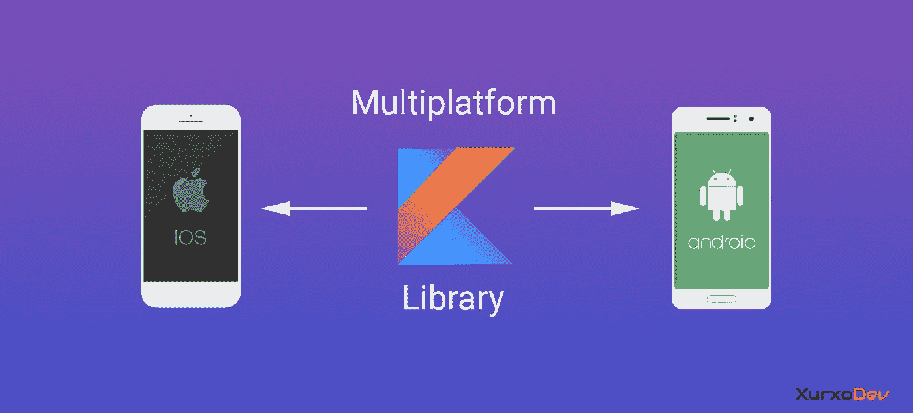

# 如何在 Kotlin 多平台中创建 REST API 客户端及其集成测试

> 原文：<https://blog.kotlin-academy.com/how-to-create-a-rest-api-client-and-its-integration-tests-in-kotlin-multiplatform-d76c9a1be348?source=collection_archive---------0----------------------->



Kotlin Multiplatform Library

这篇文章是我在博客[xurxodev.com](http://xurxodev.com/cliente-api-rest-y-test-de-integracion-en-kotlin-multiplatform)中的原文的英文翻译。

大多数移动应用程序都基于与 API Rest 的通信。

与外部服务的集成是移动开发的基础。为了获得最佳的集成，有必要通过集成测试来确保它。

随着 Kotlin 多平台的出现，出现了一个非常有趣的场景，比如在多平台库中有一个 REST API 的客户端，我们可以在 Android 应用程序和 iOS 应用程序中使用它。

在这篇博文中，我们将回顾如何使用 Kotlin 多平台创建 REST API 客户端，以及如何创建验证我们的集成工作正常所需的集成测试。

几周前，我参加了一个卡鲁米的[移动测试培训，我们在那里制作了这个](https://blog.karumi.com/5th-mobile-testing-training-edition-is-over/)[形](https: / /github.com/Karumi/KataTODOApiClientKotlin)，我们将回顾一个科特林多平台版本。

# API REST

我们将要创建的客户机与下面的 web 服务通信:[http://jsonplaceholder.typicode.com/](http://jsonplaceholder.typicode.com/)

这个 REST API 管理任务，您将能够获取所有现有的任务，使用其标识符获取任务，添加新任务，更新任务或删除现有的任务。

# 创建 Gradle 项目

首先要做的是创建项目，可以使用 Intellij 或者 Android Studio。

如何配置 Kotlin 多平台库的详细解释超出了本文的范围，但是这里有 Jetbrains 的官方文档:[多平台 Kotlin 库](https://kotlinlang.org/docs/tutorials/multiplatform-library.html)。

# 设置持续集成

为一个项目设置 CI 的最佳时间是在开始的时候，所以这将是下一步。

我已经使用了 Travis，你所要做的就是进入[https://travis-ci.org](https://travis-ci.org)，启用你的 Github 项目进行持续集成，并在项目的根目录下添加一个 travis.yml 文件:

```
os: osx
  osx_image: xcode10.1script:
  - ./gradlew build
```

在这个文件中，我们将 OS X 作为执行构建的操作系统。

这是执行我们将要在 iOS 模拟器中创建的测试所必需的。

最后，我们指出运行构建任务的脚本命令。

在其他子任务中，build task 将为 JVM 和 iOS 编译库代码，最后，它将在两个平台上运行测试。

# 创建客户端

## 要使用的库

我们需要下一个图书馆:

*   对于 T1 来说，它是一个多平台库，可以向远程服务发出请求。类似于 Android 的翻新或者 iOS 的 Alamofire 和 AFNetworking。
*   [Kotlinx 序列化](https://github.com/Kotlin/kotlinx.serialization)，它是一个多平台的序列化和反序列化库，JSON 是支持的格式之一。

## TodoApiClient

我们的客户机包含一个 HttpClient 来发出请求，并由构造函数接收一个 HttpClientEngine，我们将在后面看到原因。

引擎可以由 build.gradle 文件中包含的工件显式或隐式分配。

JVM 有一些引擎像 Apache，Jetty，OkHttp 对于 iOS，它只存在一个 iOS 引擎，它在内部使用异步 NSURLSession，并且没有额外的配置。

```
class TodoApiClient constructor(      
    httpClientEngine: HttpClientEngine? = null) {     companion object {         
        const val BASE_ENDPOINT =  
              "http://jsonplaceholder.typicode.com"     
    }

    private val client: HttpClient = 
         HttpClient(httpClientEngine!!) {             
             install(JsonFeature) {             
               serializer = KotlinxSerializer().apply {                  
                  register(Task.serializer())            
         } 
    }   
 }
```

我们将为远程服务允许的每个操作提供一个方法，让我们看一些例子:

```
suspend fun getAllTasks(): Either<ApiError, List<Task>> = try {
    val tasksJson = client.*get*<String>("$BASE_ENDPOINT/todos")

    // JsonFeature does not working currently with root-level array
    // https://github.com/Kotlin/kotlinx.serialization/issues/179
    val tasks = Json.nonstrict.parse(Task.serializer().*list*,   
                tasksJson)

    Either.Right(tasks)
} catch (e: Exception) {
    handleError(e)
}

suspend fun addTask(task: Task): Either<ApiError, Task> = try {
    val taskResponse = client.*post*<Task>("$BASE_ENDPOINT/todos") **{** *contentType*(ContentType.Application.Json)
        body = task
    **}** Either.Right(taskResponse)
} catch (e: Exception) {
    handleError(e)
}
```

注意，每个方法都返回一个要么类型，记住它是一种[函数式编程技术](http://xurxodev.com/desde-donde-comunicar-o-tratar-errores-parte-2/)，在不使用异常的情况下处理错误。

在更传统的面向对象编程中，这些方法都可能返回异常。

如果结果令人满意，我们返回相应泛型的正确类型。

如果出现错误，Ktor 会返回一个异常，我们用它自己的方法来处理这个异常:

```
private fun handleError(exception: Exception): Either<ApiError, Nothing> =
    if (exception is BadResponseStatusException) {
        if (exception.statusCode.value == 404) {
            Either.Left(ItemNotFoundError)
        } else {
            Either.Left(UnknownError(exception.statusCode.value))
        }
    } else {
        Either.Left(NetworkError)
    }
```

# 集成测试

为了测试我们的客户端与 Rest API 的集成，我们需要验证以下内容:

*   请求被正确地发送到 API:端点、动词、头、主体(如果适用)。
*   服务器响应被正确解析。
*   正确处理服务器错误响应。

为了执行这些检查，我们必须模拟服务器响应，并且能够以某种方式访问我们发送的 HTTP 请求。

## 要使用的库

我们需要下一个图书馆:

*   ktor-client-mock ，这是一个多平台库，它公开了 MockEngine，允许我们模拟服务器响应，并访问发送的请求来执行验证。
*   [Kotlinx 协同程序](https://github.com/Kotlin/kotlinx.coroutines)，Ktor 基于[暂停函数](https://kotlinlang.org/docs/reference/coroutines/composing-suspending-functions.html)，因此，我们需要协同程序库从测试中调用我们的客户端。

## 创建测试

让我们看看我们可以创建的一些测试。

我们可以尝试的第一个测试是验证 todos 端点，例如:

*   验证响应是否被正确解析。
*   验证 accept 标头是否已发送。
*   如果出现错误，请验证其处理是否正确。

我们需要什么基础设施？我们需要有一种方法来配置一个 MockEngine，在这里我们可以模拟一个响应，并将这个 mock engine 传递给构造函数中的客户端，而不是一个真实的客户端。

我们需要一个 JSON 来表示服务器的响应，最简单的方法是用一个函数返回 JSON 字符串:

```
fun getTasksResponse() =
    "[{\n" +
        "  \"userId\": 1,\n" +
        "  \"id\": 1,\n" +
        "  \"title\": \"delectus aut autem\",\n" +
        "  \"completed\": false\n" +
        "}," +
        " {\n" +
        "  \"userId\": 1,\n" +
        "  \"id\": 2,\n" +
        "  \"title\": \"quis ut nam facilis et officia qui\",\n" +
        "  \"completed\": false\n" +
        "}, " +
        "{\n" +
        "  \"userId\": 2,\n" +
        "  \"id\": 3,\n" +
        "  \"title\": \"fugiat veniam minus\",\n" +
        "  \"completed\": false\n" +
        "}," +
        "{\n" +
        "  \"userId\": 2,\n" +
        "  \"id\": 4,\n" +
        "  \"title\": \"et porro tempora\",\n" +
        "  \"completed\": true\n" +
        "}]"
```

现在，我们需要能够配置一个模拟引擎来返回存根响应，并使用这个引擎来访问发送的请求，以实现对它的验证。

我们可以为我们的测试创建一个基类，或者创建一个特定的类来实现这项工作。在测试中，我更喜欢组合而不是继承。

```
class TodoApiMockEngine {
    private lateinit var mockResponse: MockResponse
    private var lastRequest: MockHttpRequest? = null

    fun enqueueMockResponse(
        endpointSegment: String,
        responseBody: String,
        httpStatusCode: Int = 200
    ) {
        mockResponse = MockResponse(endpointSegment, responseBody, httpStatusCode)
    }

    fun get() = MockEngine **{** lastRequest = this

        when (url.encodedPath) {
            "${mockResponse.endpointSegment}" -> {
                MockHttpResponse(
                    call,
                    HttpStatusCode.fromValue(
                    mockResponse.httpStatusCode),
                    *ByteReadChannel*(mockResponse.responseBody
                        .*toByteArray*(Charsets.UTF_8)),
                    *headersOf*(HttpHeaders.ContentType *to listOf*(
                    ContentType.Application.Json.toString()))
                )
            }
            else -> {
                *error*("Unhandled ${url.*fullPath*}")
            }
        }
    **}** fun verifyRequestContainsHeader(key: String, 
         expectedValue: String) {
        val value = lastRequest!!.headers[key]
        *assertEquals*(expectedValue, value)
    }

    fun verifyRequestBody(addTaskRequest: String) {
        val body = (lastRequest!!.content as TextContent).text

        *assertEquals*(addTaskRequest, body)
    }

    fun verifyGetRequest() {
        *assertEquals*(HttpMethod.Get.value,  
        lastRequest!!.method.value)
    }

    fun verifyPostRequest() {
        *assertEquals*(HttpMethod.Post.value,  
                     lastRequest!!.method.value)
    }

    fun verifyPutRequest() {
        *assertEquals*(HttpMethod.Put.value, 
                     lastRequest!!.method.value)
    }

    fun verifyDeleteRequest() {
        *assertEquals*(HttpMethod.Delete.value, 
                     lastRequest!!.method.value)
    }
}
```

正如您在这个类中看到的，在 get 函数中，我们配置了一个 MockEngine，根据编码的路径，我们将返回一个带有 HTTP 状态代码和主体的响应，该响应已在 enqueueMockResponse 方法中传递。

如果 encodedPath 不匹配，我们将抛出一个错误:

```
error("Unhandled ${url.fullPath}")
```

这样，我们就没有必要为每个端点创建一个特定的测试来验证发送请求的端点是否正确，它将在每个测试中被隐式地验证。

最后，我们编写测试:

```
class TodoApiClientShould {
    companion object {
        private const val ALL_TASK_SEGMENT = "/todos"
    }

    private val todoApiMockEngine = TodoApiMockEngine()

    @Test
    fun `send accept header`() = *runTest* **{** val apiClient = givenAMockTodoApiClient(
                    ALL_TASK_SEGMENT, *getTasksResponse*())

        apiClient.getAllTasks()

        todoApiMockEngine
         .verifyRequestContainsHeader("Accept", "application/json")
    **}** @Test
    fun `send request with get http verb getting all task`() =   
      *runTest* **{** val apiClient = givenAMockTodoApiClient(ALL_TASK_SEGMENT, 
                        *getTasksResponse*())

        apiClient.getAllTasks()

        todoApiMockEngine.verifyGetRequest()
    **}** @Test
    fun `return tasks and parses it properly`() = *runTest* **{** val apiClient = givenAMockTodoApiClient(ALL_TASK_SEGMENT, 
                        *getTasksResponse*())

        val tasksResponse = apiClient.getAllTasks()

        tasksResponse.*fold*(
            **{** left **->** *fail*("Should return right but was left: 
                           $left") **}**,
            **{** right **->** *assertEquals*(4, right.size.toLong())
                assertTaskContainsExpectedValues(right[0])
            **}**)
    **}** @Test
    fun `return http error 500 if server response internal server 
         error getting all task`() =
        *runTest* **{** val apiClient =givenAMockTodoApiClient(ALL_TASK_SEGMENT, 
            httpStatusCode = 500)

            val tasksResponse = apiClient.getAllTasks()

            tasksResponse.*fold*(
                **{** left **->** *assertEquals*(UnknownError(500), left) **}**,
                **{** right **->** *fail*("Should return left but was right:  
                                $right") **}**)
        **}** private fun assertTaskContainsExpectedValues(task: Task?) {
       *assertTrue*(task != null)
       *assertEquals*(task.id, 1)
       *assertEquals*(task.userId, 1)
       *assertEquals*(task.title, "delectus aut autem")
       *assertFalse*(task.completed)
    }

    private fun givenAMockTodoApiClient(
       endpointSegment: String,
       responseBody: String = "",
       httpStatusCode: Int = 200): TodoApiClient {

       todoApiMockEngine.enqueueMockResponse(endpointSegment,   
       responseBody, httpStatusCode)

       return TodoApiClient(todoApiMockEngine.get())
    }
}
```

注意，在我们返回 runTest 的测试中，这是协程发挥作用的地方。

目的是用 runBlocking 运行测试，以便同步执行测试。

由于我们在多平台项目的公共模块中，我们没有这个构建器可用，所以我们必须做的是创建一个抽象，并按照[期望/实际机制](http://xurxodev.com/kotlin-multiplatform-y-el-principio-de-inversion-de-dependencias/)在每个平台的源集中定义它的实现:

```
// This is within CommonTest source test     
internal expect fun <T> runTest(block: suspend () -> T): T // This is within JvmTest source test     
internal actual fun <T> runTest(block: suspend () -> T): T {            
    return runBlocking { block() }     
}// This is within iosTest source test     
internal actual fun <T> runTest(block: suspend () -> T): T {      
   return runBlocking { block() }
}
```

## 为什么不为 iOS 执行测试？

当您第一次运行构建时，不会为 iOS 执行测试。

这是因为该插件默认只支持在 macOS、Windows 等平台上执行测试。

但是我们可以创建一个容易执行的 Gradle 任务。

```
task iosTest {
    doLast {
        def binary = kotlin.targets.iOS.compilations.test.getBinary('EXECUTABLE', 'DEBUG')
        exec {
            commandLine 'xcrun', 'simctl', 'spawn', "iPhone XR", binary.absolutePath
        }
    }
}
tasks.check.dependsOn iosTest
```

# 形和源代码

你可以在这里找到源代码。

主分支包含了所有由我解决的形。

最好的学习方法是通过练习，所以我推荐使用整合-测试-科特林-多平台-形分支，你自己做练习。

# 相关课程

[测试过程](http://xurxodev.com/curso-testing/)

# 结论

在本文中，我们看到了如何创建包含 REST API 客户端的多平台库，以及如何创建测试来验证与远程服务的集成，并在 JVM 和 iOS 模拟器上运行它们。

但这只是一个形的例子，它不是一个准备发布到产品中的库。

**感谢您阅读这篇文章！如果你喜欢，请按👏🏼按钮，这样其他人也可以阅读:)**

[](https://kotlin-academy.us17.list-manage.com/subscribe?u=5d3a48e1893758cb5be5c2919&id=d2ba84960a)