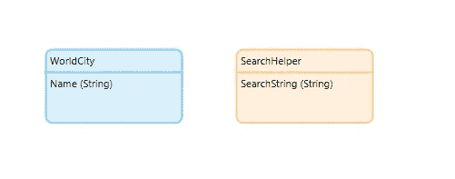
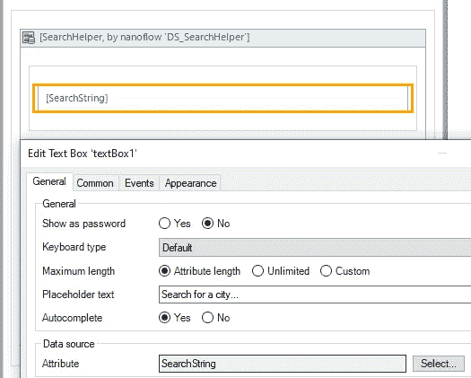
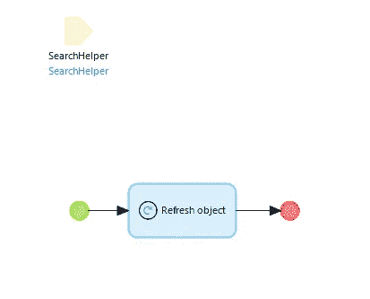
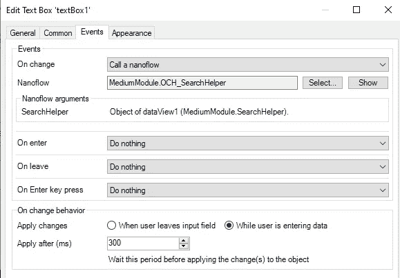
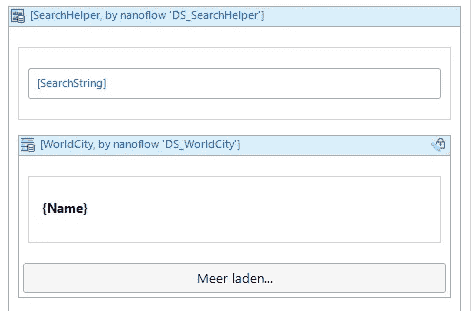
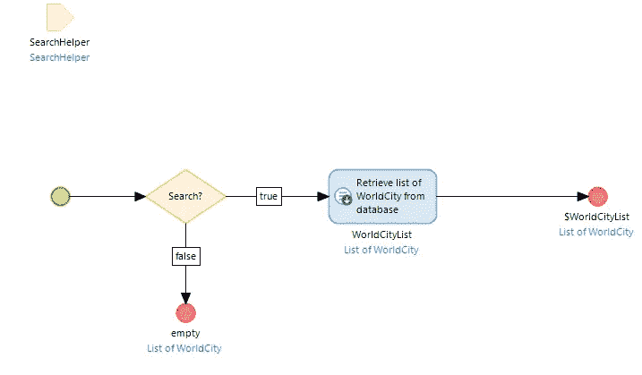
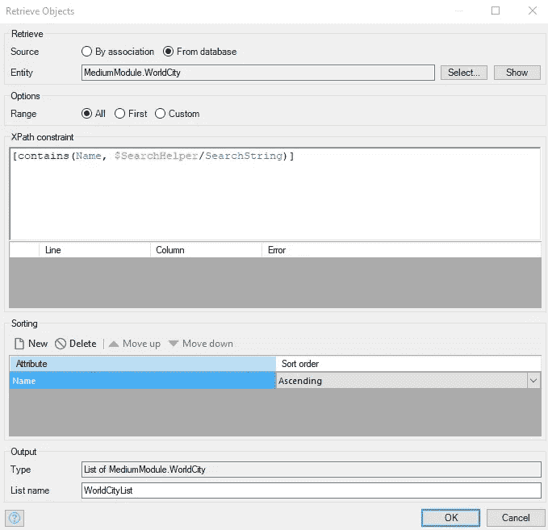
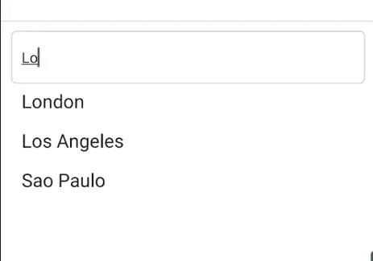

# 如何在几分钟内创建本地移动搜索功能！

> 原文：<https://medium.com/mendix/how-to-create-a-search-functionality-in-a-mendix-native-mobile-app-f6f48b59f1be?source=collection_archive---------0----------------------->

# 有可能在某个时候你的用户想要从列表中选择一个选项，但是如果这个列表真的很长呢？无休止的滚动毫无意义，因为这会提供糟糕的用户体验，可能会让你的用户远离你的应用。过滤器可以为显示较小的列表提供一个答案，但是搜索呢？

目前， [Mendix 本地移动应用](https://docs.mendix.com/howto/mobile/getting-started-with-native-mobile)中没有用于搜索列表的默认 UI 组件，这与 Mendix 浏览器应用的列表视图或数据网格中的搜索功能不同。幸运的是，只使用**默认的 Mendix 组件**，构建自己的定制搜索功能真的很容易。

原生 Android 和 iOS 应用程序使用 SQLite 数据库，这是一种提供完整离线功能的关系数据库，自智能手机问世以来一直在使用。这是我们需要执行搜索的数据库，我们可以使用 [X-Path](https://docs.mendix.com/refguide/xpath) 来完成。

假设您有一个世界城市列表，您的用户想从中选择一个来了解更多信息。您将需要有一个搜索框，用户可以输入他正在寻找的城市名称，结果显示出来。我将向你展示一个简单而有效的方法来实现这一点。

[https://bit.ly/MXW21](https://bit.ly/MXW21)

1.  从您的领域模型开始。当然，您将拥有一个包含城市名称的城市实体。你可以用这个来搜索。
2.  添加第二个实体。它可以是持久的，也可以是非持久的，这取决于您的需要。我暂时称它为“搜索助手”。它应该包含搜索所需的属性；在这种情况下是字符串“SearchString”。

Domain model

3.创建用户将进行搜索的页面。对 page 参数使用 SearchHelper 对象。如果页面是从导航菜单中调用的，请使用 datasource 流来创建它，如果是从 nano 流中调用的，您可以在那里创建对象，并将其作为显示页面操作中的参数进行传递。

4.添加一个属性为 SearchString 的 textbox。

Search page with textbox

5.添加一个 On-Change nanoflow，当用户在搜索框中输入新内容时，它会刷新页面参数。您可以提交 SearchHelper 对象，或者使用来自 [nanoflow commons 模块](https://docs.mendix.com/appstore/modules/nanoflow-commons)的刷新对象操作。

Refresh page parameter on-change

6.在搜索框的“事件”选项卡中，根据您选择的事件设置新创建的纳流。在这种情况下，我选择了更改时事件，并选择了“用户输入数据时”选项。

7.现在我们已经设置了页面，我们可以开始根据用户的输入实际检索列表。将 listview 添加到 SearchHelper 的 dataview，并选择“Nanoflow”作为数据源。

Listview

8.对于数据源 nanoflow，使用 SearchHelper 实体作为参数创建一个新的 nanoflow。使用 split 检查 SearchString 是否包含输入*(提示:使用 trim($ search helper/search string)！= ' ')，*并添加一个从数据库中检索的活动。如果 SearchHelper 不包含任何输入，则返回空值。

9.对于检索动作，使用基于用户输入的 [X 路径查询](https://docs.mendix.com/refguide/xpath-constraint-functions)。您有几个选项，如 contains()、starts-with()或 equals。对于这个例子，我选择了 contains()，但是如果你有太多的数据，你想使用一个[索引](https://docs.mendix.com/refguide/indexes)，你将需要选择一个不同的选项。

X-path retrieve

## 就这些，我们来测试一下

终于可以尝试一下了！您刚刚创建了一个定制的搜索功能，它具有出色的性能，可以在线和离线工作，并且只使用本地 Mendix 功能！

*来自发布者-*

*如果你喜欢这篇文章，你可以在我们的* [*媒体页面*](https://medium.com/mendix) *或我们自己的* [*社区博客网站*](https://developers.mendix.com/community-blog/) *找到更多类似的内容。*

*希望入门的创客，可以注册一个* [*免费账号*](https://signup.mendix.com/link/signup/?source=direct) *，通过我们的* [*学苑*](https://academy.mendix.com/link/home) *获得即时学习。*

有兴趣加入我们的社区吗？你可以加入我们的 [*Slack 社区频道*](https://join.slack.com/t/mendixcommunity/shared_invite/zt-hwhwkcxu-~59ywyjqHlUHXmrw5heqpQ) *或者想更多参与的人，看看加入我们的*[*Meet ups*](https://developers.mendix.com/meetups/#meetupsNearYou)*。*