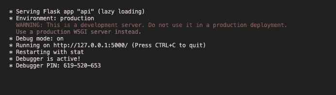
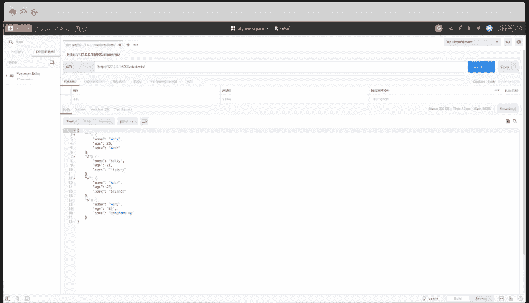
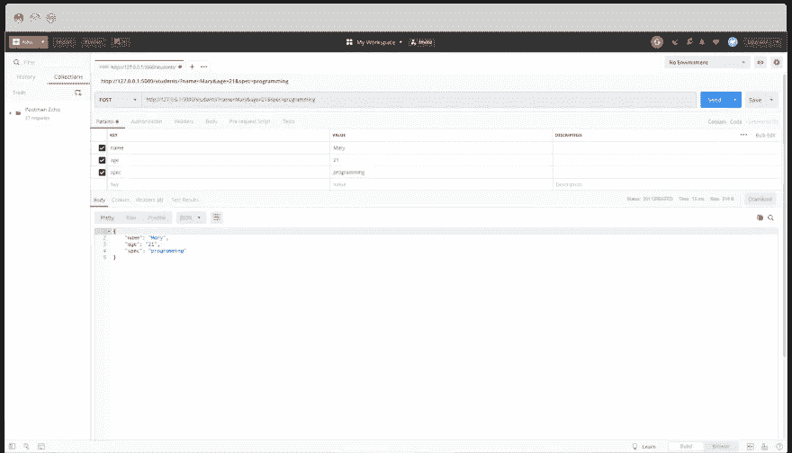
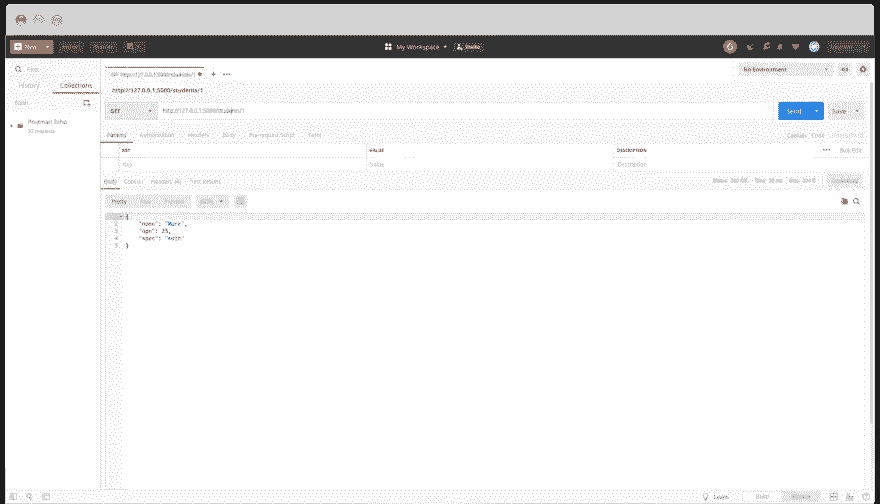
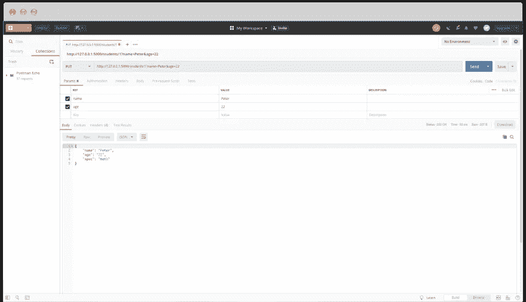
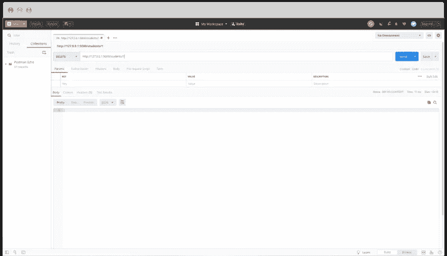

# 如何在 5 分钟内用 Python 和 Flask 创建简单的 REST API

> 原文：<https://medium.com/duomly-blockchain-online-courses/how-to-create-a-simple-rest-api-with-python-and-flask-in-5-minutes-94bb88f74a23?source=collection_archive---------0----------------------->


[Duomly — Programming Online Courses](https://www.duomly.com)

本文最初发表于:[https://www.blog.duomly.com/python-api-tutorial/](https://www.blog.duomly.com/?p=1861&preview=true)

Python 是 2020 年需求量最大的编程语言之一。有很多工作机会提供给 Python 开发人员和很多想学习这种编程语言的人。正如我们在之前的一篇关于学习 Python 的文章中提到的，实践知识是最重要的。

考虑到 Python 可用于构建应用程序的后端，我决定撰写一篇文章，描述如何使用 Python、Flask 和 flask_restful 库创建一个简单的 REST API。我将为学生列表构建一个基本的 CRUD 资源。要学习本教程，您需要在计算机上安装 Python 和 pip。为了检查 API，我将使用 Postman。

此外，本教程主要关注构建 API，所以我使用模拟数据。在大多数情况下，当你制作 API 时，它会连接到数据库。

在开发过程中，我们将经历以下几点:

1.  安装 flask 和 flask_restful
2.  创建并初始化文件
3.  模拟数据
4.  创建学生列表类和路线
5.  为 StudentsList()创建 get()和 post()方法
6.  定义学生班级和路线
7.  创建 get()、update()和 delete()方法
8.  测试端点

为了使它更容易和更方便，我为那些喜欢从电影中学习的人准备了这个教程的视频版本。

[Duomly — Python API tutorial](https://youtu.be/lDw_g1gQP2s)

开始吧！

## 1.安装 Flask 和 Flask_RESTful

一开始，我们必须安装所有需要的库。Flask 是用 Python 编写的微框架，用于构建 web 应用。所以，让我们使用下面的命令来安装它:

```
pip install Flask
```

如果准备好了，我们可以开始安装 flask 库 Flask_RESTful:

```
pip install Flask-RESTful
```

如果完成了，我们就可以开始构建我们的 API 了！

## 2.创建并初始化文件

当我们安装了创建 API 所需的所有东西后，让我们创建一个文件。我将它命名为 api.py，您可以使用任何您喜欢的名称，但是请记住 Python 文件应该有。py 扩展名。请在您喜欢的代码编辑器中打开该文件，让我们导入一些启动项目所必需的东西。

```
from flask import Flask
from flask_restful import Resource, Api, reqparse
```

虽然文件顶部的所有内容都很重要，但是让我们用下面的代码初始化我们的 API:

```
app = Flask(__name__)
api = Api(app)STUDENTS = {}if __name__ == "__main__":
  app.run(debug=True)
```

很好，现在我们的 API 已经初始化了。让我们转到下一点，我们将创建我们的模拟数据。

## 3.模拟数据

在 STUDENTS 变量中，我们将创建一个按 id 排序的学生字典。每个学生都有一个名字、年龄和具体的属性。让我们创建四个简单的用户:

```
STUDENTS = {
  '1': {'name': 'Mark', 'age': 23, 'spec': 'math'},
  '2': {'name': 'Jane', 'age': 20, 'spec': 'biology'},
  '3': {'name': 'Peter', 'age': 21, 'spec': 'history'},
  '4': {'name': 'Kate', 'age': 22, 'spec': 'science'},
}
```

它已经准备好了，所以我们可以向前移动一步，开始创建我们的第一个带有路线的类。

## 4.创建学生列表类和路线

现在我们可以开始做有趣的事情了。首先，让我们创建一个类 StudentsList 和其中的两个方法:get 和 post。

```
class StudentsList(Resource):
  def get(self);
  def post(self):
```

准备好之后，我们应该添加一个路由，它将被用作 URL 来调用这个类中的数据。

```
api.add_resource(StudentsList, '/students/')
```

很好，现在我们差不多准备好显示来自端点的 firs 数据了，剩下的最后一件事就是用一些逻辑填充方法并运行第一个端点。

## 5.为 StudentsList()创建 get()和 post()方法

这是一个简单的步骤。在 API 的第一个 get 方法中，我们希望返回所有学生的列表。为此，我们要归还我们的字典:

```
def get(self):
  return STUDENTS
```

很好，现在是时候创建一个 post()方法，以便有可能向我们的列表中添加一个新学生。为此，我们需要在类 StudentsList 上方创建一个解析器变量，以便能够将参数添加到 post()调用中，然后我们可以构建一个 post 方法，在该方法中，我们基于传递的参数生成新的 id 并保存新的 student。

```
parser = reqparse.RequestParser()def post(self):
  parser.add_argument("name")
  parser.add_argument("age")
  parser.add_argument("spec")
  args = parser.parse_args()
  student_id = int(max(STUDENTS.keys())) + 1
  student_id = '%i' % student_id
  STUDENTS[student_id] = {
    "name": args["name"],
    "age": args["age"],
    "spec": args["spec"],
  }
  return STUDENTS[student_id], 201
```

现在，我们准备检查对 API 的第一次调用。首先，让我们运行代码。我将在我的代码编辑器中完成它。代码运行时，您应该会在控制台中看到下图:



Python API tutorial

然后，请转到 Postman 并设置 GET 方法，粘贴本地主机，就像我们的服务器工作的地方一样，并在最后传递路由。在我的例子中，链接如下所示:

结果应该显示学生的完整列表:



Python API tutorial

让我们检查一下 post 方法是否也有效。为此，您必须将方法改为 POST，并传递参数:姓名、年龄和规格:



Python API tutorial

看起来一切都很好！现在是时候创建另一个类和其他端点了。

## 6.定义学生班级和路线

现在，我们将为该类创建另一个类和路由。学生类将管理获取、更新和删除。这堂课中的所有内容都与一个通过 student _ id 获得的学生有关。

```
class Student(Resource):
  def get(self, student_id): def put(self, student_id): def delete(self, student_id):
```

接下来，我们将在当前路线下方添加一条新路线:

```
api.add_resource(Student, '/students/<student_id>')
```

## 7.创建 get()、update()和 delete()方法

在这一步中，我们将为 get()、update()和 delete()方法创建一个逻辑。首先，我们想通过 student_id 返回一个学生。让我们开始吧:

```
def get(self, student_id):
  if student_id not in STUDENTS:
    return "Not found", 404
  else:
    return STUDENTS[student_id]
```

很好，接下来我们将创建 update()方法逻辑。它与上一个类中的 post()方法非常相似，但是我们不会创建新的 id。首先，我们将检查具有给定 id 的学生是否存在。如果是，我们将更新这些值；如果没有，我们将返回信息。

```
def put(self, student_id):
  parser.add_argument("name")
  parser.add_argument("age")
  parser.add_argument("spec")
  args = parser.parse_args()
  if student_id not in STUDENTS:
    return "Record not found", 404
  else:
    student = STUDENTS[student_id]
    student["name"] = args["name"] if args["name"] is not None else student["name"]
    student["age"] = args["age"] if args["age"] is not None else student["age"]
    student["spec"] = args["spec"] if args["spec"] is not None else student["spec"]
    return student, 200
```

最后，我们将创建一个 delete()方法。在这种情况下，我们还必须检查具有给定 id 的学生是否存在，以便能够删除该项。

```
def delete(self, student_id):
  if student_id not in STUDENTS:
    return "Not found", 404
  else:
    del STUDENTS[student_id]
    return '', 204
```

好像一切都准备好了！让我们检查一下！

## 8.测试端点

让我们运行代码并打开 Postman，以便能够测试端点。先说单生吧。为此，我们必须在末尾传递带有用户 id 的链接:



Python API tutorial

有用！让我们尝试更新学生，设置 PUT 方法，传递带有用户 id 的链接，并添加一些参数来更改它们:



Python API tutorial

这个也可以！最后要检查的是删除方法。所以，让我们在末尾创建一个带有学号的链接，并将方法改为 DELETE:



Python API tutorial

一切正常！

## 结论

在本文中，我们用 Python 创建了一个简单的 rest API。我们使用 Flask 框架和 Flask_RESTful 库来使它变得快速和简单。我们的 API 允许我们获取所有项目的列表，通过 id 获取一个项目，向列表添加一个新项目，通过 id 更新项目，以及删除具有给定 id 的项目。为了测试端点，我使用了 Postman。为了编写和运行代码，我使用了 Visual Studio 代码。

我希望你会发现这篇教程很有帮助，并把它作为你第一次 Python API 训练的基础！如果您想掌握您的 Python 知识，请加入 Duomly 并完成我们更新的 [Python 课程！](https://dev.to/duomly/%E2%80%9Ehttps://www.duomly.com/course/python-course%E2%80%9D)


[Duomly — Programming Online Courses](https://www.duomly.com)

好好编码！
来自多姆利的安娜