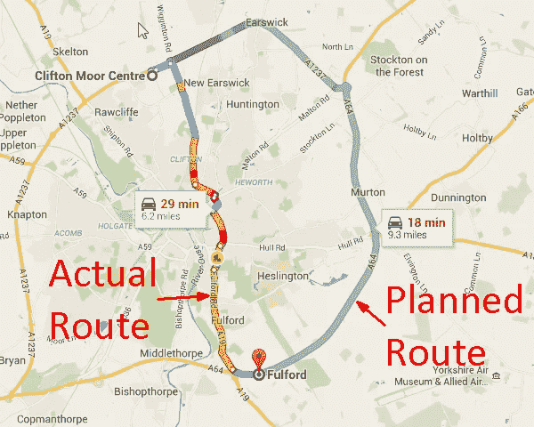
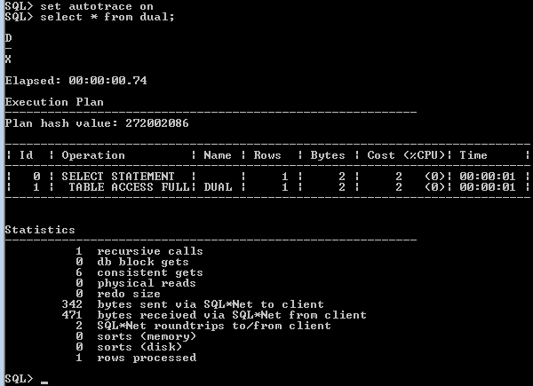
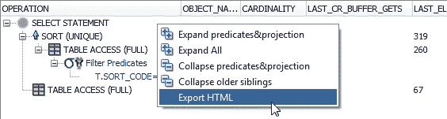
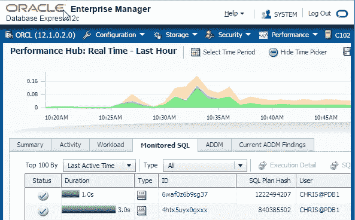
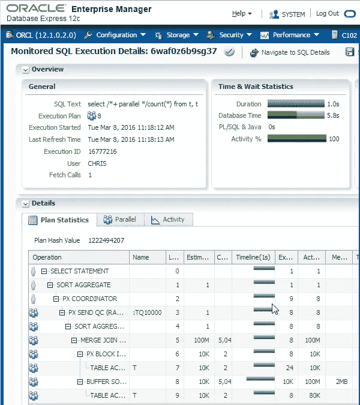
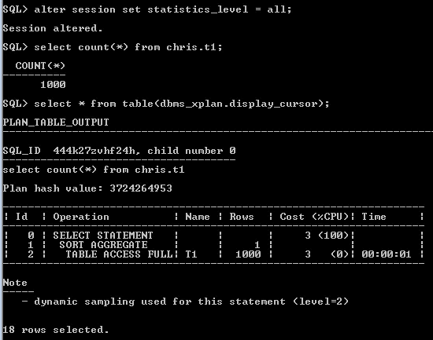
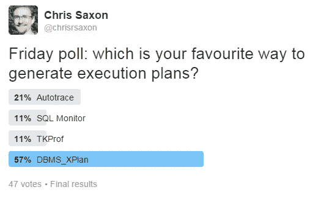

# 如何为 Oracle 数据库创建执行计划

> 原文：<https://medium.com/oracledevs/how-to-create-an-execution-plan-oracle-all-things-sql-blog-b3aa9dc7144c?source=collection_archive---------0----------------------->

当你试图让 SQL 运行得更快时，有一样东西是至关重要的:执行计划。在本帖中，我们将探讨创建这些的四种方法:

*   [自动跟踪](https://blogs.oracle.com/sql/how-to-create-an-execution-plan#autotrace)
*   [SQL 监视器](https://blogs.oracle.com/sql/how-to-create-an-execution-plan#sqlmonitor)
*   [TKPROF](https://blogs.oracle.com/sql/how-to-create-an-execution-plan#tkprof)
*   [DBMS_XPlan](https://blogs.oracle.com/sql/how-to-create-an-execution-plan#dbmsxplan)

但在我们开始之前，让我们先回答这个问题:

# 什么是执行计划？

SQL 语句的计划是一组指令。这告诉数据库如何访问数据并将其连接在一起。

计划有两种类型:

这些听起来差不多。但它们是不同的。要理解为什么要考虑这个例子。

你在做一次汽车旅行。你事先计划好了。这是你期望走的路线。

但是就在你准备离开的时候，你听到新闻说在你选择的路线上发生了一起事故。这样会让它慢很多。所以你走了一条不同的路。



这里有两条路线。你期望拿走的和你实际拿走的。

到达目的地后，你想知道自己是否能更快地完成旅程。要弄清楚这一点，你需要看看你去了哪里。不是你计划去的地方。

一个解释计划*预测了*Oracle 将如何处理您的查询。

执行计划描述了*实际采取的步骤*。

就像上面的驾驶示例一样，Oracle 可能会使用不同于其预测的路线。正如 [Tom Kyte 所讨论的](http://tkyte.blogspot.co.uk/2007/04/when-explanation-doesn-sound-quite.html)，这种情况的发生有几个原因。因此，要诊断您的查询，您需要知道 Oracle 做了什么。不是它猜测它可能做的事！

# 边注

“解释计划”听起来很像“执行计划”。这可能会导致混乱。很多时候，当我要求人们提供一个执行计划时，他们提供的是一种解释。

我想如果我们给这些非常不同的名字会更好。例如，将执行计划称为“描述的路径”或类似的东西。这将有助于提醒人们这些是不同的东西(尽管它们看起来很相似)，并减少混淆的机会。

提示:如果有人问你要“计划”，他们通常是在寻找一种执行方式。即实际发生了什么。

那么清楚了这一点，你如何着手收集它们呢？

# 电气液压靠模仿型铣床

首先，autotrace。这是一个免费的工具。您可以在 SQL*Plus 中使用“set autotrace”命令启用它。

启用此选项后，Oracle 会在每次查询后显示其输出。下面是该计划及其性能统计数据:



如果您的查询返回数百或数千行，您必须等待 Oracle 显示所有行。这可能是一种痛苦。

幸运的是，您可以使用 trace[only]选项隐藏结果。您也可以选择只显示计划或统计数据。例如，要隐藏查询输出并仅显示统计信息，请使用:

```
set autotrace trace stat
```

要包括输出和计划，请输入

```
set autotrace on exp
```

完成后，您可以通过以下方式将其关闭:

```
set autotrace off
```

虽然使用 SQL*Plus 比什么都不用要好，但它有几个限制:

*   它没有显示统计数据(输出行数、缓冲区获取数等。)对于计划中的每一步
*   它使用解释计划，所以您看到的可能不是 Oracle 所做的！

因此，虽然它对空中快速手指很有用，但还有更好的版本可用。

比如:

# SQL Developer 中的 Autotrace

这比 SQL*Plus 版本更上一层楼。它显示了计划中每一步的统计数据。因此，对于每个操作，您可以看到以下指标:

*   使用了多少缓冲区
*   跑了多长时间
*   它进行了多少次磁盘读写

这使得找出消耗最多资源的点变得容易得多。

要了解如何配置和运行它，请观看此视频:

除了一步一步的分解， [SQL Developer](http://www.oracle.com/sqldeveloper) 中的 autotrace 比 SQL*Plus 更有优势。其中包括:

*   您可以展开和折叠部分计划。这使得更容易看到发生了什么
*   您可以比较执行计划。当你试图找出两个大计划之间的差异时，这是一个绝妙的工具。

这是 SQL*Plus 版本的一大进步。所以从现在开始，当我提到 autotrace 时，我指的是 SQL Developer 版本。

一句简短的警告。默认情况下，SQL Developer 只根据“ [SQL 数组提取大小](http://www.thatjeffsmith.com/archive/2014/09/30-sql-developer-tips-in-30-days-day-7-the-array-fetch-size-preference/)”参数提取行数。对于返回大量行的查询，这可能会错过大量工作。确保将其设置为“[获取所有行](http://www.thatjeffsmith.com/archive/2013/07/explain-plan-and-autotrace-enhancements-in-oracle-sql-developer-4/)”。

在优化查询时，您通常希望保存计划以供以后参考或与其他人共享。为此，右键单击该计划，您将获得一个“导出 HTML”选项:



保存这个以获得 HTML 格式的计划。

这听起来很棒。

但是 autotrace 有一个很大的缺点:您必须等待查询完成！

如果您的 SQL 需要几分钟或几小时才能完成，等待是一件痛苦的事情。如果能实时看到查询进度，那就太棒了。

这就引出了下一个方法:

# SQL 监视器

SQL 监控器提升 autotrace。它提供了类似的操作级统计信息。但是有额外的好处。您可以实时查看执行计划的进度！

有麻烦的满桌扫描吗？你可以看着甲骨文公司努力工作。您不必等待查询完成，而是可以立即看到计划。这使得识别瓶颈变得容易。

更好的是，与需要手动运行的 autotrace 不同，Oracle 会自动为您捕获计划。

那么，你如何看待这些计划？

在 SQL Developer 中，可以通过工具->监控 SQL…

或者，您可以在企业管理器的“性能”选项卡中查看它们:



单击您的语句的 SQL ID 会显示完整的详细信息:



与 SQL Developer 一样，您可以展开和折叠计划的各个部分。关于阅读这些报告的更多细节，请看这篇关于[监控并行执行](https://blogs.oracle.com/datawarehousing/entry/monitoring_parallel_execution_using_real)的文章。

对于喜欢文本的人，可以使用 SQL 输出计划。为此，请使用以下查询:

```
select dbms_sqltune.report_sql_monitor( 
  sql_id => '4htx5uyx0gxxx', type => 'TEXT', report_level => 'ALL' 
       ) as report 
from dual;
```

您需要用查询的 ID 替换 SQL ID 参数。您可以通过以下语句找到这一点:

```
select sql_id, sql_text 
from   v$sql 
where  sql_text like '%some text from your query%' 
and    sql_text not like '%not this%';
```

如果有许多匹配项，请检查 SQL 文本，看哪一个是您的语句。

注意 SQL_text 被限制为 1000 个字符。所以对于非常大的语句，您可能还需要包含 SQL_fulltext 列！

如果它如此伟大，为什么这不是我最喜欢的方法？

嗯，有几个警告:

*   默认情况下，并非所有查询都会出现。Oracle 只捕获持续时间超过五秒或并行运行的线程。
*   您需要有诊断和优化包许可证才能使用它

第一个限制很容易绕过。一种方法是添加 monitor 提示:

```
select /*+ monitor */… from …
```

要获得许可，您需要与当地销售代表联系；)

假设您获得了许可，SQL Monitor 是对那些长达一小时的查询进行早期故障排除的绝佳方式。通常，您可以在几分钟内发现计划中哪些部分造成的损害最大。这使得早期诊断成为可能。您可以计划新的方法，而不必等待语句结束！

这两种方法都很棒。但是他们一次只处理一条语句。如果想分析一个事务中几段 SQL 的性能怎么办？

输入:

# TKPROF

TKPROF 是一个命令行实用程序，它分析跟踪文件并将它们转换成可读形式。它为您提供文件中所有 SQL 的执行统计信息。这就引出了一个问题:

# 如何生成跟踪文件？

有几种方法。最简单的方法是打开 SQL 跟踪。执行此操作的命令是:

```
alter session set sql_trace = true;
```

Oracle 将在跟踪文件中捕获此后执行的所有语句。要停止这种情况，请使用以下命令断开连接或关闭跟踪:

```
alter session set sql_trace = false;
```

这种方法很简单，但是有局限性。例如，它只跟踪您的会话。

更强大的方法是调用[DBMS _ monitor . session _ trace _ enable](http://docs.oracle.com/database/121/ARPLS/d_monitor.htm#ARPLS67178)。这有五个参数:

*   会话 id
*   序列号
*   等待
*   约束
*   计划 _ 统计

传入相关的 session_id 和 serial_num 来跟踪另一个会话。如果您将这些保留为空，Oracle 将跟踪您当前会话。将等待和绑定设置为 true 会在文件中包含这些信息。

要停止跟踪，调用[DBMS _ monitor . session _ trace _ disable](http://docs.oracle.com/database/121/ARPLS/d_monitor.htm#ARPLS67176)。与启用过程一样，传递相关的 session_id 和 serial_num。如果跟踪当前会话，则保留空白。

因此，要为当前会话生成跟踪文件，包括等待和绑定细节，请执行以下操作:

```
exec DBMS_monitor.session_trace_enable ( null, null, true, true ); 
***your code here*** 
exec DBMS_monitor.session_trace_disable;
```

DBMS_monitor 还包括跟踪所有语句的过程:

请注意，跟踪会增加开销。所以避免对整个数据库启用它。完成后记得关闭它！

一旦你跟踪了你的代码，你需要得到这个文件，这样你就可以分析它。

# 如何获取跟踪文件

“但是我在哪里可以找到跟踪文件呢？”我听到你问了。

它位于数据库服务器上。这意味着你需要访问它(或者从需要的人那里得到帮助！).你还需要知道它在哪里，叫什么！

康纳在这段视频中解释了如何找到他们:

获取文件可能很麻烦，尤其是如果你无法访问服务器的话。你可以通过[配置一个文件阅读器](https://oracle-base.com/articles/misc/sql-trace-10046-trcsess-and-tkprof#query_contents_of_trace_files)来解决这个问题，使你能够查询它们的内容(从而保存到你的本地机器)。

有了跟踪文件，就可以用 TKPROF 解析它。其基本语法是:

```
tkprof <trace_file_name> <output_file_name>
```

例如:

```
tkprof ORCL_ora_27883.trc trace.log
```

这会将 ORCL_ora_27883.trc 的内容解析到 trace.log 中。

快速注意:TKPROF 还包括一个解释选项。这将显示你的解释，而不是执行计划。小心使用这个。

与 autotrace 和 SQL Monitor 相比，这是一个很大的工作量。

所以你可能会想:这额外的麻烦值得吗？

TKPROF 比这些有一些优势:

*   它包括在开始和停止跟踪之间运行的所有 SQL 语句。这包括递归 SQL，即触发器、函数等内部的语句。
*   它将执行时间分解为解析、执行和获取时间

如果您有一个包含几个语句的慢速事务，第一个好处非常大。您可以在输出文件中将它们从最慢到最快排序。这有助于你发现哪一个花费的时间最长。为此，请使用排序选项:

```
tkprof <trace_file_name> <output_file_name> sort=prsela,exeela,fchela
```

这对于发现多次执行的快速查询特别有用。这可能是因为您正在进行逐行处理。或者你有一个 SQL 语句，它有很多调用 PL/SQL，而 PL/SQL 本身调用 SQL(这是你应该[避免](https://blogs.oracle.com/sql/the-problem-with-sql-calling-plsql-calling-sql)的)。或者触发你没有意识到的逻辑。但是，正如 Jonathan Lewis 在评论中指出的，要知道一个 SQL 语句可能对每个执行都有不同的计划。TKPROF 只会报告其中一个。

解析、执行和获取的分解有助于您发现与计划本身无关的问题。例如，在过载的系统中，解析时间可能会更长。如果语句运行时的很大一部分是解析，那么您应该开始寻找计划本身以外的问题。

所以 TKPROF 使您能够看到在前两个工具中看不到的信息。有时候额外的麻烦是值得的！

# DBMS_XPlan



我们要看的最后一个方法使用了包 [DBMS_XPlan](http://docs.oracle.com/database/121/ARPLS/d_xplan.htm) 。这包括几个显示功能。这些是流水线式的，所以可以像普通表一样使用 table()操作符查询它们。

使用这些，您可以获得计划中每一步的性能统计数据:实际的行数、花费的时间等。

要查看这些信息，您需要提高 Oracle 的统计级别。您可以通过以下方式做到这一点:

*   在会话(或数据库)中将 statistics_level 设置为 all！)使用:

```
alter session set statistics_level = all;
```

*   向查询中添加/*+ gather_plan_statistics */提示

一旦你完成了其中的一项，并运行语句直到完成，你就可以得到你的计划了！

在执行完 SQL 后，立即调用 display_cursor 来获取计划(注意确保您已经[将 serveroutput 设置为 off](https://connormcdonald.wordpress.com/2016/01/29/common-gather_plan_statistic-confusion/) ):

```
select * from table(dbms_xplan.display_cursor);
```

这将获取会话中最后一条语句的计划。这很好，但错过了许多有趣的细节。若要包含这些内容，请使用 format 参数。这使您能够包括或排除部分计划。我最喜欢的一些选项是:

*   all stats—IOSTATS MEMSTATS 的简写。这包括诸如使用了多少行和每个步骤的一致性等细节。
*   LAST —仅显示上次执行的统计信息。否则，这将默认为您提供每次执行的信息。
*   分区—包括 Pstart 和 Pstop 列。这会告诉您 Oracle 访问了哪些分区。只有在查询分区表时才需要！
*   PARALLEL——同样，只与 PARALLEL 语句相关！
*   注释-包括注释部分。这提供了额外的信息，例如 Oracle 是否使用了动态统计、自适应计划等特性。

如果您想排除部分计划，只需在格式前加上减号'-'。

你也可以用这个来获取之前语句的计划。您只需要找到 SQL ID 并将其传入:

```
select * 
from   table(
  dbms_xplan.display_cursor('sql_id', null, 'ALLSTATS LAST')
);
```

该计划必须仍在游标缓存中才能使用。前往 [LiveSQL 查看如何做到这一点的示例](https://livesql.oracle.com/apex/livesql/file/content_FAQU2DYYI7N1RYDB5CR2Y98DD.html)。如果您使用的是[自动工作负载库](https://docs.oracle.com/cd/E11882_01/server.112/e41573/autostat.htm#PFGRF02601)，您可以使用 display_AWR 获得旧的计划:

```
select * 
from   table(
  dbms_xplan.display_awr('sql_id', null, null, 'ALLSTATS LAST')
);
```

这一切都很好。但是输出是静态文本。您不能像在 SQL Developer 中那样展开和折叠计划。这可能会使大型计划难以理解。

那么，为什么您会选择这个而不是 SQL Developer 呢？

一个显而易见的答案是，因为这是脚本化过程的一部分。这些需要纯 SQL！

另一个是如果你想把这个计划贴在某个地方(*咳* [问汤姆](https://asktom.oracle.com/)*咳*)以获得他人的帮助。简单的文本格式非常适合分享。

# 摘要

我们已经了解了创建执行计划的四种方法。

这些都各有利弊。最后，你用哪一种很大程度上取决于个人品味。

对于短期运行的查询，扩展、折叠和比较执行计划的能力使 SQL Developer 中的 autotrace 成为我的赢家。对于较长的查询——在许可的情况下——我会选择 SQL monitor。

但是根据我最近的 Twitter 投票，DBMS_XPlan 是我的追随者中最受欢迎的:



还有许多其他方法可以生成 Oracle 执行计划。特别是 [SQLTXPLAIN](https://carlos-sierra.net/2012/04/03/what-is-sqltxplain/) 。这是一个强大的工具，还包括许多支持细节，比如当前的表统计数据。如果需要他人的帮助，这是非常有用的(例如支持！).这确保他们拥有诊断问题所需的所有信息。

最重要的是确保你得到*执行*计划，**而不是** *解释*计划。如果输出缺少细节，比如实际的行数和花费的时间，那么很可能是类型错误。至少，您错过了帮助您调优 SQL 的重要信息。

你呢？你最喜欢哪个？你还使用过我没有提到的其他工具吗？我听说其他供应商也有创建执行计划工具的工具；)这些有什么显著的好处吗？

请在评论中告诉我们！

*原载于 2016 年 3 月 22 日*[*【blogs.oracle.com】*](https://blogs.oracle.com/sql/how-to-create-an-execution-plan)*。*