# 如何使用 Azure DevOps CI/CD 创建和部署 Python Azure 函数

> 原文：<https://medium.com/globant/how-to-create-and-deploy-a-python-azure-function-using-azure-devops-ci-cd-2aa8f8675716?source=collection_archive---------0----------------------->

Azure 函数是一种在云中运行小段代码的简单方式。您不必担心托管这些代码所需的基础设施。您可以用 C#、Java、JavaScript、PowerShell、Python 或 Azure Functions 文章中的[支持的语言中列出的任何语言来编写函数。](https://docs.microsoft.com/en-us/azure/azure-functions/supported-languages)

当您将 Azure 功能部署到生产环境时，有许多部署策略，您的部署策略完全取决于您的应用程序架构和您使用的 DevOps 工具。例如，如果您正在使用 Jenkins，您可以设置构建管道并在 Jenkins 中部署应用程序。

使用 Azure DevOps，你就有了一个现成的模板来部署你的功能 app。在这篇文章中，我们将看到如何使用 Azure DevOps 部署 Azure function 应用程序。

*   *简介*
*   *先决条件*
*   *创建本地项目*
*   *打造 Azure 功能 App。*
*   *建立管道*
*   *释放管道*
*   *演示*
*   *总结*
*   *结论*

# **1-简介**

函数应用程序包含您的函数代码所在的单个函数。每个函数应用程序包含一个或多个函数作为单独的端点。当功能应用的授权级别为匿名时，您可以直接从互联网访问功能应用端点。

我们可以使用针对 Visual Studio 代码的 [Azure Functions 扩展](https://marketplace.visualstudio.com/items?itemName=ms-azuretools.vscode-azurefunctions)直接将我们的 Azure 函数从 VSCode 部署到 function app。但是，当您在团队中工作时，直接从本地机器部署并不是一个理想的解决方案。我们需要建立一个渠道，让整个团队能够合作。

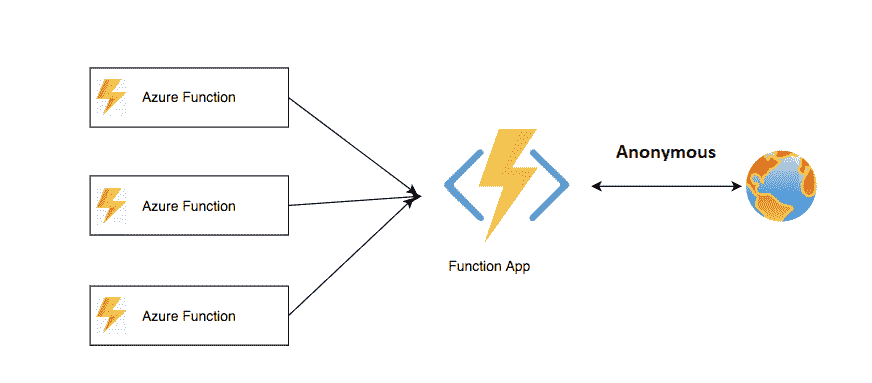

**我们必须构建两条管道来使用 Azure DevOps 部署该应用程序:构建管道和发布管道**

## 构建管道

该管道从 Azure Repos 或任何版本控制中获取代码，并经历一系列操作，如安装、测试、构建以及最终生成为部署做好准备的工件。

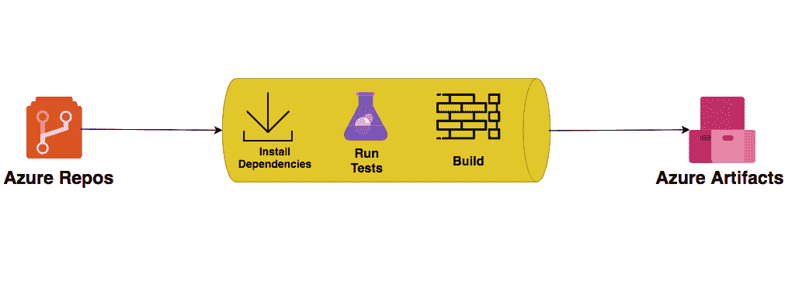

## 释放管道

这个管道获取工件，并将其部署到功能应用程序中。您可以拥有发布到生产环境的预部署条件，如批准、部署触发器等。

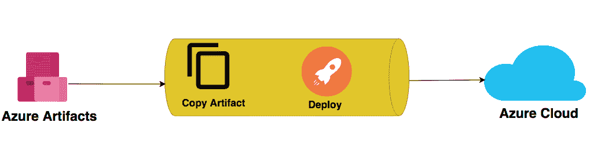

# **2-先决条件**

首先，您需要设置一个 Microsoft Azure 帐户来使用 Function App Service 部署代码。让我们通过下面的链接创建帐户。

*   [微软 Azure 账户](https://azure.microsoft.com/en-us/)
*   [登录 Azure DevOps](https://azure.microsoft.com/en-us/services/devops/)
*   Visual Studio 代码
*   [Azure Functions 核心工具](https://docs.microsoft.com/en-us/azure/azure-functions/functions-run-local#install-the-azure-functions-core-tools)3 . x 版本
*   Visual Studio 代码的 [Python 扩展](https://marketplace.visualstudio.com/items?itemName=ms-python.python)。
*   针对 Visual Studio 代码的 Azure 函数应用程序扩展。
*   [用于 Windows 的 GIT](https://git-scm.com/downloads)
*   [Azure 上的功能 App](https://docs.microsoft.com/en-us/azure/azure-functions/)。

# **3-创建本地项目**

在本节中，您将使用 Visual Studio 代码在 Python 中创建本地 Azure Functions 项目。在本文的后面，您将向 Azure 发布您的函数代码。

1.  在活动栏中选择 Azure 图标，然后在 **Azure: Functions 区域**中选择“创建新项目…”图标。

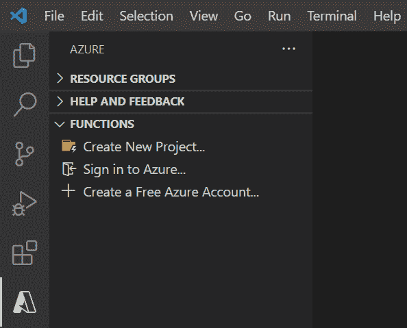

2.为项目工作环境选择一个目录位置，然后选择“选择”。

3.根据提示提供以下信息:

*   *为你的函数项目选择一种语言:选择* ***Python。***
*   选择一个 Python 别名来创建一个虚拟环境:选择您的 Python 解释器的位置。如果没有显示位置，输入 Python 二进制文件的完整路径。
*   *为你的项目的第一个函数选择一个模板:选择* ***HTTP 触发器。***
*   *提供一个函数名:Type* ***HttpExample。***
*   *授权级别:选择* ***匿名*** *，使得任何人都可以调用你的函数端点。选择您希望如何打开您的项目:选择* ***添加到工作区。***

4.使用这些信息，Visual Studio 代码生成一个带有 HTTP 触发器的 Azure Functions 项目。您可以在浏览器中查看本地项目文件。

## 在本地运行该功能

Visual Studio 代码与[Azure Functions Core tools](https://docs.microsoft.com/en-us/azure/azure-functions/functions-run-local)集成，让你在自己的计算机上本地运行这个项目。

1.  按 *F5* 启动功能 app 项目。核心工具的输出显示在终端面板中。您的应用程序在终端面板中启动。您可以看到本地运行的 HTTP 触发函数的 URL 端点。

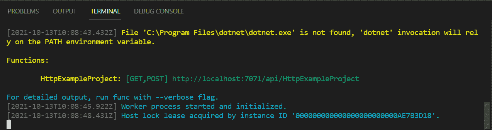

2.运行核心工具，进入 Azure: Functions 区域。在“函数”下，展开“本地项目”>“函数”。右键单击(Windows)**HttpExampleProject**函数并选择立即执行函数。

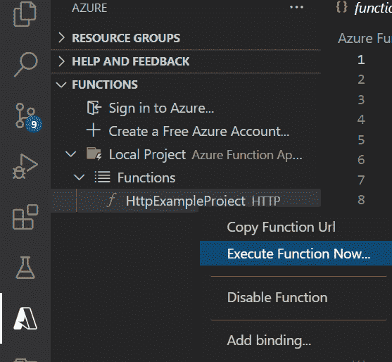

3.在“输入请求正文”中，您会看到请求消息正文值**{“name”:“Azure”}**。按回车键将此请求消息发送到您的函数。

4.当函数在本地执行并返回响应时，Visual Studio 代码中会引发一个通知。有关功能执行的信息显示在终端面板中。

5.按 Ctrl + C 停止核心工具并断开调试器。

在您验证了该函数在本地计算机上正确运行后，就可以使用 Azure DevOps 来创建 CI/CD 管道，以将该函数部署到 Azure Function App。

在 Azure Devops 中创建管道之前，首先我们需要在 Azure Portal 上创建一个功能应用程序，如下所示:

# **4-创建 Azure 功能应用**

登录门户网站，点击**创建资源**，或者您可以从搜索栏中搜索函数 app，以创建并给出必填字段，如 app 名称、存储帐户、资源组、运行时堆栈等。

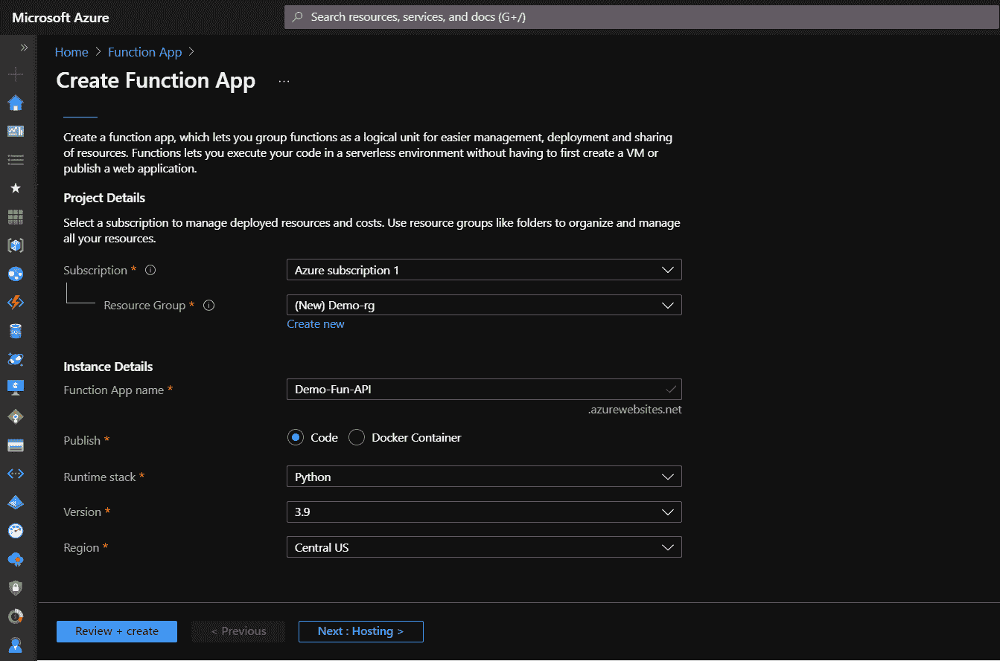

您的设置应该会在一段时间后完成。

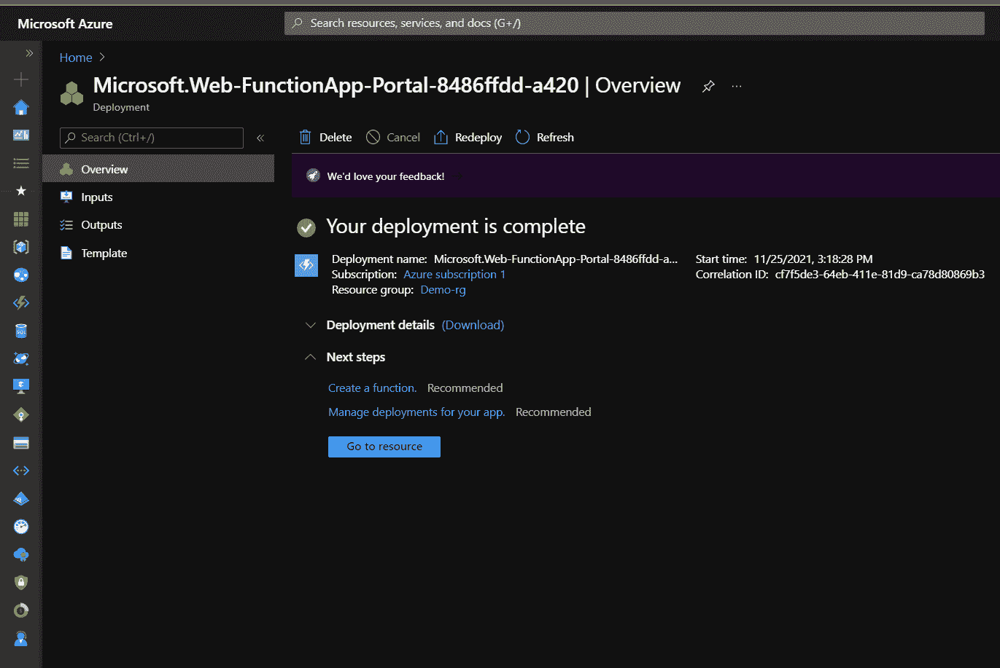

这是创建的函数应用程序，只要它的授权级别是匿名的，您就可以使用该 URL 访问 API。

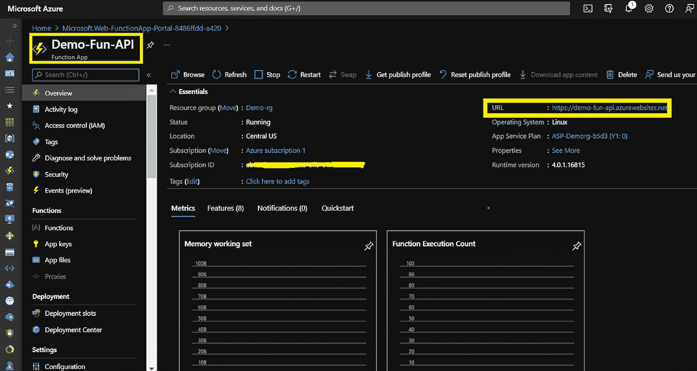

# 5-建立管道

我们需要首先构建管道作为持续集成的一部分。这个管道的工作方式是，当你将代码签入 Github 或 Azure Repos 时，这个管道构建项目，测试它，并使构建工件为部署做好准备。让我们按照所有的步骤来设置这个管道。

1.  在 Azure DevOps 中创建项目
2.  创建一个 Repo 并将你的代码放入 Azure Repos
3.  创建一个从源存储库中获取数据的管道。
4.  安装所有依赖项
5.  运行测试
6.  构建代码
7.  从源复制文件用于暂存
8.  存档所有复制的文件
9.  最后，发布神器。
10.  启用与触发器的持续集成

让我们在您的 Azure DevOps 帐户中创建一个项目。我将这个项目命名为 **Azure_function_demo** ，这是一个私有项目。您可以根据自己选择的可见性将项目设为公共或私有。

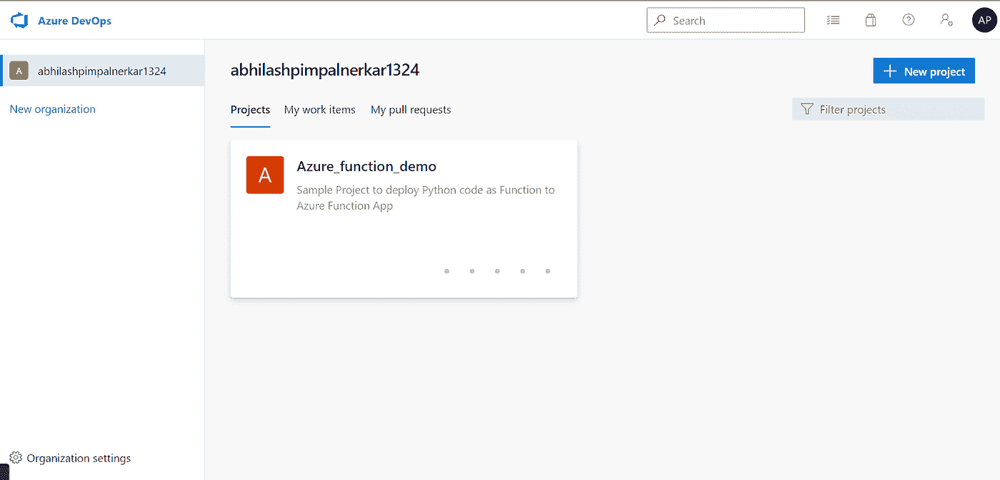

## 将您的代码放在 Azure Repos 中

是时候创建一个 repo 了，将上面示例项目中的所有代码放到这个 repo 中。我创建了一个名为 **Azure_function_demo** 的 repo，并将所有代码推送到这个 repo 中。

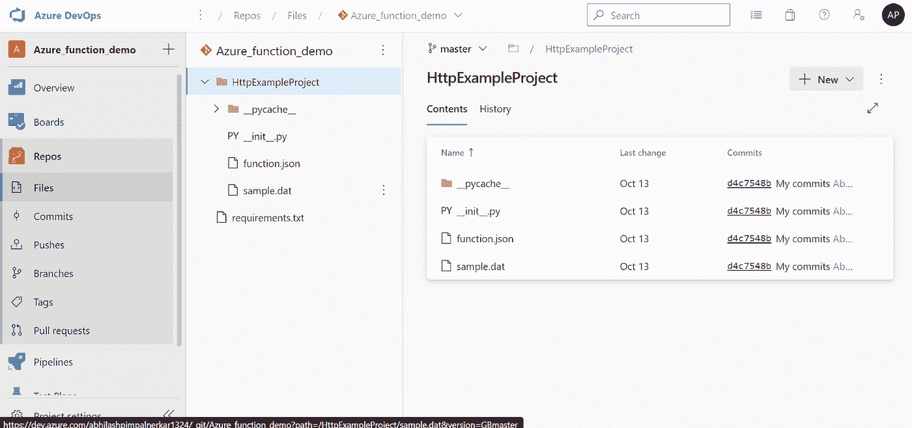

## 创建生成管道

让我们通过选择一个源和存储库分支，并通过选择一个经典编辑器来创建一个管道。

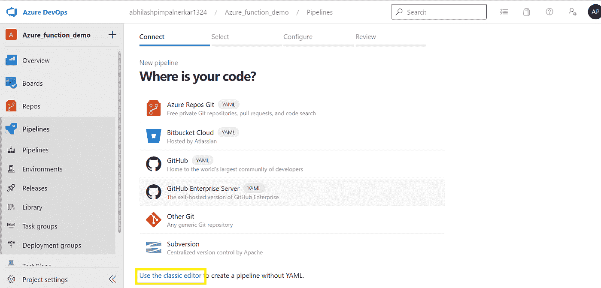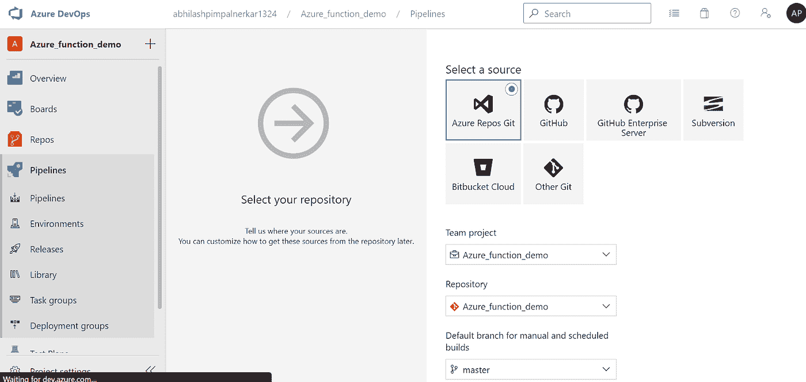

在下一页，为 Python 模板选择 Azure 函数，因为 Azure 为我们提供了现成的模板。

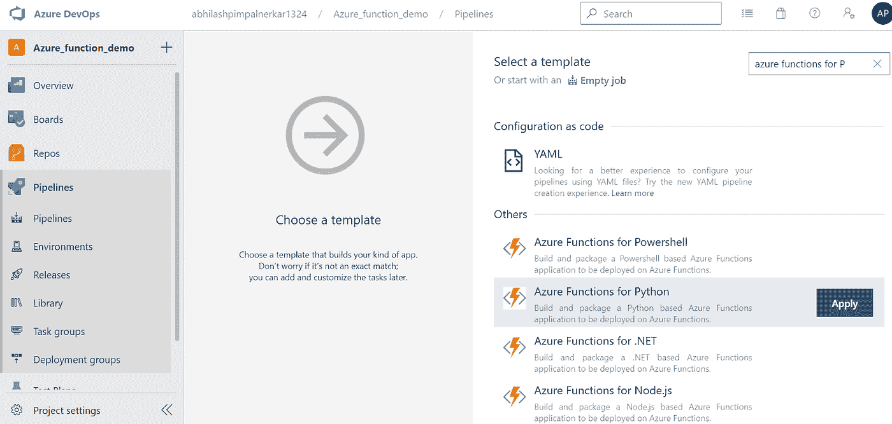

单击“应用”按钮后，您可以看到包含所有这些任务的下一个屏幕。您可以根据需要更改管线名称。我已经改成 Azure_function_demo-CI 了。如果您注意到它使用 Python 版的任务，安装依赖项、构建扩展、归档文件并发布工件。

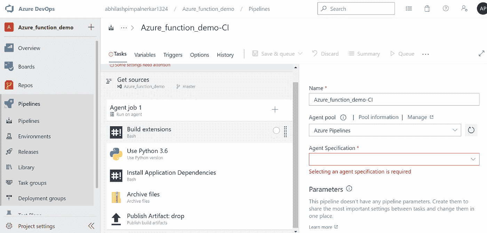

点击保存将此保存到任何文件夹中。让我们来定义触发器。

## 定义触发器

> 让我们来定义这个构建的触发器。单击触发器选项卡，并启用持续集成。对 Azure_function_demo repo 主分支的任何提交都会触发此管道。

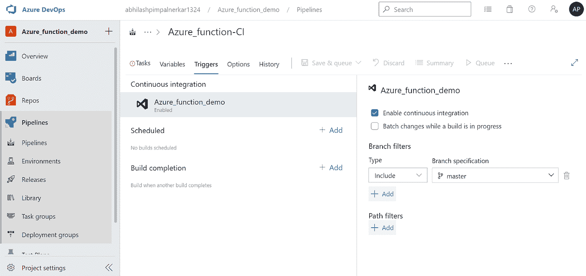

这次让我们通过单击队列来手动构建管道。

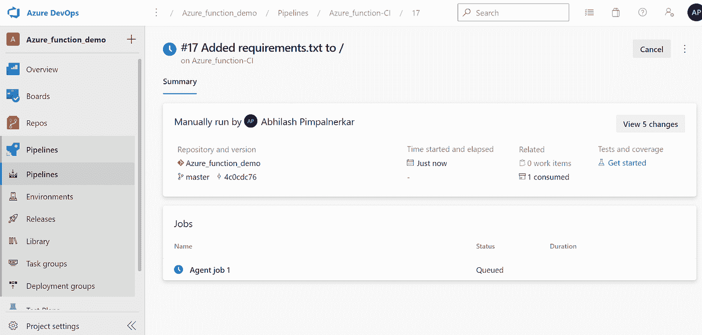

单击代理作业 1 查看结果。

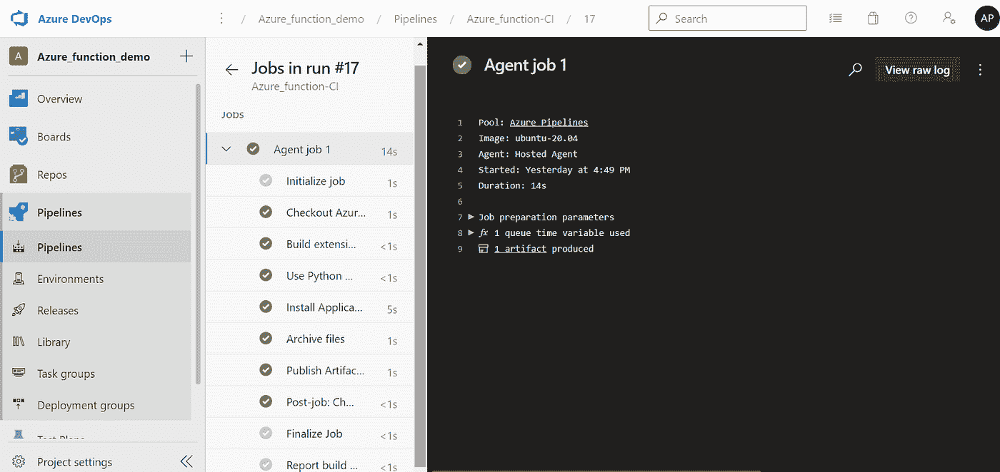

单击日志屏幕中的工件链接。您将能够在如下的 zip 文件中看到创建的工件。

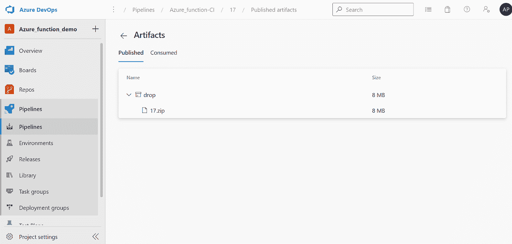

您可以下载 zip 文件来交叉验证您创建的所有函数是否都在其中。

# 6-释放管道

我们已经完成了持续集成部分，让我们为持续交付构建一个发布管道。单击“发布”、“新发布”,然后按照下面的说明进行操作。

1.  定义工件。
2.  选择用于部署的模板。
3.  给舞台起个名字。
4.  定义舞台上的任务。
5.  添加工件。
6.  启用持续部署的触发器。

## 定义工件

第一步是定义工件，以便它在构建管道完成后获取特定的工件。确保你有一个触发器。

当您点击发布时，您会看到一个带有新管道按钮的空白页面。点击它来创建一个新的发布管道。选择一个名为 ***的模板，将一个功能 app 部署到 Azure Functions。***

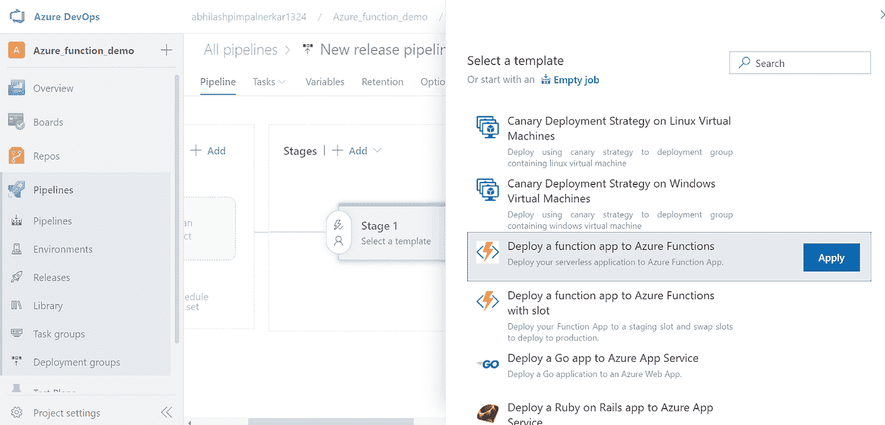

你可以说出艺名。我把它命名为戴夫。

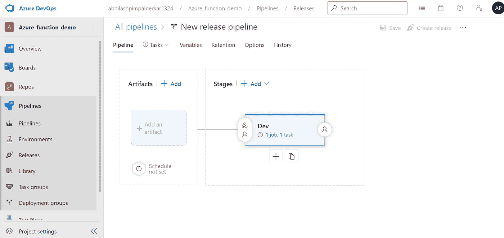

单击阶段的作业任务部分以定义任务。

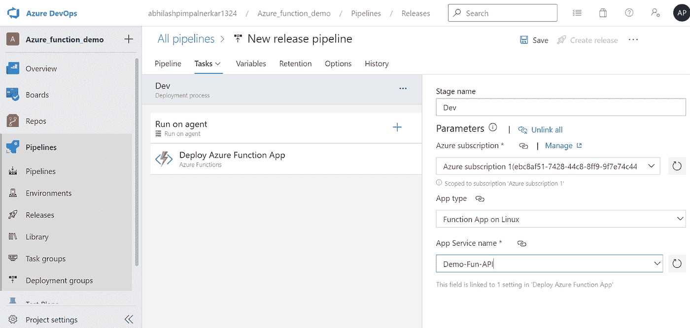

我们需要通过选择源管道来添加工件

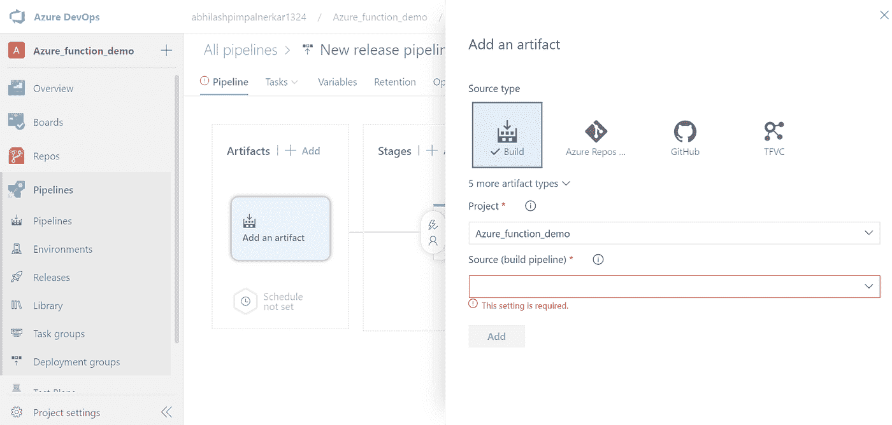

添加之后，您就可以定义触发器了。点击闪光图标

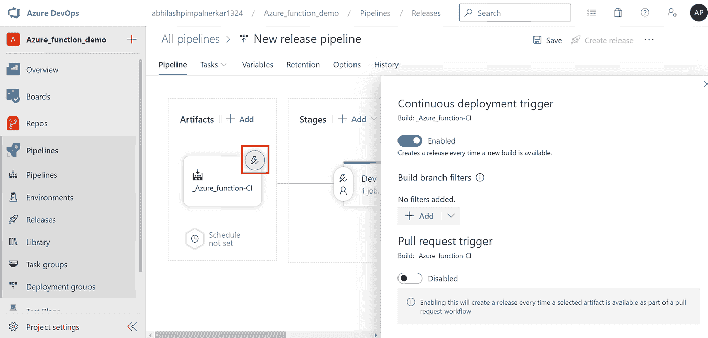

# 7-演示

演示时间到了。一旦您将代码签入到 master，它就会触发构建管道。通常，您不直接将代码签入 master，而是创建一个 pull 请求。为了简单起见，我使用了主分支。

我手动触发构建管道，然后自动触发发布管道。一旦构建完成，创建的工件将触发发布管道。

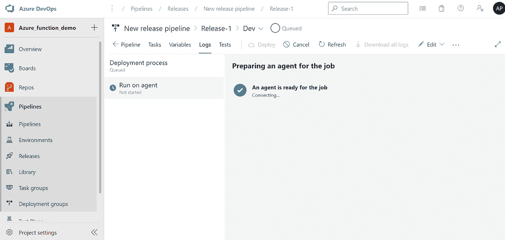

一旦成功，就可以去门户里的功能 app 验证功能了。

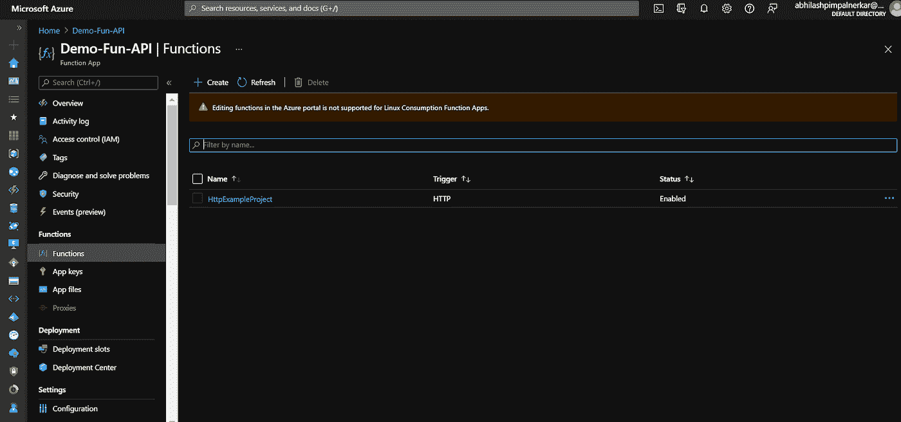

您可以直接在门户中测试该函数，也可以使用函数 URL 并在浏览器或 postman 中点击它。您可以从门户以及使用函数 URL 看到下面的响应。

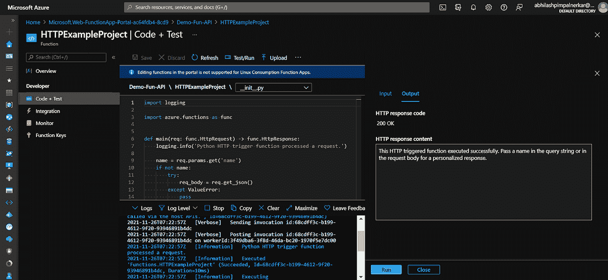

点击下面已部署功能的 URL 后，您将看到下面的响应。

***https://demo-fun-API . azure websites . net/API/HTTPExampleProject？*name = Abhilash**

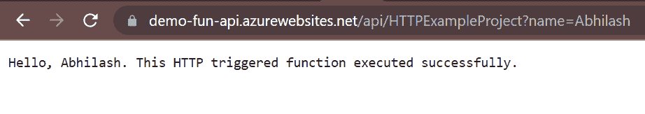

# 8-摘要

*   构建 Python REST API 的一种方式是使用 Azure function app。
*   当你将 Azure 功能部署到产品中时，有很多部署策略。部署策略完全取决于您的应用程序架构和您使用的 DevOps 工具。
*   使用 Azure DevOps，您就有了一个现成的模板来部署您的功能应用程序。
*   您必须构建两条管道来使用 Azure DevOps 部署此应用程序:构建管道和发布管道。
*   只要源存储库中有一个提交，构建管道就会生成工件。
*   发布管道获取工件并将其发布到适当的环境中。
*   应该提供/创建适当的服务连接，以便与管道一起工作，实现身份验证目的
*   您可以使用任务组将常见任务放在整个环境中的一个位置。
*   您可以使用 Azure key vault 来存储您的存储帐户的访问密钥。
*   您可以在创建任务时利用管道变量。这是将关键数据放入管道各个阶段的便捷方式。

# 9-结论

这是使用 Azure DevOps 部署功能 app 的基本方式。我没有在这些管道中使用变量、Azure key vault、任务组，因为我们正在部署到一个环境中。这些超出了本文的范围。

# **参考文献**

1.  [https://docs . Microsoft . com/en-us/azure/azure-functions/create-first-function-vs-code-cs harp？tabs =进程中](https://docs.microsoft.com/en-us/azure/azure-functions/create-first-function-vs-code-csharp?tabs=in-process)
2.  [https://docs . Microsoft . com/en-in/azure/developer/JavaScript/tutorial/vs code-function-app-http-trigger/tutorial-vs code-server less-node-test-local](https://docs.microsoft.com/en-in/azure/developer/javascript/tutorial/vscode-function-app-http-trigger/tutorial-vscode-serverless-node-test-local)

Visit us at [https://www.globant.com/studio/cloud-ops](https://www.globant.com/studio/cloud-ops)