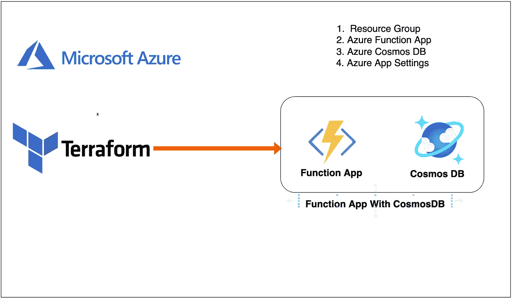

# 如何在 Terraform 中用函数 App 和 CosmosDB 创建后端模块

> 原文：<https://medium.com/bb-tutorials-and-thoughts/how-to-create-backend-modules-with-function-app-and-cosmosdb-in-terraform-56ab07379f97?source=collection_archive---------0----------------------->

## 包含示例项目的逐步指南

在 Terraform 中，模块是模块化 terraform 代码并使其可重用的方法。我们不应该为每个资源创建一个包装器，并把它称为一个模块。该模块应该是一组逻辑资源，您可以在其中立即进行部署。