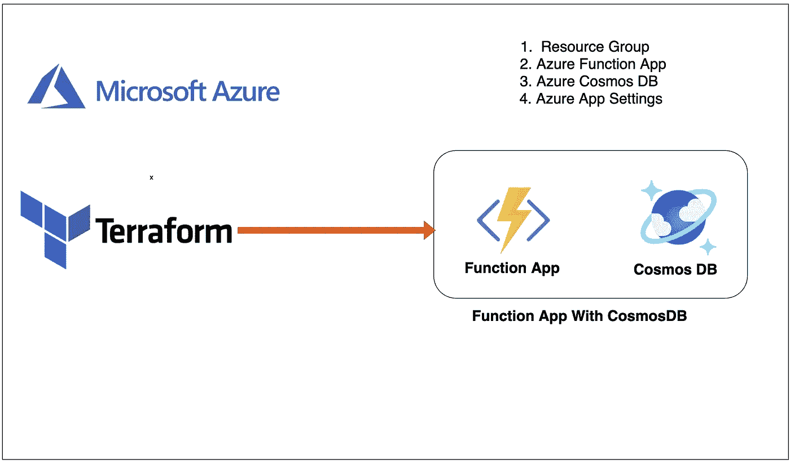

# 如何用 Azure Function App 创建后端，用 Terraform 创建 CosmosDB

> 原文：<https://medium.com/bb-tutorials-and-thoughts/how-to-create-backend-with-azure-function-app-and-cosmosdb-in-terraform-db84467a428d?source=collection_archive---------0----------------------->

## 包含示例项目的逐步指南

有很多方法可以在 Azure 上构建后端基础设施，如应用服务、功能应用等。您甚至可以在 Kubernetes 上构建和部署整个后端。公司越来越多地将无服务器架构用于后端。在…