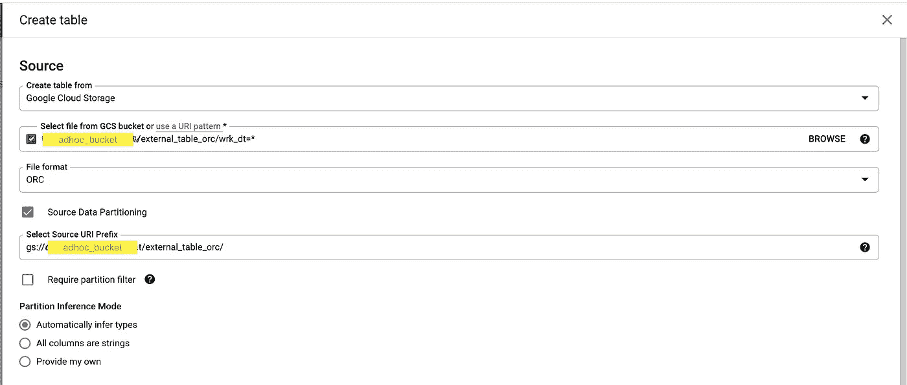
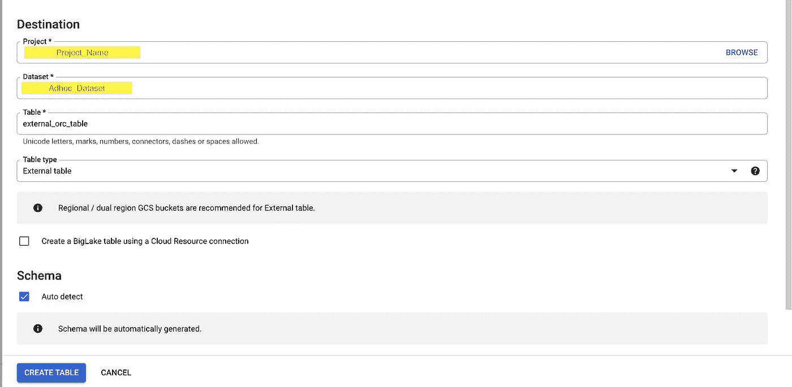
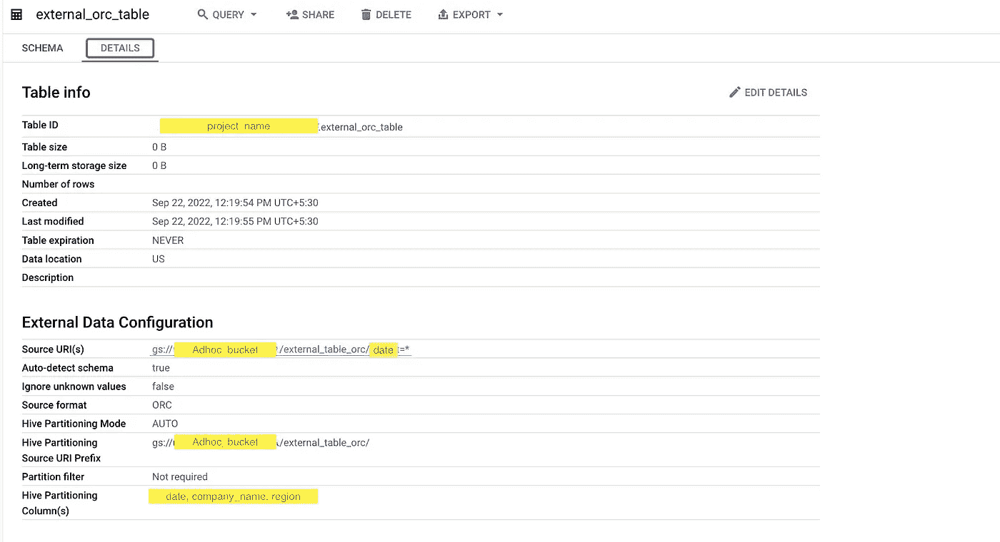
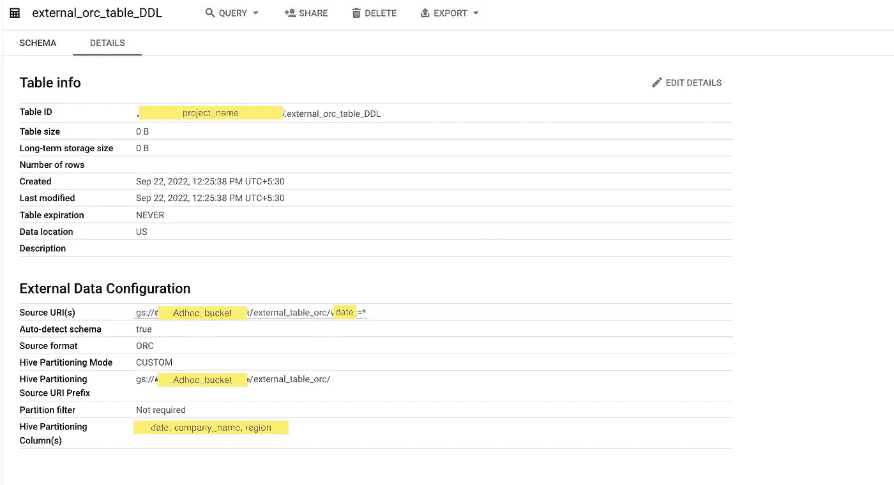

# 如何用外部数据源(orc)创建 BigQuery 表？

> 原文：<https://medium.com/walmartglobaltech/how-to-create-bigquery-table-with-external-data-source-orc-218bb9e92388?source=collection_archive---------0----------------------->

Image Source : Image taken by [Avinash Prakash](https://medium.com/u/dcb4a49113ef?source=post_page-----218bb9e92388--------------------------------)

**简介:** 大查询外部表利用存储在各种 google 存储(GCP 存储桶、数据存储、Firestore)上的数据来节省与将数据从其他 google 存储转移到大查询内部存储(巨像)相关的存储和转移成本。

**BigQuery 支持查询以下格式的云存储数据:**
逗号分隔值(CSV)
JSON(换行符分隔)
Avro
ORC
Parquet
Datastore exports
Firestore exports
**big query 支持查询这些存储类的云存储数据:**
。标准
。近线
。Coldline
。存档
**外部 vs 本地表:**
1。外部表从作为数据源的云存储中扫描数据——这具有总是查询最新数据的优势。然而，虽然可以限制扫描的数据量，但是外部表没有利用缓存，查询可能会更慢。
2。原生表将数据导入 BigQuery，并允许您从那里进行查询。云存储不收取数据传输费用，但会收取每份扫描数据的正常费用。对于原生表，您只能看到创建表时导入的数据，这是一个手动过程。查询可能比外部表更快。
**如何在外部分区的 ORC 数据上创建表:** 使用 BQ 控制台创建表:

Create table google console part 1

Create table google console part 2

**一些重点要突出:**
1。选择“Google Cloud Storage”作为“Create Table from”下的选项。在“从 GCS 存储桶中选择文件”中，只需提供带有日期=*(根据您的表的第一个分区)和后缀的存储桶名称。在我们的示例中，它将是“GS://ad hoc _ bucket/external _ table _ orc/date = *”。在“文件格式”下，选择为“ORC”
2。选择“源数据分区”复选框。提供“选择源 URI 前缀”作为“GS://ad hoc _ bucket/external _ table _ orc/”，这是表在 bucket 中的位置，并选择“分区推断模式”作为“自动推断类型”。
3。选择“表类型”为“外部表”
4。选择“自动检测模式”复选框。这将允许自动检测列名和数据类型。如果您不想从数据源推断模式，可以选择手动提供模式。只需取消选择“自动检测”并添加模式细节。
5。最后，单击 create table 按钮创建外部表。

自动分区表的外部表信息:

External Table Info

**重点突出:**
1 .桌子大小:0 B
2。表没有在 BigQuery 存储中存储任何数据。
3。来源 URI:GS://ad hoc _ bucket/external _ table _ orc/date = *
4。表格数据位于 GCS 桶位置上方。
5。源格式为 ORC，配置单元分区模式为 auto
使用自定义分区创建表 BQ DDL:

以下查询从 GCS 存储桶创建表，分区列为 work_date，company_code，region_code，其他列从配置单元表元数据中自动推断。

创建或替换外部表 Project_Name。带有分区列的 ad hoc _ dateset . external _ orc _ table _ DDL
(
DATE DATE，
company_name STRING，
region STRING
)OPTIONS(uri =[' GS://ad hoc _ bucket/external _ table _ orc/DATE = *]，
format=orc，
hive _ PARTITION _ uri _ prefix = ' GS://ad hoc _ bucket/external _ table _ orc/')；

External Table DDL Properties

如果你仔细看上面的截图，你会注意到所有的细节都是一样的，除了配置单元分区模式(自定义)。

结论:

1.  如果我们想对 google buckets 中的数据进行快速分析，而不需要将大量数据复制到 BQ 内部存储，那么可以使用 BQ 外部表。
2.  BQ 外部表可用于快速更改 google bucket 或任何其他 BQ 外部表支持数据存储的参考数据。
3.  如果我们想从存储在 google bucket 上的原始文件中提取数据，然后将其加载到 BQ 内部表中，也可以使用它。

*参考文献:*

 [## 外部表| BigQuery | Google 云

### 本页概述了如何使用外部表来查询存储在 BigQuery 之外的数据。大湖表和…

cloud.google.com](https://cloud.google.com/bigquery/docs/external-tables) 

图片来源:所有图片都是在沃尔玛内部沙盒环境实验中拍摄的。