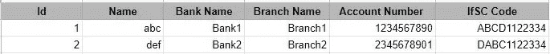
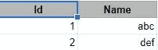
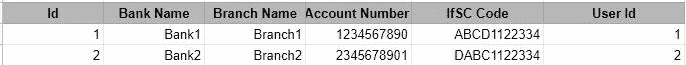

# 如何在姜戈创建自定义迁移

> 原文：<https://medium.com/quick-code/how-to-create-custom-migrations-in-django-610718f49ae2?source=collection_archive---------0----------------------->


最近，我陷入了一个与数据库模式相关的问题。有什么问题吗？让我们先理解这个问题。

有一个表格包含用户的银行账户详细信息和用户个人详细信息。在由其他人开发之后，我必须为一个用户添加多个银行账户。

让我们看看桌子。

`users`银行账户明细表。



Previous users table with a bank account details

当时我想到了两个解决方案。

1.  如果用户添加了 1 个以上的银行账户，则创建另一个包含银行账户的表`bank_accounts`。在这种情况下，1 个银行账户在`users`表中，其他账户在该表中。这种方法不包含任何数据迁移。
2.  为用户的所有银行账户创建单独的表格。在这种情况下，我们必须将银行账户明细从表中移到一个新表中。这种方法包含数据迁移。

由于以下几点，我选择了第二个解决方案。

1.  银行账户是一个不同的实体，必须在一个单独的表中管理。

2.银行账户的 CRUD 操作很简单，因为我们只需要在`bank_accounts`表中执行这些操作。在第一种方法中，我们必须检查`users`和`bank_accounts`表。

#2 方法中的`users`和`bank_accounts`表。



Updated user table



New bank_accounts table

在这种方法中，我需要一个 python 脚本来将银行账户数据从`users`表传输到`bank_accounts`表。我在迁移文件中创建了一个函数来传输这些数据。该函数将在迁移时执行，我们不需要在部署时运行单独的脚本来传输数据和从`users`表中手动删除列。

## 旧型号

Old models.py

## 新型号

New Models.py

## 迁移文件

运行**python manage . py make migration**创建迁移文件。

这是一个使用上述命令自动生成的迁移文件。

Auto-generated migration file

现在我们将增加从`users`表到`bank_accounts`表传输数据的功能。

我们将使用原始查询来获取现有用户，因为我们已经从**模型中的`users`表中删除了银行账户相关字段，但是该字段存在于数据库中。**

## 传递数据的功能

这是带有函数的更新的迁移文件。

Modified migration file

在`bank_accounts`表创建后，从`users`表中删除银行账户相关字段前，运行该功能。

运行 **python manage.py migrate** 并验证来自 shell 的结果。

```
>>> Users.objects.values()
<QuerySet [{'id': 1, 'name': 'name1'}, {'id': 2, 'name': 'name2'}, {'id': 3, 'name': 'name3'}]>>>> BankAccounts.objects.values()
<QuerySet [{'id': 1, 'bank_name': 'bank1', 'branch_name': 'branch1', 'ifsc_code': 'ABCD1122334', 'account_number': '1234567890', 'user_id': 1}, {'id': 2, 'bank_name': 'bank2', 'branch_name'
: 'branch2', 'ifsc_code': 'ABDD1122334', 'account_number': '123456789', 'user_id': 2}, {'id': 3, 'bank_name': 'bank3', 'branch_name': 'branch3', 'ifsc_code': 'ABDDD1122334', 'account_number
': '1234567892', 'user_id': 3}]>
```

WOWWW。运行迁移后，一切都正常。

**感谢您阅读本文。如果你喜欢，点击👏将其评为 50 个** **之一，并与您的朋友分享。这对我很重要。**

***你想看看我的其他文章吗？***

[](/better-programming/using-python-pandas-with-excel-d5082102ca27) [## 在 Excel 中使用 Python 熊猫

### 使用 Python 库执行基本的 Excel 操作

medium.com](/better-programming/using-python-pandas-with-excel-d5082102ca27) [](/aubergine-solutions/working-with-excel-sheets-in-python-using-openpyxl-4f9fd32de87f) [## 使用 openpyxl 在 Python 中处理 Excel 工作表

### 在本教程中，我们将看到如何使用 openpyxl 在 python 中使用 Excel 工作表的演示。

medium.com](/aubergine-solutions/working-with-excel-sheets-in-python-using-openpyxl-4f9fd32de87f) [](/aubergine-solutions/partial-string-search-in-apache-solr-4b9200e8e6bb) [## Apache Solr 中的部分字符串搜索

### 在本教程中，我们将看到如何为部分字符串搜索配置 Apache Solr 的演示。

medium.com](/aubergine-solutions/partial-string-search-in-apache-solr-4b9200e8e6bb) [](/aubergine-solutions/django-jenkins-integration-for-django-project-3fe3251cd6f4) [## Django-Jenkins Django 项目整合

### 在本教程中，我们将看到如何为一个 django 项目集成 django-jenkins 的演示。

medium.com](/aubergine-solutions/django-jenkins-integration-for-django-project-3fe3251cd6f4)