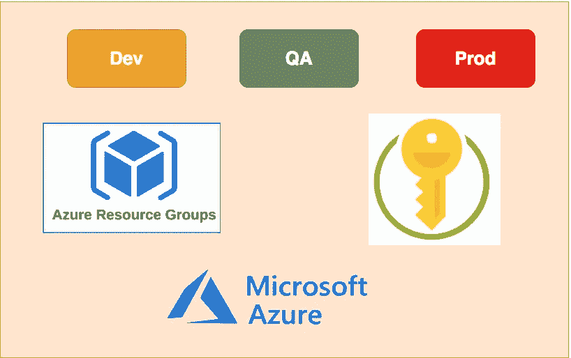

# 如何在 Azure 上创建不同的环境

> 原文：<https://medium.com/bb-tutorials-and-thoughts/how-to-create-different-environments-on-azure-22331d11ea11?source=collection_archive---------0----------------------->

## 在 Azure 上构建不同的环境，如开发、质量保证和生产

每个应用程序出于不同的目的需要不同的环境，每个应用程序至少需要 3 个环境。例如，我们需要一个开发环境，让开发人员自己推送代码并进行测试，一个 QA 环境，让测试人员在我们…