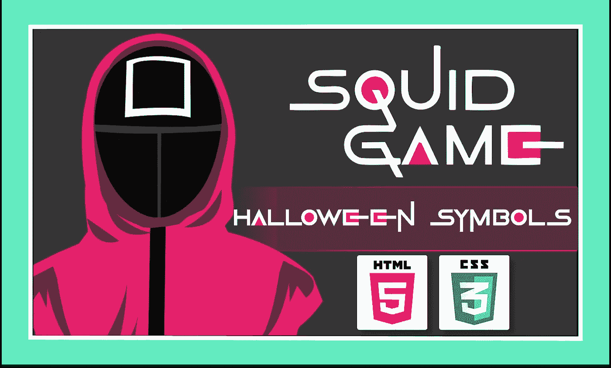
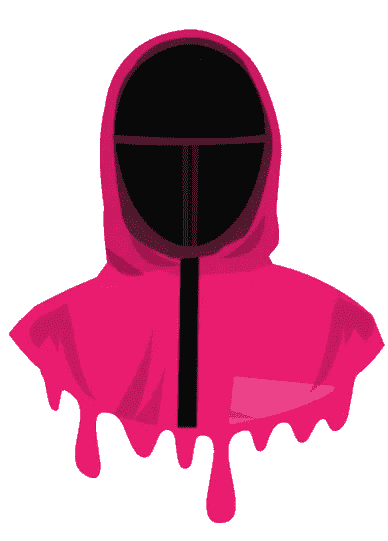
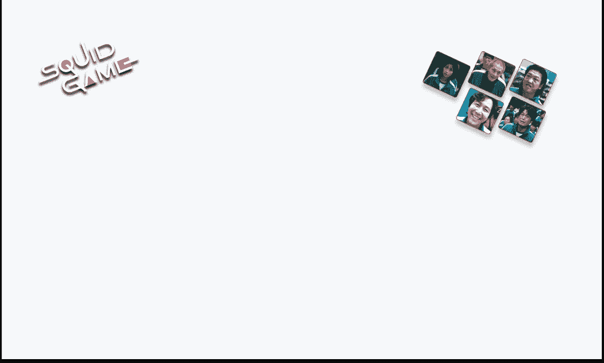

# 如何用 Html & CSS 创建乌贼游戏符号

> 原文：<https://medium.com/quick-code/how-to-create-squid-game-symbols-with-html-css-cf1eac8d6a3c?source=collection_archive---------2----------------------->

## 2 步骤指南创建鱿鱼游戏万圣节符号只使用 HTML 和 CSS。

鱿鱼游戏是孩子们玩的真正的娱乐，在 70 年代和 80 年代的韩国非常有名。

基于这一概念，它成为了最近一段时间网飞上增长最快的韩剧 2021。

你有没有想过我们可以使用编程语言来编码动画乌贼游戏万圣节符号！！！所以我们走吧…

我想看看只用基本的 HTML、CSS 和 JavaScript 为万圣节符号创建一个动画设计有多简单。

因此，在这篇文章中，我将向你展示如何通过 2 个步骤来创建它。

## 步骤 01

创建一个 index.html 文件，并编写下面的代码。

## 第二步:

创建一个 style.css 文件来设计样式，并编写下面的代码。

确保所有的图片和 CSS 文件链接完美。

你可以在这里下载士兵的图片。

soldier.png

你可以在这里下载背景图片。

background.png

希望这对你有帮助。如果你在实现这个过程中有任何困难或者你需要任何帮助，请联系我。