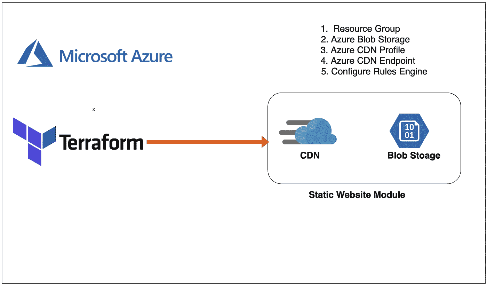

# 如何在 Terraform 中创建静态网站模块

> 原文：<https://medium.com/bb-tutorials-and-thoughts/how-to-create-static-website-module-in-terraform-b39c5b95f4d9?source=collection_archive---------0----------------------->

## 一步一步的指导，包括一个微软 Azure 上的示例项目

在 Terraform 中，模块是模块化 terraform 代码并使其可重用的方法。我们不应该为每个资源创建一个包装器，并把它称为一个模块。该模块应该是一组逻辑资源，您可以在其中立即进行部署。