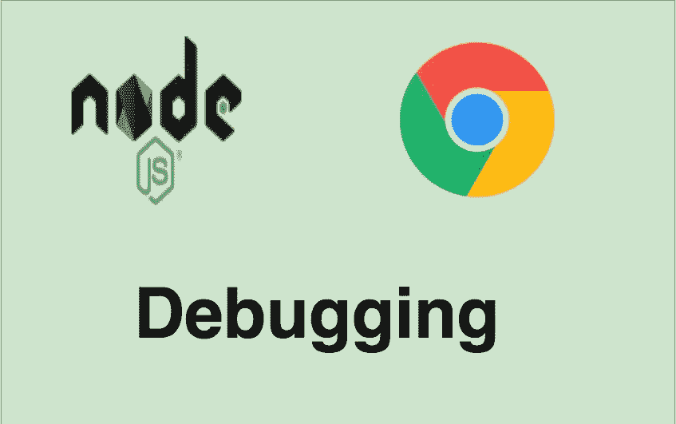

# 如何用 Chrome DevTools 调试 NodeJS 进程

> 原文：<https://medium.com/bb-tutorials-and-thoughts/how-to-debug-a-nodejs-process-with-chrome-devtools-1e5252c039ef?source=collection_archive---------0----------------------->

## 带有示例项目的详细指南

调试在软件开发中非常常见，知道如何调试 NodeJS 应用程序非常重要。当谈到 NodeJS 应用程序时，我们可以使用 Chrome DevTools 调试该应用程序。您需要在 inspect 模式下启动应用程序，以便该过程在可调试状态下启动。