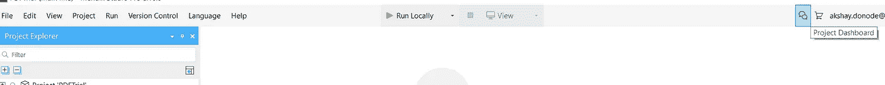

# 如何在 Mendix 中调试

> 原文：<https://medium.com/mendix/how-to-debug-in-mendix-aff65bd01ebc?source=collection_archive---------0----------------------->

# Mendix 提供了一个内置的调试功能。调试是必要的，以避免运行时的技术错误，我们能够知道应用程序的确切流程。

从调试开始，你需要在微流中添加断点。

**检查断点:**

为了检查所有断点，我们在 Mendix 中有一个预建选项。点击查看->调试窗口。

断点窗格显示当前应用程序的微流的所有断点。调试后不要忘记删除断点！！

您可以从断点平面中删除断点，只需取消选择微流的活动。

断点列表:

开发完成后，单击“本地运行”。断点将暂停执行。这对于分析当时的执行流和数据非常有用。当调试器触发时，您将看到 Mendix 图标在任务栏上闪烁。

## 调试窗格:

在调试窗格中，您有 4 个选项:单步执行、单步跳过、单步退出和继续。

**步入:**这意味着调试器步入子微流或循环。

**单步执行:**将调试器移动到微流中的下一步。

**单步执行:**它基本上与单步执行相反，因为单步执行指示调试器离开子微流或循环。

**继续:**调试器应该继续运行，直到它到达另一个断点。

在调试应用程序时，如果想要调试特定的活动，可以添加断点。在断点窗格中，您可以启用、禁用和删除断点。有时您需要配置一个断点，以便微流在特定条件下触发。

可变窗格:

变量窗格显示了当前微流中涉及的变量，以及它们在通过调试器窗格在微流中变化时的值。它将显示与实体、引用、当前用户信息和设备类型相关的所有信息。这些值会随着您在调试器中执行的每一步而更新。

调试后，您应该删除所有的断点，如图所示。

您也可以从“断点”窗格中移除所有断点。

## 在云上调试:

首先，打开项目仪表板。单击如图所示的图标。

单击部署>环境>显示调试器信息。点击后，弹出页面显示一个网址和密码。

现在转到 Mendix studio pro，打开调试器窗格，点击连接，填写网址和密码。

成功连接后,“连接”选项将变为“断开”。现在向微流添加断点，并在 Mendix 云上部署应用程序。

**提示:检查断点，在云上部署后，有时断点会被禁用。**

现在点击微流(通过按钮)开始调试，你会看到 Mendix 图标在任务栏上闪烁。打开 Mendix studio pro 并检查调试器。

# **结论:**

在两种环境中(本地和 Mendix 云上)调试 Mendix 都很容易，只需几个步骤。最重要的是当你开始调试时打开调试器窗格和变量窗格并行。在“变量”窗格中，尝试理解所有变量以及它们是如何变化的，以便更好地理解您的逻辑在做什么，以及如何修复它。