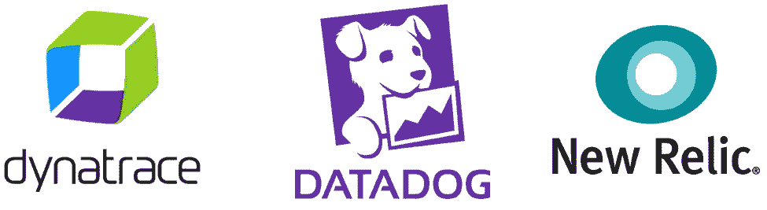
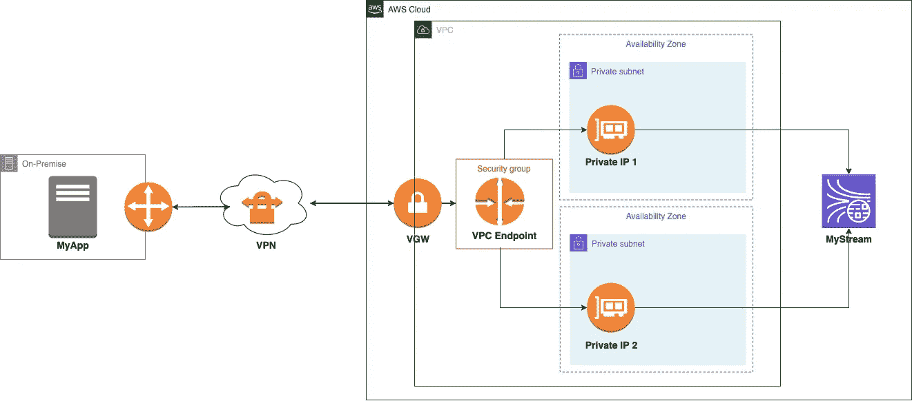
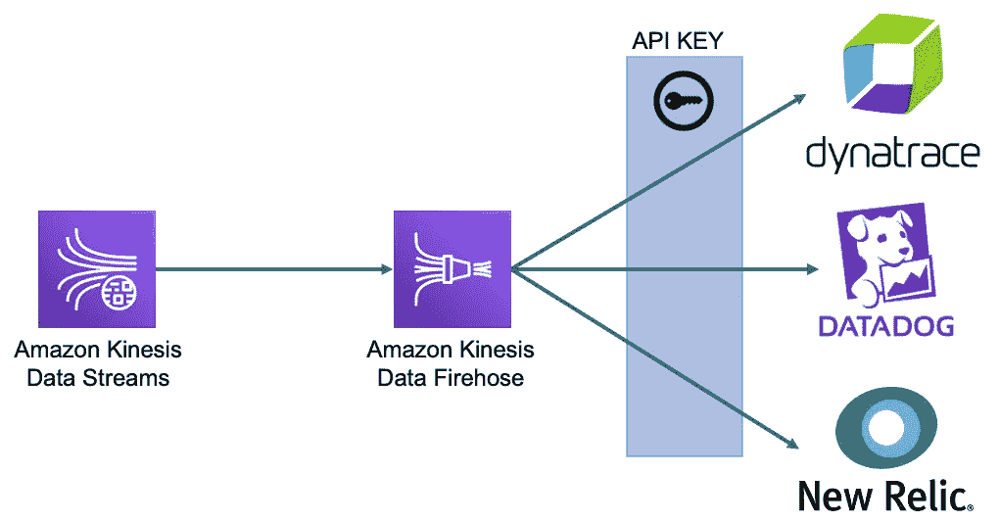
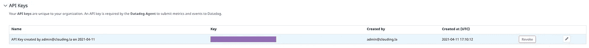
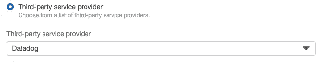
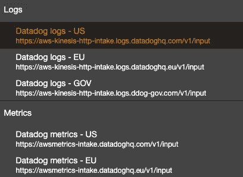
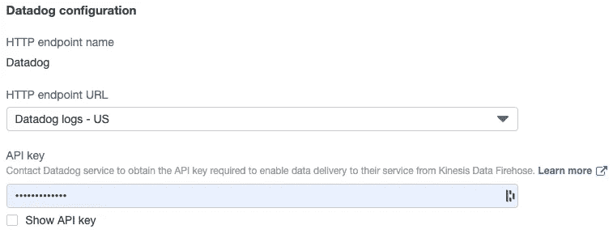
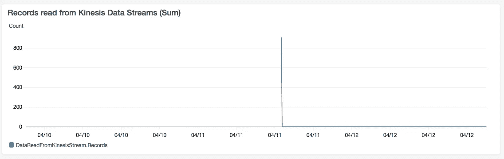
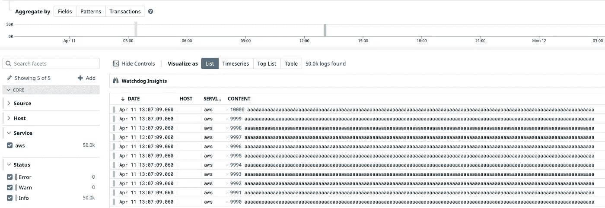
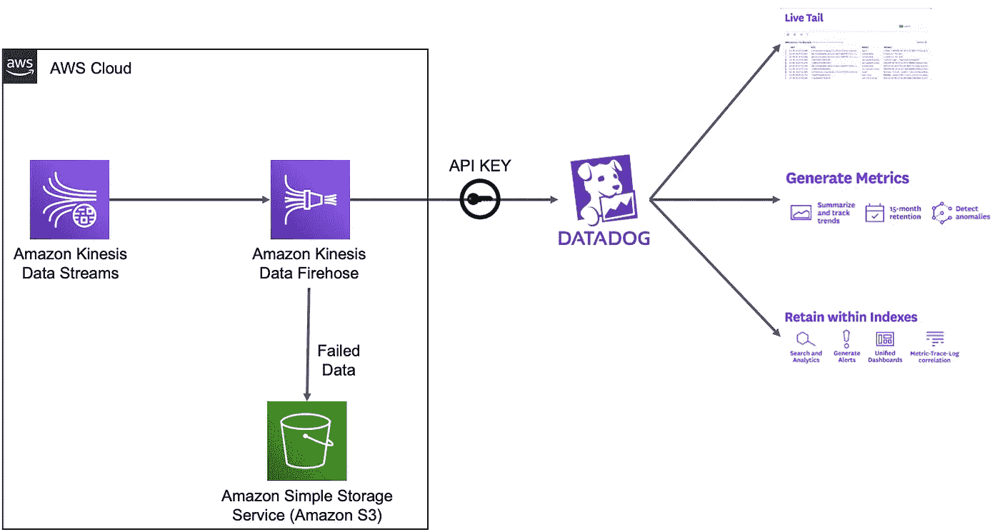

# 如何使用 Amazon Kinesis Data Firehose 将您的日志/指标交付给 Datadog

> 原文：<https://medium.com/globant/how-to-deliver-your-logs-metrics-to-datadog-using-amazon-kinesis-data-firehose-8bfeb5d43f44?source=collection_archive---------0----------------------->

AWS 数据和分析服务不断发展；最近，我看到亚马逊 Kinesis Data Firehose 允许第三方目的地，如 Dynatrace、Datadog 和 NewRelic 等。这种新的集成将允许我们轻松地将我们的日志和指标流提供给这些提供商。

Some of the third party integrations

当我看到这个新版本时，我开始着手我之前实现的一个架构，你可以在这个[链接](/globant/ingesting-data-in-kinesis-data-streams-using-kpl-for-on-premise-application-e1957a3bfe59)看到。因为我们通过 VPN 在本地将许多日志接收到 AWS。然后，我决定测试新功能，并实现与 datadog 的集成，看看它如何在不利用以前实现的功能的情况下让日志到达 Datadog。

我与 Datadog 进行了集成，以测试这一新功能，并能够利用该工具为我们带来的优势:

*   日志解析。
*   日志充实。
*   指标的生成。
*   过滤和优先排序。

# 集成是如何工作的？

与这些提供者的集成都是通过一个 API 键完成的；您必须选择正确的端点，并使用从服务生成的 API 密钥。

# 数据狗集成

1-进入[数据狗配置页面](https://app.datadoghq.com/account/settings#api)。

2-创建一个 API 密钥。

3-创建 Amazon Kinesis 数据消防软管，并为 Datadog 选择端点。

4-选择 HTTP 端点 URL。

5-放入步骤 2 中的 API 密钥。

# 检查集成

在 Amazon Kinesis Data Firose monitoring 选项卡中检查从 Amazon kine sis 数据流(Sum)中读取的记录。

检查[数据狗日志](https://app.datadoghq.com/logs)。图像中的日志是从[样本 KPL](https://github.com/awslabs/amazon-kinesis-producer/tree/master/java/amazon-kinesis-producer-sample) 生成的。

一旦您在 Datadog 中有了所有的日志，您就可以利用它提供的所有功能。

# 最终架构和结论

在上面的架构中，Amazon Kinesis 数据流从运行 KPL 的本地应用程序接收信息。该信息通过 VPN 并使用 VPC 端点传输；它到达了 Kinesis 数据流。它将整个 Amazon Kinesis 数据消防水管流传送到数据狗。

1-通过 Amazon Kinesis Data Firehose，管理日志和指标的集成更加容易。

2-所有集成必须使用 API 键；为此，您必须参考第三方提供商的文档。

3-这些集成将允许您利用这些第三方提供商在日志管理和监控方面提供的功能。

4-无法发送到第三方提供商的数据可以存储在本地存储桶中。

5-将有可能在 Amazon Kinesis 数据流中集中 N 个日志源，并使用 Amazon Kinesis 数据消防软管发送到 Datadog 这个用例非常普遍，因为许多公司使用其他提供商的工具作为他们的监控和日志记录核心。

在这篇文章中，我将讨论 Dynatrace、Datadog 和 NewRelic。尽管如此，您还必须考虑其他第三方集成，如 LogicMonitor、MongoDB Cloud、Splunk 和 Sumo Logic。

许多人会想为什么不直接在实例上安装 Datadog 代理，避免使用 Kinesis？在这种情况下，使用 Amazon Kinesis 数据流和 Amazon Kinesis Data Firehose 允许 AWS 中有更多可以使用日志的流，例如为 S3 提供日志的流使用 Amazon Quicksight 并可视化信息。

— [卡洛斯·桑布拉诺](https://www.czam.dev/)