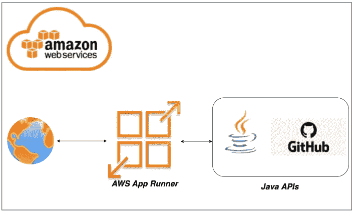

# 如何在 GitHub 的 AWS App Runner 上部署和运行 Java APIs

> 原文：<https://medium.com/bb-tutorials-and-thoughts/how-to-deploy-and-run-java-apis-on-aws-app-runner-from-github-4d364d277a60?source=collection_archive---------0----------------------->

## 一步一步的指导，包括一个带有源代码库的示例项目

如果您希望通过选择运行时在托管平台上部署应用程序，AWS App Runner 是正确的选择。您可以在 App Runner 中配置和构建整个 API，而不用担心您这边的配置…