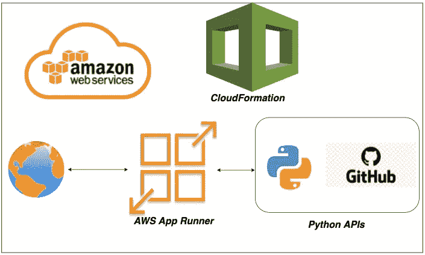

# 如何使用 CloudFormation 在 AWS App Runner 上部署和运行 Python APIs

> 原文：<https://medium.com/bb-tutorials-and-thoughts/how-to-deploy-and-run-python-apis-on-aws-app-runner-with-cloudformation-cf9c6fd14cf6?source=collection_archive---------0----------------------->

## GitHub 示例项目的逐步指南

AWS CloudFormation 是一个作为代码工具的基础设施，您可以在 AWS 上提供基础设施。如果您希望通过选择运行时在托管平台上部署应用程序，AWS App Runner 是正确的选择。您可以配置和…