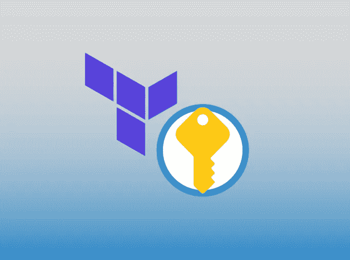
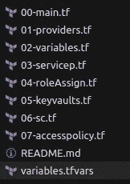
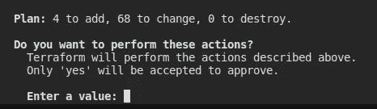

# 如何使用 Terraform 部署 Azure Key Vaults

> 原文：<https://medium.com/globant/how-to-deploy-azure-key-vaults-with-terraform-94b04031fa0e?source=collection_archive---------0----------------------->



# 介绍

当我们开发我们的应用程序时，特别注意我们保护秘密的方式以及我们如何控制对它们的访问是很重要的。从无意的错误到恶意的攻击，我们需要正确管理秘密的原因有很多。

如果你正在使用 Azure stack 技术，Azure Key Vault 是一个很好的云服务，可以保护你的秘密。它允许您存储密码、证书或密钥等秘密，您可以管理谁或哪些服务可以访问您的秘密，并且您可以控制他们将拥有的权限类型。

在大型项目中，你可能会使用不同的产品，每个产品都将使用不同的环境，如开发、TST、UAT 和生产。因此，如果遵循最佳实践，每个应用程序和每个环境都需要一个密钥库。这将允许你妥善管理你的秘密，也将减少在违反情况下的影响。

如果你有少量的项目，它们相对容易管理，但是当你有大的项目时会发生什么呢？幸运的是，今天我们有不同的工具和服务可以帮助我们。今天，我将谈论 Terraform 以及我们如何使用它来管理我们的密钥库。

引用 Terraform 官方网站:“HashiCorp Terraform 是一个基础设施代码工具，允许您在可读的配置文件中定义云和本地资源，您可以对这些文件进行版本化、重用和共享。”基本上，它帮助您以更有效的方式将基础设施配置为代码。它在一个状态文件中跟踪您的真实基础设施，该文件充当您的环境的真实来源。然后，创建并配置 terraform 文件，对实际基础设施进行修改。

考虑到上述情况，我将分享我用来维护我们的基础设施的脚本，以创建必要的密钥库，分配权限并生成服务连接，以将其与 Azure DevOps 集成。

在本文中，我们将讨论以下几点:

1-需求:测试本文应该运行的软件。

2-地形脚本:所有文件及其脚本。

3-结论:本文的成果！

4-参考资料:如果你想了解更多这方面的信息。

# 要求

1.  Azure 的基础知识
2.  您需要具备:

*   Azure 订阅
*   Azure Devops 项目
*   已经创建了资源组
*   只有一个容器的存储帐户
*   从 azure devops 生成的个人访问令牌(PAT)
*   客户端 ID 和客户端机密

3.Terraform 应该安装并配置在运行脚本的机器上

# 地形脚本

这些脚本的主要目标是:

*   为每个项目创建一个密钥库，一个用于开发，一个仅用于测试环境。
*   创建 Azure Devops 所需的服务连接。
*   为将管理密钥保管库的用户分配所有权限。

为了以有效的方式工作，我们将有不同的地形文件。



## 变量. tfvars

答。tfvars 文件是一个 terraform 文件，您可以在其中声明变量。然后在你的脚本文件中，你通过写变量来引用它们。$(变量名称)。

因此，在这个文件中，我们将编写所有要使用的变量:

pat= "xxxxxx" →在 azure devops 创建的个人访问令牌

sub_id_dev= "xxxxxx" →您在 azure 中的订阅 id

tenant_id= "xxxxxx" →您的租户 id

client_id= "xxxxxx" →您的客户 id

client_secret= "xxxxxx" →您的客户机密

sa_resource_group = "xxxxxx" →存储帐户资源组

storage_account= "xxxxxxx" →存储帐户名称

container_name = "xxxxxx" →容器名称

key = "xxxxxx" →将要保存在容器中的文件的名称

org_service_url = "xxxxxx" →您在 azure devops 中的组织 url

## 00-main.tf

我们配置我们的 terraform 所需的提供商:

```
terraform {
  required_providers {
    azuredevops = {
      source = "microsoft/azuredevops"
      version = "0.1.0"
    }

    azurerm = {
      source  = "hashicorp/azurerm"
      version = "=2.46.0"
    }azuread = {
      source  = "hashicorp/azuread"
      version = "=2.11.0"
    }
  }
  backend "azurerm" {
  resource_group_name  = var.sa_resource_group
  storage_account_name = var.storage_account
  container_name       = var.container_name
  key                  = var.key
  subscription_id      = var.sub_id_dev
  tenant_id            = var.tenant_id
  }
}provider "azurerm" {
  features {}
}
```

## 01-providers.tf

azure devops 和 azurerm 提供程序的配置:

```
provider "azuredevops" {
  org_service_url = var.org_service_url
  personal_access_token = var.pat
}provider "azurerm" {
  features {}
  subscription_id =  var.sub_id_dev
  tenant_id = var.tenant_id
  client_id       = var.client_id 
  client_secret   = var.client_secret
  alias = "non-prod"
}
```

## 02-变量. tf

这里我们定义了每个项目的变量。我们可以添加我们需要的项目数量:

*   kv_name =我们将为该特定项目分配的密钥库名称
*   rg_dev =开发资源组
*   rg_tst =测试资源组
*   proyecto_ado = azure devops 项目的名称
*   devops =有权修改密钥库的用户的电子邮件。

这是一个示例，您必须根据您的项目替换所有这些变量:

```
variable "p_data" {
    type = list(object({
      kv_name = string,
      rg_dev = string,
      rg_tst = string,
      proyecto_ado = string,
      devops = list(string)

  }))
  default = [
     {
      kv_name = "akvname" 
      rg_dev = "a-dev-rg"
      rg_tst = "a-tst-rg"
      proyecto_ado = "A_PROJECT"
      devops = ["[devops1@gmail.com](mailto:devops1@gmail.com)", "[devops2@gmail.com](mailto:devops2@gmail.com)"]
      },
     {
      kv_name = "bkvname" 
      rg_dev = "b-dev-rg"
      rg_tst = "b-tst-rg"
      proyecto_ado = "B_PROJECT"
      devops = ["[devops11@gmail.com](mailto:devops1@gmail.com)"]
     },
     {
      kv_name = "ckvname" 
      rg_dev = "c-dev-rg"
      rg_tst = "c-tst-rg"
      proyecto_ado = "C_PROJECT"
      devops = ["[devops3@gmail.com](mailto:devops3@gmail.com)", "[devops4@gmail.com](mailto:devops4@gmail.com)", "[devops5@gmail.com](mailto:devops5@gmail.com)"]
     }
  ]
}data "azurerm_subscription" "s_non_prod" {
  subscription_id = var.sub_id_dev
  provider = azurerm.non-prod
}
```

## 03-servicep.tf

为了生成密钥库和 azure devops 项目之间的集成，我们需要为每个密钥库创建一个服务主体。这将允许我们稍后创建服务连接。

```
data "azuread_client_config" "current" {}#Service principal
resource "azuread_application" "app-non-prod" {
  for_each = {for p in var.p_data:  p.kv_name => p} 
  display_name = "KV-${each.value.kv_name}"
  owners       = [data.azuread_client_config.current.object_id]
}resource "azuread_service_principal" "sp-non-prod" {
  for_each = {for p in var.p_data:  p.kv_name => p}
  application_id               = azuread_application.app-non-prod[each.value.kv_name].application_id
  app_role_assignment_required = false
  owners                       = [data.azuread_client_config.current.object_id]feature_tags {
    enterprise = true
    gallery    = true
  }
}resource "azuread_service_principal_password" "sp-non-prod-passwd" {
  for_each = {for p in var.p_data:  p.kv_name => p}
  service_principal_id = azuread_service_principal.sp-non-prod[each.value.kv_name].object_id
}
```

## 04-角色分配. tf

我们必须将角色“Contributor”分配给在每个密钥库中创建的先前的服务主体。

```
#Resource group from each environmentdata "azurerm_resource_group" "dev-rg" {
  for_each = {for p in var.p_data:  p.kv_name => p}
  name = each.value.rg_dev
  provider = azurerm.non-prod
}data "azurerm_resource_group" "tst-rg" {
  for_each = {for p in var.p_data:  p.kv_name => p}
  name = each.value.rg_tst
  provider = azurerm.non-prod
}# Assign Contributor permission to the service principalsresource "azurerm_role_assignment" "sp-dev-roleassignment" {
  for_each = {for p in var.p_data:  p.kv_name => p}
  scope              = data.azurerm_resource_group.dev-rg[each.value.kv_name].id
  role_definition_name = "Contributor"
  principal_id       = azuread_service_principal.sp-non-prod[each.value.kv_name].object_id
  depends_on = [resource.azuread_service_principal.sp-non-prod]
  provider = azurerm.non-prod
}resource "azurerm_role_assignment" "sp-tst-roleassignment" {
  for_each = {for p in var.p_data:  p.kv_name => p}
  scope              = data.azurerm_resource_group.tst-rg[each.value.kv_name].id
  role_definition_name = "Contributor"
  principal_id       = azuread_service_principal.sp-non-prod[each.value.kv_name].object_id
  depends_on = [resource.azuread_service_principal.sp-non-prod]
  provider = azurerm.non-prod
}
```

## 05-keyvaults.tf

在此文件中，我们将为每个项目创建密钥库。每个环境一个:dev 和 tst。

```
data "azurerm_resource_group" "rg_dev" {
  for_each = {for p in var.p_data:  p.kv_name => p}
  name = each.value.rg_dev
  provider = azurerm.non-prod
}data "azurerm_resource_group" "rg_tst" {
  for_each = {for p in var.p_data:  p.kv_name => p}
  name = each.value.rg_tst
  provider = azurerm.non-prod}resource "azurerm_key_vault" "kv-dev" {
  for_each = {for p in var.p_data:  p.kv_name => p}  
  name                        = "${each.value.kv_name}-dev"
  location                    = data.azurerm_resource_group.rg_dev[each.value.kv_name].location
  resource_group_name         = data.azurerm_resource_group.rg_dev[each.value.kv_name].name
  enabled_for_disk_encryption = true
  tenant_id                   = data.azurerm_subscription.s_non_prod.tenant_id
  soft_delete_retention_days  = 14
  purge_protection_enabled    = true
  provider = azurerm.non-prod 
  sku_name = "standard"
  depends_on = [azuread_service_principal.sp-non-prod]}resource "azurerm_key_vault" "kv-tst" {
  for_each = {for p in var.p_data:  p.kv_name => p}  
  name                        = "${each.value.kv_name}-tst"
  location                    = data.azurerm_resource_group.rg_tst[each.value.kv_name].location
  resource_group_name         = data.azurerm_resource_group.rg_tst[each.value.kv_name].name
  enabled_for_disk_encryption = true
  tenant_id                   = data.azurerm_subscription.s_non_prod.tenant_id
  soft_delete_retention_days  = 14
  purge_protection_enabled    = true
  provider = azurerm.non-prod
  sku_name = "standard"
  depends_on = [azuread_service_principal.sp-non-prod]}
```

## 06-sc.tf

在每个 Azure DevOps 项目中创建服务连接。

```
resource "azuredevops_serviceendpoint_azurerm" "sc-akv-non-prod" {
  for_each = {for p in var.p_data:  p.kv_name => p}
  project_id            = each.value.proyecto_ado
  service_endpoint_name     = upper("KV-${each.value.kv_name}-NON-PROD")
  description = "Managed by Terraform" 
  azurerm_spn_tenantid      = data.azurerm_subscription.s_non_prod.tenant_id
  azurerm_subscription_id   = data.azurerm_subscription.s_non_prod.subscription_id
  azurerm_subscription_name = data.azurerm_subscription.s_non_prod.display_name
  credentials {
    serviceprincipalid  = azuread_service_principal.sp-non-prod[each.value.kv_name].application_id
    serviceprincipalkey = azuread_service_principal_password.sp-non-prod-passwd[each.value.kv_name].value
  }
}
```

## 07-accesspolicy.tf

访问策略是我们在每个密钥库中授予的创建、获取、删除机密等权限。

在这个文件中，我们将访问策略分配给我们在 02-variables.tf 中定义的所有用户，以及我们需要的权限列表。

我们还将访问策略分配给具有“get”和“list”权限的服务连接的服务主体。

```
locals {flattened-pdata =  flatten([
    for pos, kv in var.p_data : [
      for pos2, devops in var.p_data[pos].devops : {
        kv_name = kv.kv_name
        devops_name = kv.devops[pos2]
    }]
  ])
}data "azuread_user" "user-ad" {
   for_each = {
    for devops in local.flattened-pdata : "${devops.kv_name}.${devops.devops_name}" => devops
    }user_principal_name = each.value.devops_name
}#Access policy assign to devops#DEV
resource "azurerm_key_vault_access_policy" "kv-pol-devops-dev" {for_each = {
    for devops in local.flattened-pdata : "${devops.kv_name}.${devops.devops_name}" => devops
    }key_vault_id = azurerm_key_vault.kv-dev[each.value.kv_name].id
      tenant_id = data.azurerm_subscription.s_non_prod.tenant_id
      object_id = data.azuread_user.user-ad["${each.value.kv_name}.${each.value.devops_name}"].object_idkey_permissions = [
      "get","list","update","create","import","delete","recover","backup","restore",
      ]secret_permissions = [
      "get","list","set","delete","recover","backup","restore",
      ]storage_permissions = [
      "get","list",
      ]  
      depends_on = [
        azurerm_key_vault.kv-dev
      ]
      provider = azurerm.non-prod
}#TST
resource "azurerm_key_vault_access_policy" "kv-pol-devops-tst" {for_each = {
    for devops in local.flattened-pdata : "${devops.kv_name}.${devops.devops_name}" => devops
    }key_vault_id = azurerm_key_vault.kv-tst[each.value.kv_name].id
      tenant_id = data.azurerm_subscription.s_non_prod.tenant_id
      object_id = data.azuread_user.user-ad["${each.value.kv_name}.${each.value.devops_name}"].object_idkey_permissions = [
      "get","list","update","create","import","delete","recover","backup","restore",
      ]secret_permissions = [
      "get","list","set","delete","recover","backup","restore",
      ]storage_permissions = [
      "get","list",
      ]

     depends_on = [
        azurerm_key_vault.kv-tst
      ]
      provider = azurerm.non-prod
}#Access policy assign to service connection's service principals.#DEV
resource "azurerm_key_vault_access_policy" "kv-pol-sp-dev" {
  for_each = {for p in var.p_data:  p.kv_name => p}key_vault_id = azurerm_key_vault.kv-dev[each.value.kv_name].id
  tenant_id = data.azurerm_subscription.s_non_prod.tenant_id
  object_id = azuread_service_principal.sp-non-prod[each.value.kv_name].object_idkey_permissions = [
      "get","list",
    ]secret_permissions = [
      "get","list",
    ]storage_permissions = [
      "get","list",
    ]depends_on = [
        azurerm_key_vault.kv-dev
    ]provider = azurerm.non-prod
}
#TSTresource "azurerm_key_vault_access_policy" "kv-pol-sp-tst" {
  for_each = {for p in var.p_data:  p.kv_name => p}key_vault_id = azurerm_key_vault.kv-tst[each.value.kv_name].id
  tenant_id = data.azurerm_subscription.s_non_prod.tenant_id
  object_id = azuread_service_principal.sp-non-prod[each.value.kv_name].object_id

   key_permissions = [
      "get","list",
    ]secret_permissions = [
      "get","list",
    ]storage_permissions = [
      "get","list",
    ]

   depends_on = [
        azurerm_key_vault.kv-tst
    ]
   provider = azurerm.non-prod
}
```

# 脚本执行

要执行这些脚本，您必须在命令行中编写以下步骤:

1.  terraform init →初始化 terraform。
2.  terra form plan-var-file = variables.tfvars→它使用带有变量“variables . TF vars”的文件，在命令行中生成一个关于它将进行的更改的计划。
3.  terra form apply-var-file = variables . TF vars→如果您确认为“是”，它将应用您的更改。参见示例:



# 结论

Terraform 是在我们的基础设施中维护大量服务的强大工具。这只是我们如何使用 Terraform 来维护密钥库的一个例子，但是我们可以在任何其他服务中应用这个解决方案。这样我们效率高，节省了很多时间，对我们的钥匙金库也有了更多的控制权。

# 参考

1.  [https://registry . terraform . io/providers/hashi corp/azure RM/latest/docs](https://registry.terraform.io/providers/hashicorp/azurerm/latest/docs)
2.  [https://docs . Microsoft . com/en-us/azure/key-vault/general/overview](https://docs.microsoft.com/en-us/azure/key-vault/general/overview)

感谢 [Pablo Rubini](https://medium.com/u/f7acacf97957?source=post_page-----94b04031fa0e--------------------------------) 在创建该任务时给予的帮助。