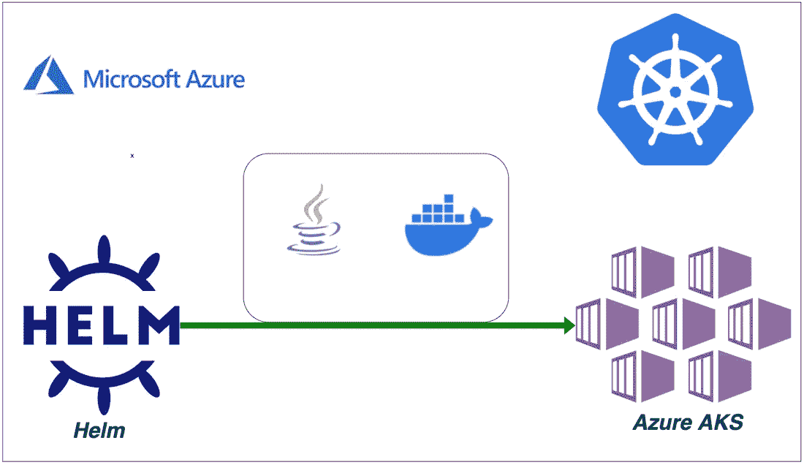

# 如何使用 HELM 在 Azure AKS 上部署 Java APIs

> 原文：<https://medium.com/bb-tutorials-and-thoughts/how-to-deploy-java-apis-on-azure-aks-using-helm-c1f18cfc49a0?source=collection_archive---------0----------------------->

## 包含示例项目的逐步指南

Kubernetes 是发展迅速的技术之一，现在所有的公司都在采用它。当您在 Kubernetes 上运行任何应用程序时，您都需要部署许多对象，如 deployment、configmap、secrets 等。你需要在 ***manifest.yml*** 文件中定义所有这些对象，并将这些文件发送到…