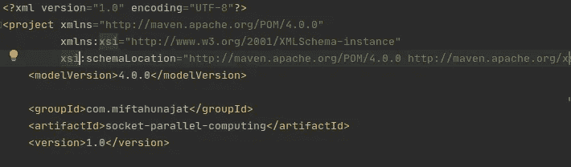
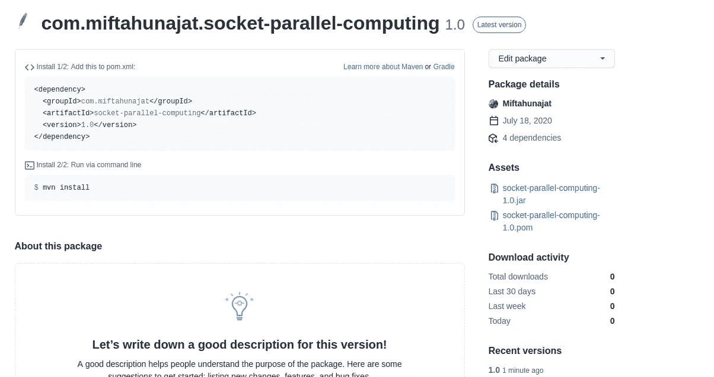

# How to Deploy Java Library on Maven Github Packages

> 原文：<https://medium.easyread.co/how-to-deploy-java-library-on-maven-github-packages-95f2c2af7b24?source=collection_archive---------8----------------------->


Pada story kali ini saya ingin membahas tentang cara untuk melakukan deploy project atau library kita ke Maven dengan menggunakan **Github Packages**

# Maven

Sebelum ada maven untuk mengimport sebuah Java library ke project kita tentu kita perlu untuk menambahkan sebuah file .jar ke library project kita tersebut. Hal akan itu tentu akan sangat merepotkan terlebih jika .jar yang kita import ternyata punya dependent ke class lain. Dengan menggunakan maven masalah tersebut bisa dengan mudah diatasi.

[Apache Maven](https://maven.apache.org/) adalah sebuah build tools yang menggunakan konsep Project Object Model atau yang biasanya disebut dengan POM. file POM ini memiliki struktur xml. Didalam file POM tersebut terdapat informasi dan konfigurasi yang digunakan maven untuk membangun sebuah project. Agar library kita bisa ditambahkan sebagai dependency pada maven maka kita ikuti langkah — langkah dibawah ini.

## Pom Configuration

Pada file POM configuration kita perlu untuk menambahkan beberapa baris dibawah ini:



*   `**<groupId>-**` nama package untuk mengidentifikasi seluruh project yang anda buat.
*   `**<artifactId>-**` isikan nama project anda
*   `**<version>-**` memberikan rilis versi jar anda pada saat dibuat

## **Github Packages**

Karena server maven yang kita gunakan adalah github, kita perlu membuat **GH_TOKEN** untuk autentikasinya. Untuk anda yang belum tahu cara mendapatkan Github Token silahkan buka link [disini](https://docs.github.com/en/github/authenticating-to-github/creating-a-personal-access-token) .

Untuk melakukan autentikasi Github Packages dengan Apache maven anda harus mengedit file.

> ***~/.m2/settings.xml* untuk menambahkan GH_TOKEN anda . Buat file *~/.m2/settings.xml* baru jika sebelumyan tidak ada**

File settings.xml nantinya akan berisikan seperti berikut

```
<settings xmlns=”[http://maven.apache.org/SETTINGS/1.0.0](http://maven.apache.org/SETTINGS/1.0.0)"
 xmlns:xsi=”[http://www.w3.org/2001/XMLSchema-instance](http://www.w3.org/2001/XMLSchema-instance)"
 xsi:schemaLocation=”[http://maven.apache.org/SETTINGS/1.0.0](http://maven.apache.org/SETTINGS/1.0.0)
 [http://maven.apache.org/xsd/settings-1.0.0.xsd](http://maven.apache.org/xsd/settings-1.0.0.xsd)"> <servers>
    <server>
      <id>github</id>
      <username>USERNAME</username>
      <password>GH_TOKEN</password>
    </server>
 </servers>
</settings>
```

Ganti USERNAME dengan username github anda dan GH_TOKEN dengan Github Token yang telah anda buat.

Langkah terakhir adalah menbamhkan distribution management pada bagian file pom.xml di project anda

```
<distributionManagement>
   <repository>
     <id>github</id>
     <name>GitHub OWNER Apache Maven Packages</name>
     <url>https://maven.pkg.github.com/OWNER/REPOSITORY</url>
   </repository>
</distributionManagement>
```

Ganti OWNER dengan username github anda dan REPOSITORY dengan nama project anda yang ada di github. Lalu jalankan :

```
**$ mvn deploy** 
```

Untuk men deploy library kita ke GitHub server di maven.

Setelah itu kalian bisa pastika di halaman github kalian kalau project/library anda sudah berhasil di upload di maven.

