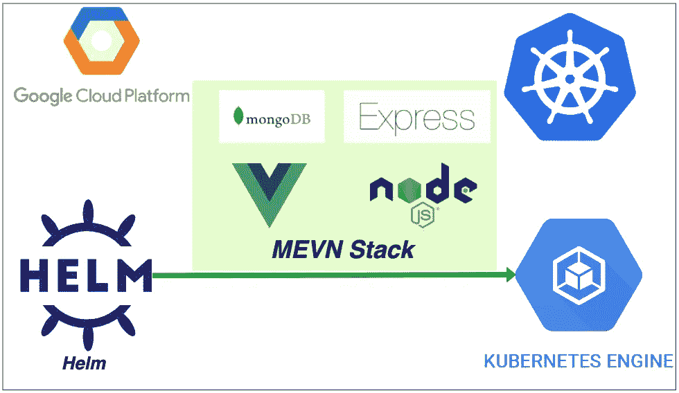

# 如何使用 HELM 在 GCP GKE 部署 MEVN 堆栈

> 原文：<https://medium.com/bb-tutorials-and-thoughts/how-to-deploy-mevn-stack-on-gcp-gke-using-helm-8ddf7825998e?source=collection_archive---------0----------------------->

## 包含示例项目的分步指南

Kubernetes 是发展迅速的技术之一，现在所有的公司都在采用它。当您在 Kubernetes 上运行任何应用程序时，您都需要部署许多对象，如 deployment、configmap、secrets 等。您需要在 ***manifest.yml*** 文件中定义所有这些对象，并将这些文件发送到…