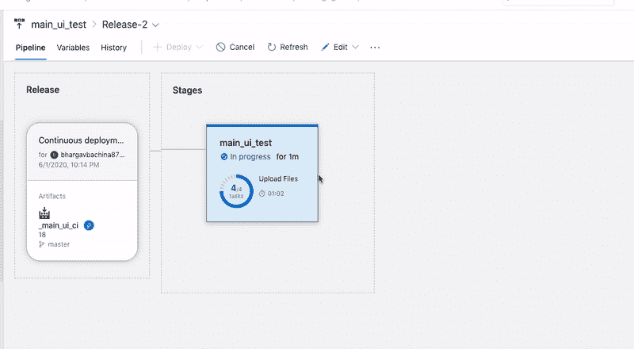

# 如何用 Azure DevOps 部署静态 Angular 网站

> 原文：<https://medium.com/bb-tutorials-and-thoughts/how-to-deploy-static-angular-website-with-azure-devops-46546b536aeb?source=collection_archive---------0----------------------->

## 使用 Azure DevOps 的逐步指南

当您将 angular 应用程序部署到生产环境中时，有许多部署策略，您的部署策略完全取决于您的应用程序架构。例如，如果您将 Java 或 Nodejs 与 Angular 一起使用，您需要在各自的环境中部署您的应用程序。如果…