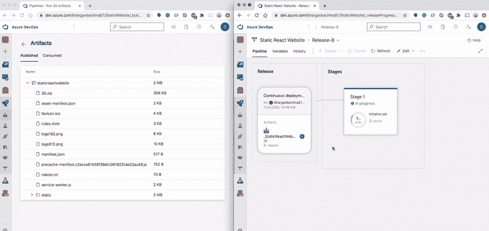

# 如何用 Azure DevOps 部署静态 React 网站

> 原文：<https://medium.com/bb-tutorials-and-thoughts/how-to-deploy-static-react-website-with-azure-devops-dfdbbdf401e4?source=collection_archive---------0----------------------->

## 使用 Azure DevOps 的逐步指南

**Azure build and release pipelines**

当您将 React 应用程序部署到生产环境时，有许多部署策略，并且您的部署策略完全取决于您的应用程序架构。例如，如果您在 React 中使用 Java 或 Nodejs，您需要在各自的环境中部署您的应用程序。如果你是…