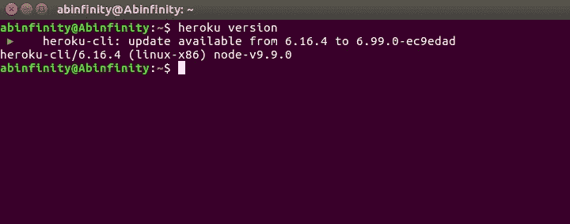

# 如何在 Heroku 上部署静态网站

> 原文：<https://medium.com/quick-code/how-to-deploy-static-website-on-heroku-9cd9af328f9f?source=collection_archive---------0----------------------->

*关于部署第一个静态网站的简单指南。*

# 什么是 Heroku？

Heroku 是基于容器的云平台即服务(PaaS ),这意味着它为部署、管理以及扩展 web 应用程序等服务提供平台。它基于 git 协议，对初学者来说是免费的。

你可以从[这个](https://devcenter.heroku.com/articles/heroku-cli)链接安装 Heroku-cli。

在本文中，我将向你展示如何在 heroku 上免费发布你的静态网页。

# 一些先决条件..

在继续之前，确保你已经把这些事情从你的清单上划掉了。

1.  在您的系统上安装 [git](https://git-scm.com/downloads) 。
2.  [注册一个 Heroku 账户](https://signup.heroku.com/)。

# 1.使用 HTML 制作网站

相应地设计您的个性化网站，并将其保存在一个文件夹中。

完成你的网站部分后，添加一个新文件`index.php`到你的文件夹中，并粘贴下面的代码到文件中。

```
*<?php header( ‘Location: /html_file_name.html’ ) ; ?>*
```

## 为什么我们需要这样做？

Heroku 只为网络应用提供平台，而不是静态网站。因此，为了上传我们的网站，我们需要玩一个把戏。我们必须让 Heroku 相信这是一个 php 应用程序，我们可以通过在我们的文件夹中导入这个文件来实现。

**注意:**不需要添加一个`composer.json`文件，因为这样会自动添加一个空的 composer.json 文件，将其识别为 php 应用程序。

现在，我们已经完成了第一阶段，因为接下来的步骤完全在终端上进行。

# 2.建立 Heroku

*   运行以下命令，检查您的系统上是否安装了 Heroku。

```
heroku version
```



Checking Heroku Version

一旦你在终端上看到这个，你就可以继续前进了。

# 3.部署网站

*   导航到您的文件夹并输入`git init`来初始化一个空的 git 存储库。
*   之后，键入`heroku login`并输入您的凭证登录您的帐户。
*   下一个任务需要给你的网站一个名字。

```
heroku create
```

这个命令会给你的网站一个随机生成的名字。但是如果你想给你的网站起一个自定义的名字，你可以使用这个命令。

```
heroku create app_name
```

需要记住的是，在这种情况下，您需要为网站提供一个唯一的应用程序名称。选择一个唯一的名称后，按 enter 键，您将获得一个 url 和一个应用程序的远程 git 存储库。

```
[http://appname.herokuapp.com](http://appname.herokuapp.com)https://git.heroku.com/appname.git
```

您也可以使用此命令重命名您的应用程序。

```
heroku apps:rename new_name
```

*   现在是时候将我们的文件添加到存储库中了。以相同的顺序输入以下代码。

```
git add . git commit -m “commit message”git push heroku master
```

期待这一成功部署的确认`remote: Verifying deploy… done.`。

任务完成。现在，您可以访问提供的 url，在任何可用的设备上查看您的网站。

如果你更新了文件夹中的任何东西，那么使用上面的三个命令来反映到你的网站上。

# 4.在本地服务器上部署 HTML

您可以通过在终端或 cmd 提示符下导航到该目录并键入以下命令来实现这一点

```
python3 -m http.server
```

感谢阅读。

编码快乐！