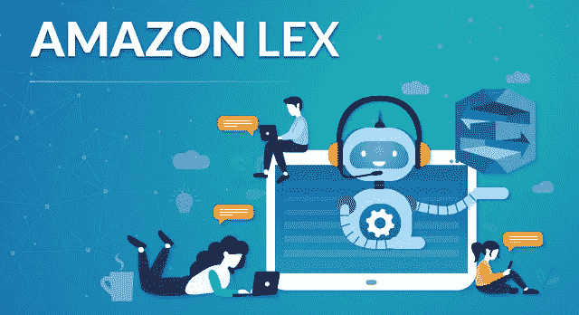
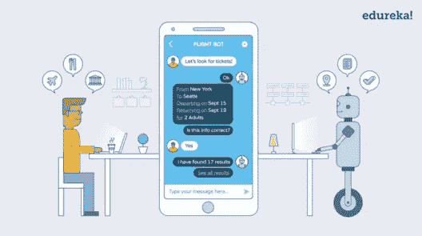
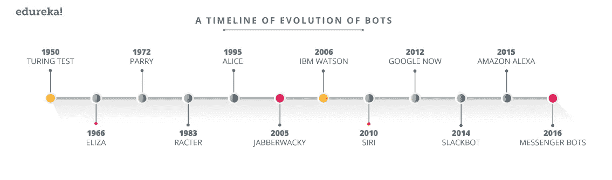
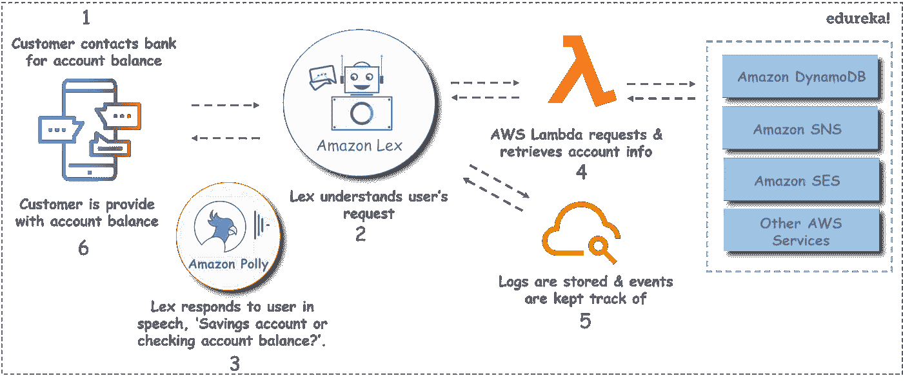

# 如何用亚马逊 Lex 开发一个聊天机器人？

> 原文：<https://medium.com/edureka/how-to-develop-a-chat-bot-using-amazon-lex-a570beac969e?source=collection_archive---------0----------------------->

Amazon Lex - Edureka

一次又一次，人类试图找到越来越多的方法来使用技术使生活变得更容易。随着各种各样的应用程序和软件照顾日常生活，聊天机器人很快成为日常生活不可或缺的一部分。这是最新的流行语。Amazon Lex 是构建聊天机器人最流行的平台之一。本教程将指导你使用 Amazon Lex 制作聊天机器人的整个过程。

让我们来看看这个 Amazon Lex 教程中涉及的主题:

*   什么是聊天机器人技术？
*   机器人是做什么的？
*   亚马逊 Lex Bot 是什么？
*   演示:如何使用亚马逊 Lex 构建聊天机器人？

# 什么是聊天机器人技术？

*“聊天机器人是一种计算机程序，它通过听觉或文本方式用自然语言进行对话，理解用户的意图，并根据商业规则和组织的数据发送响应。”*

简单来说，chatbot 是一种你可以通过聊天界面与之交流的服务或工具。聊天机器人理解你试图暗示什么，并回复相关信息或直接为你完成所需任务。

# 聊天机器人进化是如何以及何时开始的？

如果你认为聊天机器人是新技术，那你就错了。事实上，第一个聊天机器人**伊莱扎**，是 1966 年由约瑟夫·韦岑鲍姆在麻省理工学院人工智能实验室建造的，它只用了 200 行代码就模仿了心理治疗师。然后在 1988 年，当罗洛·卡彭特开始 Jabberwacky 项目时，一个语音操作的娱乐 AI 聊天机器人。以下是聊天机器人从那时起的演变过程:

# 机器人是做什么的？

聊天机器人之所以相关是因为以下原因:

*   他们在正确的时间、正确的地点向人们提供正确的信息，最重要的是只在他们需要的时候提供。
*   我们在移动设备上大约 90%的时间花在电子邮件和信息平台上。因此，使用聊天机器人吸引客户，而不是将他们转移到网站或移动应用程序是有意义的。
*   人工智能、机器学习和自然语言处理的进步，让机器人越来越像真人一样交谈。

现代聊天机器人不仅仅依赖文本，还会经常显示有用的卡片、图像、链接和表格，提供类似应用程序的体验。根据机器人的编程方式，我们可以将它们分为两种聊天机器人:基于规则的(哑机器人)和自我学习的(智能机器人)。

1.  基于规则的聊天机器人:这种机器人根据一些简单的规则回答问题，这些规则是它们接受训练的基础。
2.  **自我学习聊天机器人**:这种机器人依靠人工智能(AI) &机器学习(MI)技术与用户交谈。

有些平台采用了所有复杂的技术，允许你通过几个简单的步骤创建聊天机器人&根据你的喜好定制它们。*亚马逊 lex* 就是这样一个平台。

# 亚马逊 Lex Bot 是什么？

Amazon Lex 是一个完全托管的服务，用于在任何使用语音和文本的应用程序中构建对话界面。它提供深度学习功能，如:

*   用于将语音转换为文本的自动语音识别(ASR)
*   自然语言理解(NLU)识别文本的意图

Amazon Lex 使您能够快速轻松地构建聊天机器人，具有高度吸引人的用户体验和逼真的对话交互。现在你可能想知道，

## **亚马逊 Lex 免费吗？**

是的，它肯定是，你可以在 AWS 免费层下使用它的大部分功能。

# 使用 Amazon Lex 的好处:

*   **简单:**它提供了一个易于使用的控制台，可以在几分钟内创建自己的聊天机器人&预定义的机器人可以帮助你开始。
*   **内置技术:**你只需提供几个示例短语，亚马逊 Lex 就会构建一个完整的自然语言模型，通过这个模型，机器人可以使用语音和文本进行交互。
*   **无缝部署和扩展:**随着用户参与度的提高，您无需担心配置硬件和管理基础设施来增强您的 bot 体验。
*   **与 AWS 的内置集成:** Amazon Lex 允许与 AWS 平台上的许多其他服务集成，包括 AWS Lambda、Amazon CloudWatch、Amazon Cognito 和 Amazon DynamoDB &许多其他服务。
*   **性价比高:**有了亚马逊 Lex，没有前期成本，也没有最低费用。您只需为您发出的短信或语音请求付费

让我们考虑一个用例来理解 Amazon Lex 的功能。

# 用例:通过 Amazon Lex 聊天机器人获取银行信息。

使用 Amazon Chatbot，您可以构建用于移动应用程序的强大界面。您可以添加语音或文本聊天界面，在移动设备上创建机器人，帮助客户完成基本任务。

假设您想获得您的银行账户余额&您正在使用 *Amazon Lex Chatbot。* Amazon Lex 理解你的请求，执行必要的后台任务。它与 Amazon Polly 协调，并以语音形式要求您进一步输入。一旦收到信息，它就调用 AWS Lambda。Lambda 检索请求的信息或执行其他类型的操作。比如它可能会触发亚马逊 SNS 服务向您发送通知，或者与 AWS CloudWatch 集成以存储日志&事件。

现在你知道 Amazon Lex 是如何满足你的请求的了。让我们看看其他一些有趣的使用案例:

*   美国宇航局的机器人大使“Rov-E”是真实的美国宇航局火星探测器的复制品。通过亚马逊 Lex，美国宇航局的工作人员可以通过语音命令轻松导航 Rov-E。
*   **OhioHealth** 使用 Amazon Lex 在正确的时间和正确的地点为我们的患者提供正确的护理。
*   **HubSpot’**growth bot 是一款一体化聊天机器人，通过使用对话界面提供对相关数据和服务的访问，帮助营销人员和销售人员提高工作效率。

这些用例看起来非常有趣。

因此，如果这激起了你的兴趣&如果你渴望在 Amazon Lex 上创建一个自己的聊天机器人，那就去看看下面提供的视频吧。这段视频将带你一步步了解如何在 Amazon Lex 上创建聊天机器人。

# 演示:如何使用 Amazon Lex 创建聊天机器人

由于聊天机器人是建立在亚马逊网络服务上的，你需要创建一个账户。一旦你建立了你的账户，我们就可以开始创建聊天机器人了。这个视频演示了如何使用一些简单的响应来构建聊天机器人。

我希望你已经看了视频&成功地创建了一个你自己的聊天机器人。

最后，如果你想知道机器人是否会超越人类。不，我不这么认为。机器人是并将永远是机器人，本质上是机器人的性质和互动。总而言之，它们被开发出来是为了倾听和服从，为人类执行任务，让我们的生活更轻松。

原来就是这样！我希望这篇博客能给你提供信息，增加你的知识。

如果你想查看更多关于人工智能、DevOps、道德黑客等市场最热门技术的文章，你可以参考 Edureka 的官方网站。

请留意本系列中的其他文章，它们将解释 AWS 的各个方面。

> *1。* [*AWS 教程*](/edureka/amazon-aws-tutorial-4af6fefa9941)
> 
> *2。* [*AWS EC2*](/edureka/aws-ec2-tutorial-16583cc7798e)
> 
> *3。*[*AWS Lambda*](/edureka/aws-lambda-tutorial-cadd47fbd39b)
> 
> *4。* [*AWS 弹性豆茎*](/edureka/aws-elastic-beanstalk-647ae1d35e2)
> 
> *5。* [*AWS S3*](/edureka/s3-aws-amazon-simple-storage-service-aa71c664b465)
> 
> *6。* [*AWS 控制台*](/edureka/aws-console-fd768626c7d4)
> 
> *7。* [*AWS RDS*](/edureka/rds-aws-tutorial-for-aws-solution-architects-eec7217774dd)
> 
> *8。* [*AWS 迁移*](/edureka/aws-migration-e701057f48fe)
> 
> *9。*[*AWS Fargate*](/edureka/aws-fargate-85a0e256cb03)
> 
> *10。* [*AWS 简历*](/edureka/aws-resume-7453d9477c74)
> 
> *11。* [*亚马逊光帆*](/edureka/amazon-lightsail-tutorial-c2ccc800c4b7)
> 
> 12。 [*AWS 定价*](/edureka/aws-pricing-91e1137280a9)
> 
> *13。* [*亚马逊雅典娜*](/edureka/amazon-athena-tutorial-c7583053495f)
> 
> *14。* [*AWS CLI*](/edureka/aws-cli-9614bf69292d)
> 
> 15。 [*亚马逊 VPC 教程*](/edureka/amazon-vpc-tutorial-45b7467bcf1d)
> 
> 15。T32*AWS vs Azure*
> 
> 17。 [*内部部署 vs 云计算*](/edureka/on-premise-vs-cloud-computing-f9aee3b05f50)
> 
> *18。* [*亚马逊迪纳摩 DB 教程*](/edureka/amazon-dynamodb-tutorial-74d032bde759)
> 
> *19。* [*如何从快照恢复 EC2？*](/edureka/restore-ec2-from-snapshot-ddf36f396a6e)
> 
> 20。[*AWS code commit*](/edureka/aws-codecommit-31ef5a801fcf)
> 
> *21。* [*顶级 AWS 架构师面试问题*](/edureka/aws-architect-interview-questions-5bb705c6b660)
> 
> *22。* [*如何从快照恢复 EC2？*](/edureka/restore-ec2-from-snapshot-ddf36f396a6e)
> 
> *23。* [*使用 AWS 创建网站*](/edureka/create-websites-using-aws-1577a255ea36)
> 
> *24。* [*亚马逊路线 53*](/edureka/amazon-route-53-c22c470c22f1)
> 
> *25。* [*用 AWS WAF 保护 Web 应用*](/edureka/secure-web-applications-with-aws-waf-cf0a543fd0ab)

*原载于 2018 年 12 月 4 日*[*www.edureka.co*](https://www.edureka.co/blog/how-to-develop-a-chat-bot-using-amazon-lex/)*。*