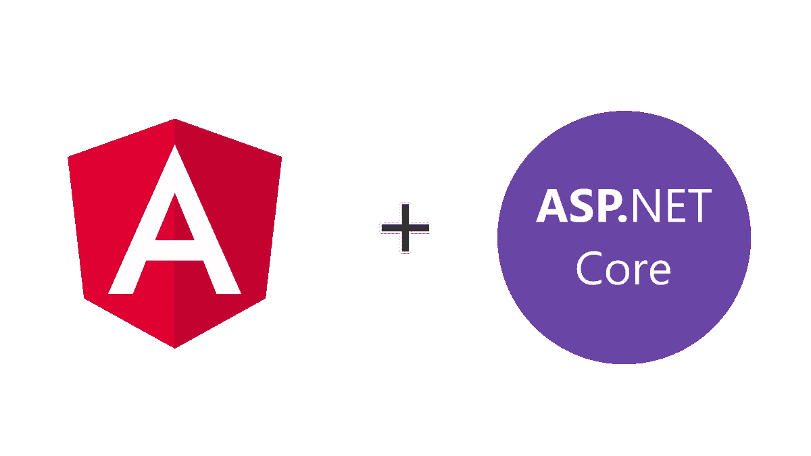

# 如何用开发和构建 Angular App？网络核心后端

> 原文：<https://medium.com/bb-tutorials-and-thoughts/how-to-develop-and-build-angular-app-with-net-core-backend-308b04cbbed5?source=collection_archive---------0----------------------->

## 了解如何开发和构建一个示例项目

我们有很多方法可以构建 Angular 应用程序并交付生产。一种方法是用 Nodejs，Java，或者。另一种方法是用 NGINX web 服务器构建 angular 并提供静态内容。与。NET 我们必须处理服务器…