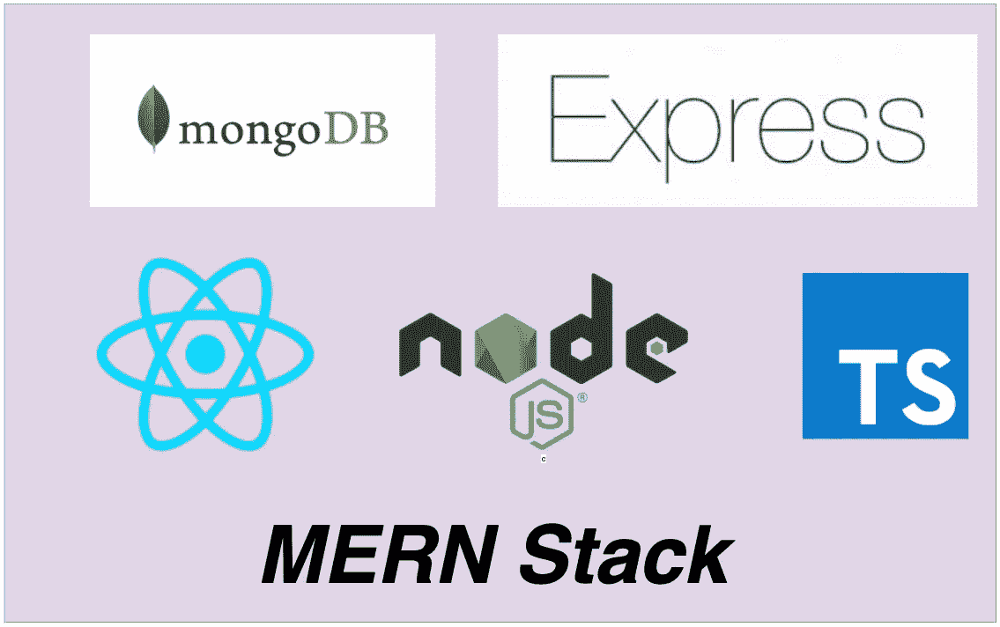

# 如何开发和构建 MERN 堆栈—打字稿版本

> 原文：<https://medium.com/bb-tutorials-and-thoughts/how-to-develop-and-build-mern-stack-typescript-version-36086ce20f01?source=collection_archive---------0----------------------->

## 包含示例项目的逐步指南

我们有很多方法可以构建 React 应用并将其交付生产。一种方法是用 NodeJS 和 MongoDB 作为数据库来构建 React app。有四件事让这个栈流行起来，你可以用 Javascript 写任何东西。这四样东西是 MongoDB、React、Express 和…