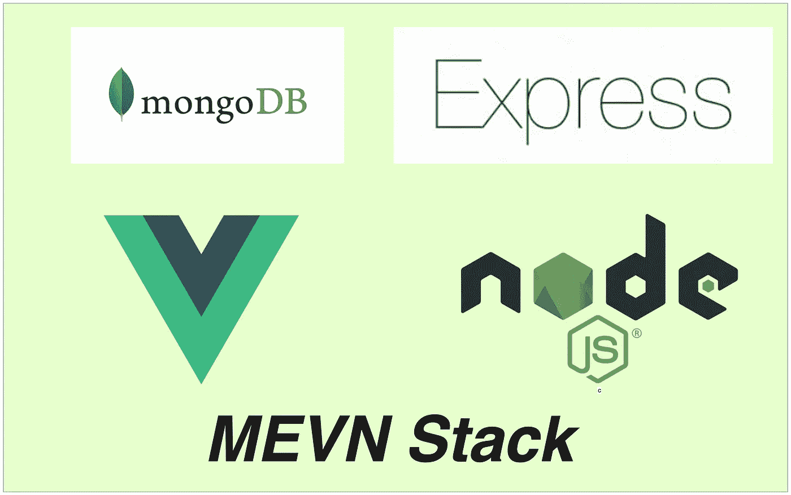

# 如何开发和构建 MEVN 栈

> 原文：<https://medium.com/bb-tutorials-and-thoughts/how-to-develop-and-build-mevn-stack-10b6e8ff7f7c?source=collection_archive---------0----------------------->

## 包含示例项目的逐步指南

我们有很多方法可以构建 Vue 应用并交付生产。一种方法是用 NodeJS 和 MongoDB 作为数据库来构建 Vue app。有四件事让这个栈流行起来，你可以用 Javascript 写任何东西。这四个东西是 MongoDB、Vue、Express 和 NodeJS。这个堆栈可以用于很多…