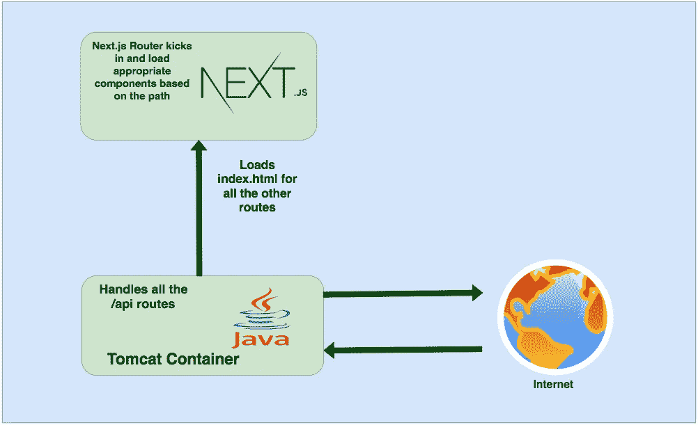

# 如何用 Java 后端开发构建 Next.js App

> 原文：<https://medium.com/bb-tutorials-and-thoughts/how-to-develop-and-build-next-js-app-with-java-backend-c8101dedc79e?source=collection_archive---------0----------------------->

## 包含示例项目的逐步指南

我们有很多方法可以构建 Next.js 应用程序并交付生产。一种方法是用 NodeJS 或 Java 构建下一个应用程序，另一种方法是用 NGINX web 服务器构建下一个应用程序并提供静态内容。用 Java 我们也必须处理服务器代码，例如，你…