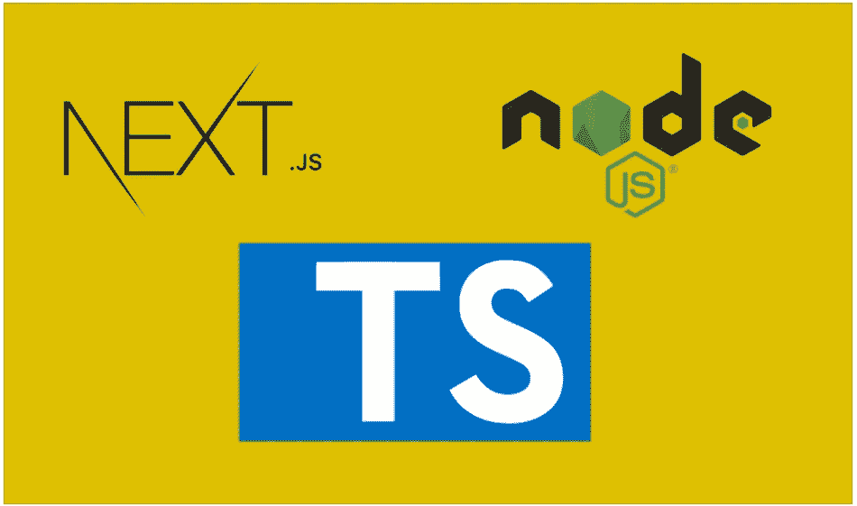

# 如何使用 NodeJS 后端开发和构建 Next.js 应用程序— Typescript 版本

> 原文：<https://medium.com/bb-tutorials-and-thoughts/how-to-develop-and-build-next-js-app-with-nodejs-backend-typescript-version-b04ede062b50?source=collection_archive---------0----------------------->

## 了解如何开发和构建一个示例项目

我们有很多方法可以构建 Next.js 应用程序并交付生产。一种方法是用 NodeJS 或 Java 构建 Next.js 应用程序，另一种方法是用 NGINX web 服务器构建 Next.js 并提供静态内容。对于 NodeJS，我们…