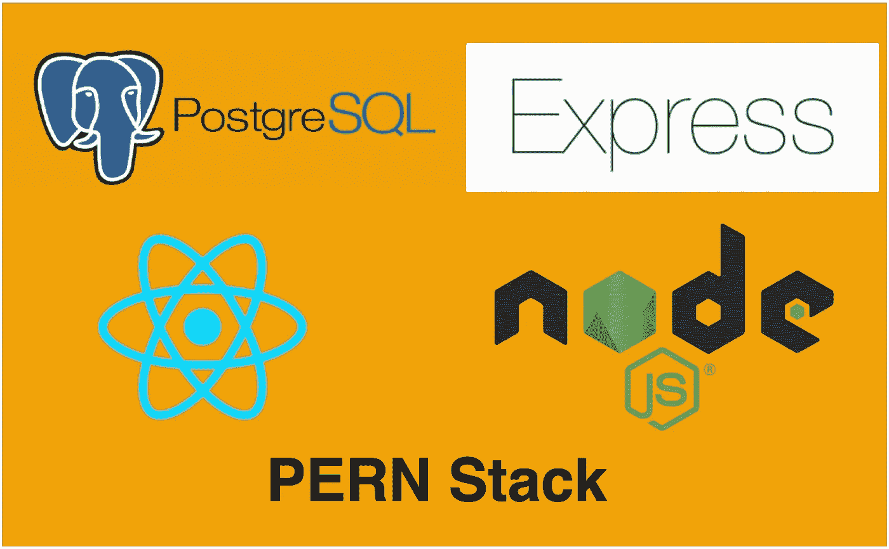

# 如何开发和构建 PERN 堆栈

> 原文：<https://medium.com/bb-tutorials-and-thoughts/how-to-develop-and-build-pern-stack-4fc18a1e5937?source=collection_archive---------0----------------------->

## 包含示例项目的逐步指南

我们有很多方法可以构建 React 应用并将其交付生产。一种方法是用 NodeJS 和 PostgreSQL 作为数据库构建 React app。有四件事让这个栈流行起来，你可以用 Javascript 写任何东西。这四个东西是 PostgreSQL、React、Express 和 NodeJS。该堆栈可用于…