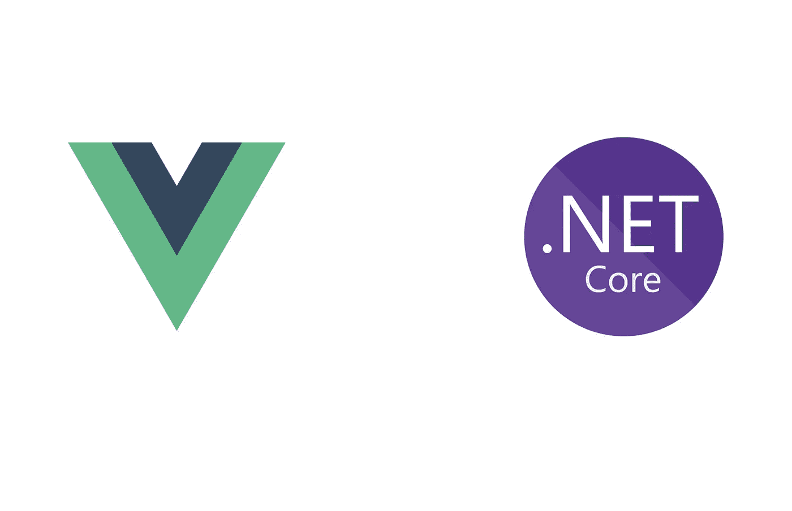

# 如何用开发和构建 Vue App？网络核心后端

> 原文：<https://medium.com/bb-tutorials-and-thoughts/how-to-develop-and-build-vue-app-with-net-core-backend-b19459f69d3b?source=collection_archive---------0----------------------->

## 了解如何开发和构建一个示例项目

我们有很多方法可以构建 Vue 应用并交付生产。一种方法是用 Nodejs，Java，或者。另一种方法是构建 Vue 并用 NGINX web 服务器提供静态内容。与。我们还必须处理服务器代码，因为…