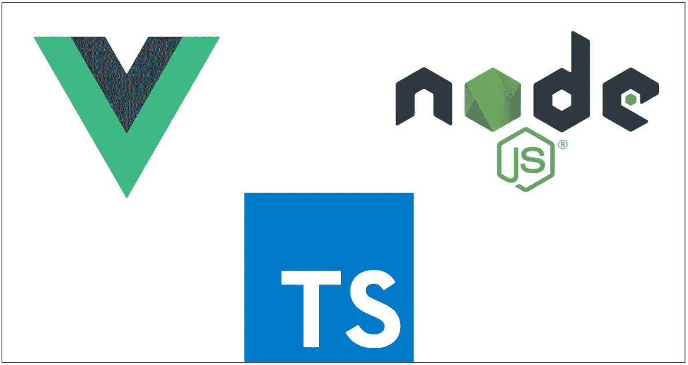

# 如何使用 NodeJS 后端开发和构建 Vue.js 应用程序— Typescript 版本

> 原文：<https://medium.com/bb-tutorials-and-thoughts/how-to-develop-and-build-vue-js-app-with-nodejs-backend-typescript-version-1c448fb4ae85?source=collection_archive---------0----------------------->

## Vue 和 NodeJS 都在 Typescript 中

我们有很多方法可以构建 Vue.js 应用程序并交付生产。一种方法是用 NodeJS 或 Java 创建 Vue 应用程序，另一种方法是用 NGINX web 服务器开发和提供静态内容。对于 NodeJS，我们必须将服务器代码作为…