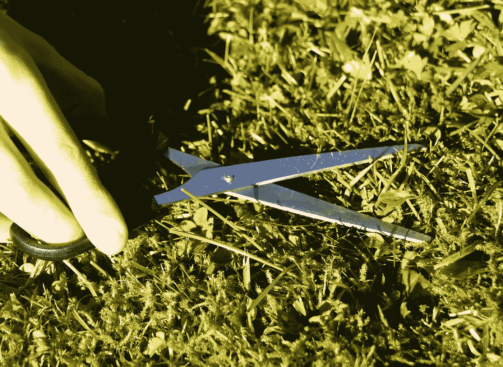

# 如何培养对细节的关注？

> 原文：<https://medium.com/globant/how-to-develop-attention-to-detail-8c4722759dfd?source=collection_archive---------6----------------------->

# 什么是对细节的关注？

彻底的、一丝不苟的、一丝不苟的只是几个同义词，可以很容易地用来识别对细节的关注。另一方面，定义关注细节的一种方法是有效和一致地全面处理信息，或者更简单地说，它指的是对正在处理的事情的细节给予充分的关注。你可以问自己一些问题，看看自己是否对细节有足够的关注，这些问题如下:

*   你如何检查你的工作中的错误？
*   你会评论别人的作品吗？
*   你如何避免犯错误？
*   当你必须处理大量信息时，你会怎么做？
*   你上一次做需要细节的项目是什么时候？

如果真的在完成一个项目后你没有检查错误，如果你很长时间没有被分配一项要求你彻底的工作，即使当你必须处理许多细节时你犯了几个错误，注意细节对你来说有很大的机会。

# 提高对细节的关注

为了改善你内心的细致，你不必去解决一个 5000 块的难题或者去图书馆买所有的“沃利在哪里？”书籍，并沉迷于解决每一个问题。这里有一些好的建议来最大化你对细节技巧的关注。

不要着急

在不影响工作质量的情况下尽可能快地完成工作的想法是乌托邦式的，因为这种努力只能由机器人来完成。

因此，有时它可能看起来乏味或无聊，你甚至可能想“踩油门”更快地完成工作，这就是缺乏对细节的关注可能导致的结果。你要做的第一件事是非常清楚自己的工作方式，当你想急于完成工作时，你应该停下来，保持适当的工作节奏。

**检查两次，最多三次**

为你所做的每件事赋予附加值的一部分，尤其是在关注细节方面，意味着你必须检查两次甚至三次，在任何事情结束时，你不需要添加或解决任何细节。

**排除杂念**

分心的事情可能有各种各样的形式…从查看社交网络，到不断查看电子邮件或与同事聊天。

分心会导致注意力不集中，减少你对细节的关注，因此要尽量减少分心。

*   让你的手机静音，或者使用一个阻止社交网络进入你的浏览器的应用。
*   戴上耳机。
*   听音乐帮助你集中注意力。

**征求反馈并列出清单**

如果你的团队成员或其他利益相关者建议你需要更加注意细节，那么去找他们，让他们提供一些反馈，告诉你他们认为你应该更加注意细节的地方。

写下他们告诉你的每一件事，包括你认为自己因不够细致而犯下的任何错误，并把这份清单放在手边，以确保这些事情没有忘记你。

# 摘要

关注细节是在执行任务时达到彻底和精确的能力。由于许多雇主寻求这种技能，难怪他们在简历中提到“非常注重细节”，但我们也有硬币的另一面，由于这样或那样的原因，人们没有达到这种能力，本文针对这些专业人士。