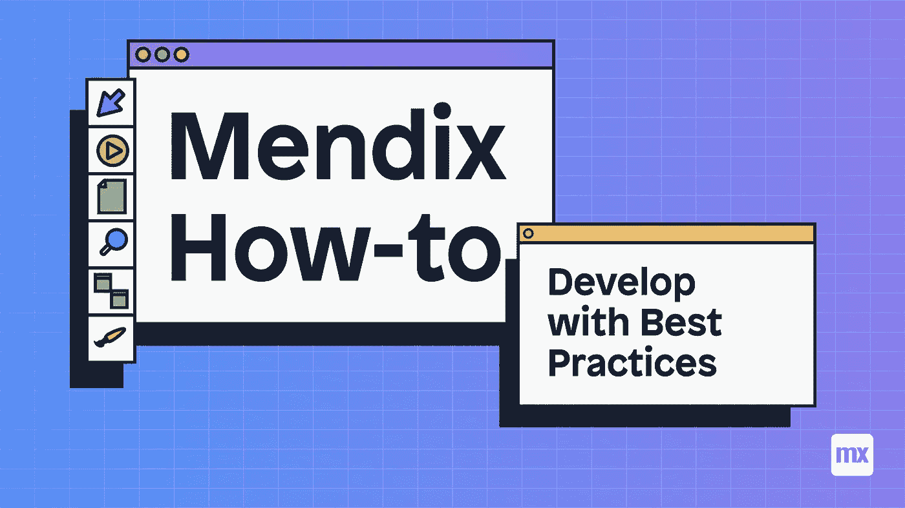
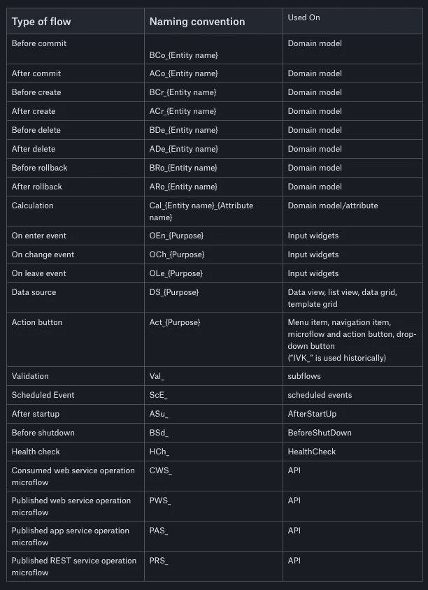

# 如何使用最佳实践进行开发

> 原文：<https://medium.com/mendix/how-to-develop-with-best-practices-mendix-how-to-1040f341672?source=collection_archive---------0----------------------->

## 在我真正加入 Mendix 之前，我是一家大型公司的顾问，为他们的客户开发 Mendix 应用。一位客户(我不想透露其姓名)经常抱怨他们的一些应用程序存在性能问题。在加入他们的应用程序开发团队后不久，我的任务是让他们的应用程序运行得更好。那么你从哪里开始这样的任务呢？当然是通过检查项目中的最佳实践！

正确实施最佳实践是提高应用程序性能和团队开发速度的最简单方法。通过遵守它们，它可以确保你避免容易犯的编码错误，提高你的应用程序的性能，并有助于在 studio 和 studio pro 中导航。

如果你只想要事实，那么你可以在这里跳转到文档[。](https://docs.mendix.com/howto/general/dev-best-practices)

# 所以让我们从顶层文件夹结构开始

一个好的、经过深思熟虑的文件夹结构是确保你的应用程序不会丢失或遗忘任何东西的最好方法。一般来说，你应该把你的文件夹分成两个独立的类别:

1.  与流程相关的文件夹(考虑工作流或向导)
2.  与实体相关的文件夹(这些是维护、验证流或事件微流的概述页面，应该都放在这里。

# 领域模型命名约定和可读性

在我的开发生涯中，有无数次，由于一个命名不当的属性导致的问题，我无法继续下去。始终确保您的属性名称具有描述性和可读性。避免不明确的名称，如$Success，它不能解释属性的整个功能。

默认情况下，当添加实体之间的关联时，平台会自动以最佳实践形式命名它们。但是，当重命名实体时，您必须自己更新关联名称(在 Mendix 8 以上不需要，studio pro 会为您完成)。

# 微流命名约定和最佳实践

在我看来，微流是最佳实践发挥最大作用的地方。如果经常使用，一个糟糕的建模流程会导致整个应用程序变慢。创建微流或纳流时，最好根据下面列出的命名约定进行创建:

通过遵循最佳实践，您可以确保您的所有流程都有清晰的描述，以便其他开发人员能够理解它们的目的和功能。

# 一般最佳实践

然而，开发不仅仅是命名惯例和项目组织。为了让你的应用程序运行良好，反应灵敏，还有一些你应该遵循的编码指南。

**计算属性** —虽然它们可能是一个有用的工具，但是您应该对使用流来计算属性值非常谨慎。这是因为每当实体或对象显示在 UI 中或在流中被访问时，都会调用这个流。这意味着在处理数据列表时，根据数据集的大小，微流可能会被调用数百次或数千次。正如你可以想象，这很容易消耗你所有的应用程序的内存，导致它变慢。

**继承**——人们普遍认为继承是一个有用的工具，但是你应该总是尽量避免多层继承。这是因为在几个级别之后，实体可能会增长到巨大的比例，因为它们包含每个继承的实体属性。

**删除行为** —为了防止系统中的孤立数据占用空间。最好确保在您的域模型中正确设置删除行为。然而，当执行大批量删除数据时，最好隐式检索关联的实体并直接删除它们，而不是依赖于删除行为

**事件处理程序** —总是尽量避免在一个实体上使用太多的事件处理程序流。使用太多会导致提交数据时出现意外行为。如果您想对一个对象应用多个流程，最好在使用子流程之前、提交数据之前这样做。

**微流** —大的微流也是要避免的。虽然我经常看到开发人员吹嘘他们的流程中有大型的复杂模式，但实际上在您的流程中最好总是有少于 25 个动作或元素。如果太长，您应该考虑使用子流将流分成几个部分。除非你独自工作，否则记录你的工作也是必不可少的，因为在你离开后，很可能有人会继续使用你的应用程序。记录和添加注释对于试图理解你的作品的人来说是一个很大的帮助，同时也确保你的逻辑以一种清晰易读的方式展现出来，类似于“常规老式编码”中的缩进。

检查任何复杂的嵌套 IF/和/或语句也是很好的。如果可能的话，考虑将这些分成多个行动。

由于集成实现不佳或 **Java/Javascript** 动作导致的应用崩溃或异常会导致内存泄漏，严重影响应用正常运行。确保在这些上添加错误处理，以确保错误得到正确处理。

XPath 是一个非常强大的数据约束工具。但是长而复杂的语句会降低数据库交互的速度。您可以使用 find 操作在应用程序中查找长的 xpath 查询。要解决这些问题，请尝试分解单个函数并执行多次检索，然后使用列表操作连接列表。

虽然错误会阻止您的应用程序启动，但警告不会。但这并不意味着我们不应该摆脱他们。例如，解决未使用变量的警告是释放一些应用程序内存的一种快速简单的方法。

# 微流和纳流建模最佳实践

一旦你组织好了你的项目，并且你遵循了上面提到的大多数实践，最后一步就是确保你的流程符合标准。这里有几件事要记住:

**循环** —在流中使用循环时，确保不在循环中提交任何数据至关重要。最好将对象添加到一个名为$Obeject_CommitList 的列表中，并一次提交整个列表，而不是在每次循环迭代中单独调用数据库。类似地，当循环内部需要数据时，在循环之前获取所有需要的数据，并使用列表操作过滤循环内部的数据。最后，如果循环中有决策，考虑是否可以将这些决策抽象成数据约束，以便在从数据库中获取数据时应用于数据，而不是每次循环迭代。

**子流** —创建子流时，考虑是否有数据可以作为参数传递，而不是对其执行检索操作。除了执行复杂的检索操作之外，最好使用列表操作来过滤/聚合所需的数据。这是因为平台优化了这些操作并同时执行它们。

**检索** —在获取数据时，如果可能的话，尽可能使用关联检索。这使用了缓存数据，这种数据可读性更好，也是一种索引。

**提交数据** —最后，最好避免提交数据，直到在您的逻辑中尽可能晚。这是因为一旦对象被提交，它就锁定该对象或列表，直到数据库交互完成。如果对相同对象进行了另一次提交，应用程序将不得不等待其完成，然后才能执行第二次提交操作。

## 做完了，现在做什么？

一旦你应用了尽可能多的这些规则，你的应用程序就会变得更好。如果你想衡量你的应用程序的改进，我会推荐一些负载测试。要做到这一点，你需要有一些软件或一个人谁能够做到这一点。我会推荐 [Loadrunner](https://www.microfocus.com/en-us/products/loadrunner-professional/free-trial) 来完成这个任务，因为它被很多公司广泛使用，并为你的应用程序性能提供可靠的结果。为了获得最佳结果，我建议在优化前后对你的应用程序进行负载测试，这样你就可以更准确地衡量改进。

*如果您或您的公司想要为您定制制作指南，请联系我* [*@Ryan M*](https://medium.com/ep/profile/1gg9uA1iUgdDmqkTo2qowQL4SaAjX9zsQB2MwWT9HmlrDYiKilBr) *或在* [*Mendix 社区 slack 频道*](https://join.slack.com/t/mendixcommunity/shared_invite/zt-hwhwkcxu-~59ywyjqHlUHXmrw5heqpQ) 中寻找我