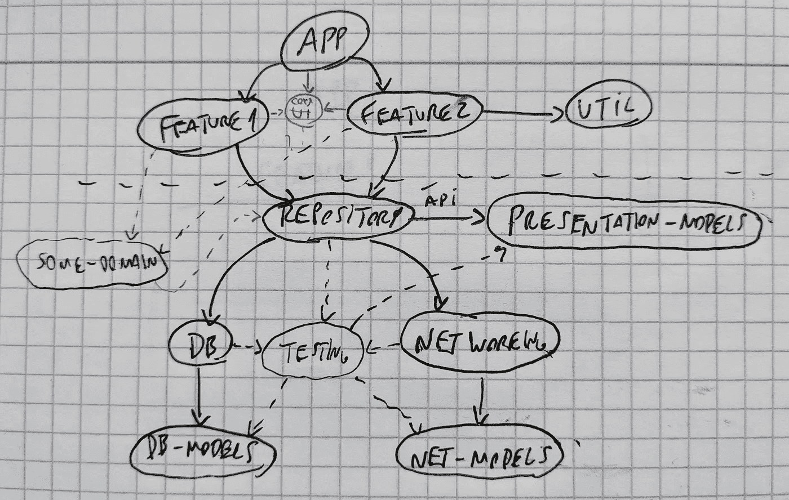
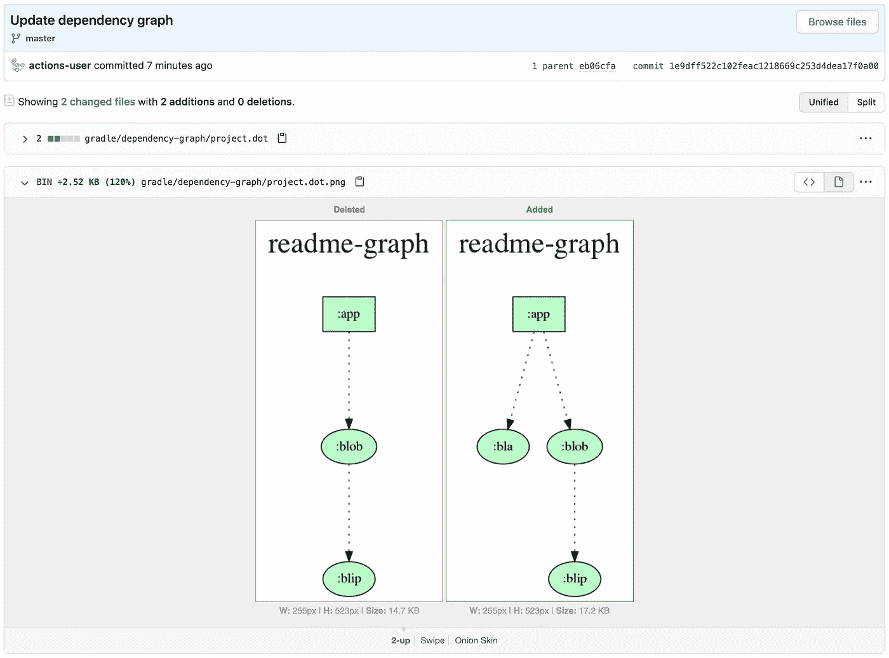

# 如何在自述文件中显示 Android 项目依赖图

> 原文：<https://medium.com/google-developer-experts/how-to-display-your-android-project-dependency-graph-in-your-readme-file-e52dcadafa7a?source=collection_archive---------0----------------------->

## 让您的 CI 为您服务，并观察您的依赖图的形成

[*你也可以在这里用葡萄牙语读这个* 🇧🇷](/android-dev-br/como-exibir-o-grafo-de-dependências-do-seu-projeto-android-no-readme-b83656185e2f)

Photo by [Alla Hetman](https://unsplash.com/@allahetman?utm_source=medium&utm_medium=referral) on [Unsplash](https://unsplash.com?utm_source=medium&utm_medium=referral)

在过去的 6 个月里，我一直在编写我的第一个高度模块化的 Android 应用程序，我不得不不断地观察依赖图(由 Gradle 模块组成)是如何演变的。你通常可能对你的图表应该是什么样子有一个初步的想法，但是新的想法和意想不到的问题出现了，所以很难总是坚持计划，偶尔移动一下东西是正常的，特别是在项目的开始。能够看到当前的图表结构真的有助于做出决策和前进。

Look at this beauty.

一开始，我有以前和同事讨论过的图纸和图片来指导我的设计。随着图表逐渐成形，我开始使用[杰克·沃顿](https://twitter.com/JakeWharton)的 [Gradle 任务](https://github.com/JakeWharton/SdkSearch/blob/master/gradle/projectDependencyGraph.gradle)来生成图表的可视化表示，这样我就可以不时地查看它。在某种程度上，我意识到我从中获得的信息是多么有价值:它指导我决定一个新模块如何适应那里，它帮助我防止循环依赖，它让我高兴地看到项目是如何发展的。

对于我的项目规模来说，我意识到这个图表对那些加入代码库的人也非常有帮助。因此，有一天，当我在 README 文件中随意工作时，我对自己说:“在这里有一个图表会很酷，但它会很快过时，这是一个耻辱”。直到我进一步思考，这篇博客背后的想法才诞生。

# 给我看看代码

这个[要诀](https://gist.github.com/tfcporciuncula/b68449d0964c572008aeadb132d664cb)有你需要的一切，但是你也可以在这个[回购](https://github.com/tfcporciuncula/readme-graph)中看看它的行动。其实没什么大不了的:

1.  我们需要`[projectDependencyGraph](https://github.com/tfcporciuncula/readme-graph/blob/master/gradle/projectDependencyGraph.gradle)` [Gradle task](https://github.com/tfcporciuncula/readme-graph/blob/master/gradle/projectDependencyGraph.gradle) ，所以第一步是将它添加到我们的项目中，并且[在我们的根构建文件](https://github.com/tfcporciuncula/readme-graph/blob/master/build.gradle#L28)中引用它。
2.  不过，我们需要在那里做一个小小的改变:[它最初在](https://github.com/JakeWharton/SdkSearch/blob/8893bb7991c0225449226c8df704c9bb50e3ec87/gradle/projectDependencyGraph.gradle#L3) `[rootProject.buildDir](https://github.com/JakeWharton/SdkSearch/blob/8893bb7991c0225449226c8df704c9bb50e3ec87/gradle/projectDependencyGraph.gradle#L3)`中创建了 `[dot](https://github.com/JakeWharton/SdkSearch/blob/8893bb7991c0225449226c8df704c9bb50e3ec87/gradle/projectDependencyGraph.gradle#L3)` [文件，这通常会被我们的版本控制系统忽略。](https://github.com/JakeWharton/SdkSearch/blob/8893bb7991c0225449226c8df704c9bb50e3ec87/gradle/projectDependencyGraph.gradle#L3)[相反，我们可以使用](https://github.com/tfcporciuncula/readme-graph/commit/abeff06ac244640f94eacb35dfc4f585a848a8b0) `[rootProject.rootDir](https://github.com/tfcporciuncula/readme-graph/commit/abeff06ac244640f94eacb35dfc4f585a848a8b0)` [并将图形放在我们项目中的某个地方。](https://github.com/tfcporciuncula/readme-graph/commit/abeff06ac244640f94eacb35dfc4f585a848a8b0)
3.  然后我们需要定义自动生成、提交和推送图表的 [GitHub 动作](https://github.com/tfcporciuncula/readme-graph/blob/master/.github/workflows/main.yml)。这是这份工作的样子:

We’re using [GitHub Actions](https://github.com/features/actions) here, but it’s most likely possible to write those same steps with your favorite tool.

谢天谢地，有一个[伟大的 GitHub 动作](https://github.com/ts-graphviz/setup-graphviz)为我们设置了 [Graphviz](https://graphviz.org/) ，这是 Gradle task 用来生成图形的工具。这是我们的第二步:`ts-graphviz/setup-graphviz@v1`。第三步是运行任务来生成图表。

一旦我们有了图表，我们需要提交它。我们只需运行几个 Git 命令来设置拥有提交权的用户，以及提交本身。我们希望确保如果没有更改，命令不会失败(可能图形自上次更新以来没有更改过)，这就是为什么命令看起来很奇怪。别问我这个，我就是从[这里抄](https://stackoverflow.com/questions/22040113/how-to-let-jenkins-git-commit-only-if-there-are-changes/40255467#40255467)💁‍♂️

最后，我们必须推动，为此还有一个[动作](https://github.com/ad-m/github-push-action)。即使我们的操作是推送到主服务器，[它也不会触发新的运行，即使工作流被配置为由推送到主服务器](https://docs.github.com/en/actions/reference/authentication-in-a-workflow#using-the-github_token-in-a-workflow)来触发，所以不必担心陷入递归运行。

# 给我看看图表

有了 Gradle 任务和 GitHub 动作，我们现在可以简单地引用 graph PNG 文件，就像 README 中的:

这将取决于我们选择的输出目录，但差不多就是这样了！✨

很高兴看到[奇迹发生](https://github.com/tfcporciuncula/readme-graph/commit/1e9dff522c102feac1218669c253d4dea17f0a00?short_path=9e7a547#diff-9e7a5473eb136ada1bcbee2f79decf05):

I wish all documentation could update itself like that.

如果你看到一种方法来改善这种设置，或者有任何关于如何在另一个场景中应用一般概念的想法，[在 Twitter 上点击我的 up](https://twitter.com/tfcporciuncula)！