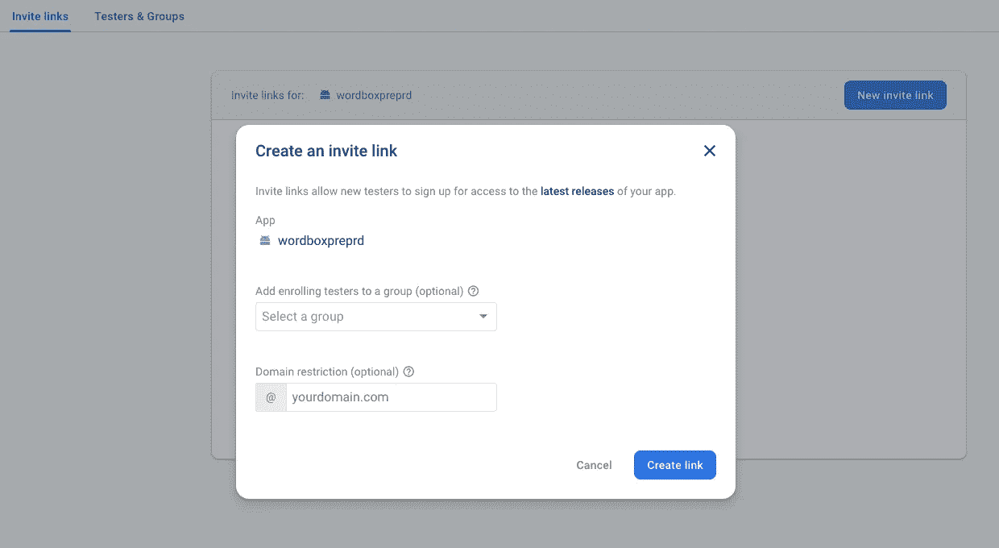

# 如何使用 Firebase 应用程序分发来分发您的应用程序

> 原文：<https://medium.com/google-developer-experts/how-to-distribute-your-application-with-firebase-app-distribution-8b70db0d389a?source=collection_archive---------1----------------------->


Firebase Distribution

当你在 Android 或者 iOS 上开发完一个应用，你需要给测试团队发一个安装程序。你是怎么分配的？如何让测试团队识别最新的或者生产中的安装程序？如何传达新版本中开发的变化或功能？你如何知道测试团队中谁下载了最新版本？

还记得你是怎么做到的吗？知道你会怎么做吗？花几分钟再回答。


**how you did it?**

您在开发团队中所做和看到的一些实践是发送一封电子邮件，其中包含安装程序和所做更改的描述；也可以通过 slack 中的通道将其发送到驱动器，或者将其留在云中的存储库中。但是在这些实践中，以一种安全的方式到达所有相关方是不可靠的，也不能被充分地版本化以进行回归测试。

想象一下，一个平台允许你创建组来分发安装程序，或者给他们一个链接作为邀请，让他们可以下载它？而且，在那个平台上，你可以知道谁下载了安装程序，测试人员可以下载过去的版本，并且总是被告知最新的版本？Firebase 分发服务提供了这一功能以及更多功能。


Firebase Distribution is Interesting

[Firebase Distribution](https://firebase.google.com/docs/app-distribution) 是一项免费服务，它允许我们将应用程序的安装程序分发给具有以下属性的测试人员组:

*   它适用于 iOS 和 Android。
*   简单快捷，无需安装 SDK。
*   立即交付申请。
*   它给了我们几种分发安装程序的方法。
*   测试设备易于管理。
*   查看谁接受了邀请，谁下载了邀请。
*   它与 crashlytics 结合使用，以获取有关应用程序稳定性的信息。

> **现在你可以分发 apk 和 Android 应用捆绑包。还有，iOS 版的 IPA**

使用 Firebase 发行版，您可以有一个简单的预发布和反馈过程。此外，它为我们提供了从手动到自动的几种分发形式，具体取决于您的流程。在这篇文章中，我们将详细介绍不同形式的分配。

在使用任何分配方法之前，您必须创建组，并向每个组中添加测试人员。让我们看看它是如何做到的:

在 Firebase web 控制台中，您将在**“发布和监控”**服务组中找到 Firebase 分发版，如下图所示:


App Distribution Service

然后，在“验证者和组”选项卡中创建组，并在每个组中添加那些想要测试应用程序的人的电子邮件。这是最佳实践，但是，您不能创建组并只是添加电子邮件。


Created a group and added emails

以上是添加电子邮件的方法，但是你也可以通过 CSV 上传电子邮件。现在让我们看看有什么策略可以分配。下面的例子将针对安卓系统。

# **第一个分发策略—手动**

在上传安装程序之前，您必须将应用程序添加到 Firebase 项目中，一旦创建了组，您只需从 Firebase 控制台上传已签名或调试的 APK，此外还要放置版本注释并分配组。


Uploaded APK

添加组后，每个成员都会收到一封电子邮件邀请，类似于下图。


Email invitation

这封邮件有一个从 Firebase 发行版下载应用程序的链接。这个应用程序是一个管理器，允许您查看安装程序及其所有版本和注释。


Apps to test

你可以选择一个你想下载的，你可以去它以前的版本。


APK versions

您可以从 Firebase web 控制台查看是谁打开了邀请并下载了安装程序，以及更多信息。


Releases

所以每当你有一个新版本要发布的时候，你可以重复这些步骤。

如果您没有持续的集成流程，前面的发布形式是最简单的，正如您所看到的，它将花费您很少的时间。

# **第二个分发策略—邀请链接**

另一种非常简单的分发方式是上传 APK 并创建一个邀请链接，该链接会将您带到一个页面，在该页面上您可以输入您的电子邮件，邀请将会到达。然后，您按照第一个分配表中提到的相同过程。



Created an invite link

如果您不知道将要测试应用程序的人的电子邮件，或者您想邀请几个人来尝试，并且不想一个接一个地添加他们的电子邮件，那么这个表单是相关的。


Invitation page

# **第三种分发策略:命令行。**

您也可以使用 [Firebase CLI](https://firebase.google.com/docs/app-distribution/android/distribute-cli) 发布您的安装程序。在需要在 firebase 中创建项目并注册应用程序之前，您可以通过命令行指定测试人员、组和注释。除了向 Firebase CLI 进行身份验证并运行以下命令之外:

Firebase CLI command to distribute

我们必须在命令中写入要分发的安装程序的路径，参数为 Firebase 应用程序 ID、发行说明、测试人员电子邮件或逗号分隔的组。关于参数的更多信息，你可以在这里 看到它们 [***。***](https://firebase.google.com/docs/app-distribution/android/distribute-cli)

您将在控制台中看到的日志如下:


Result

# **第四种分销策略— Gradle**

另一种分发策略是使用 Firebase 的[分发 Gradle 插件](https://firebase.google.com/docs/app-distribution/android/distribute-gradle)，在这里你可以在 Gradle 文件中指定测试人员、组或注释，允许你为应用程序的不同类型的构建和变体配置分发。在执行以下操作之前，记得通过 [Firebase CLI](https://firebase.google.com/docs/app-distribution/android/distribute-gradle#cli-gradle) 或者通过与 [Firebase 分发插件](https://firebase.google.com/docs/app-distribution/android/distribute-gradle#google-acc-gradle)或[服务帐户](https://firebase.google.com/docs/app-distribution/android/distribute-gradle#service-acc-gradle)相关联的任务来验证 Firebase。

你应该做的第一件事是在 Gradle 中添加插件。然后在模块的 Gradle 文件中添加发行版的属性，或者在构建变体中，或者如果您有产品风格。

Add dependencies

Add puglin

Firebase distribution plugin properties

你可以选择将电子邮件或群组名称明确地放在 Gradle 中，或者通过将它们放在 TXT 文件中的更可配置的方式。因此，我们需要调试变量，然后我们执行以下操作:

```
./gradlew assembleDebug appDistributionUploadDebug
```

您将得到以下结果，通知我们该过程是成功的:

```
Using APK path in the outputs directory: app/build/outputs/apk/debug/app-debug.apk.
Uploading APK to Firebase App Distribution...
Getting appId from output of google services plugin
Using cached Firebase CLI credentials
This APK has not been uploaded before.
Uploading the APK.
Uploaded APK successfully 202
Added release notes successfully 200
Added testers/groups successfully 200
App Distribution upload finished successfully!
```

准备好了。这是一个简单的策略来分发和自动化一些东西。现在，您可以运行适当的 Gradle 任务，您的 APK 将在几分钟内提供给测试人员。

# **分销的第五个也是最后一个策略:持续部署。**

如果您有连续部署流程或连续部署(CD ),您可以检查是否有任何组件可以将安装程序分发到 Firebase。如果你使用[浪子](https://fastlane.tools/)，你可以在 Firebase 文档[这里](https://firebase.google.com/docs/app-distribution/android/distribute-fastlane)找到如何做的例子。

我将向您展示一个关于 [Bitrise](https://app.bitrise.io/) 的示例，这是一个用于移动应用程序的持续集成(CI)和部署的平台。Bitrise 允许您以图形化的简单方式创建 CI 和 CD 流，例如，下图显示了一个构建流:


Workflow in Bitrise

一个流程有一组步骤，并且有一个 [Firebase 分发](https://www.bitrise.io/integrations/steps/firebase-app-distribution)步骤，然后我们可以用 Firebase 应用程序 ID、测试人员、组和发布说明来配置它。Bitrise 将根据您的设置运行工作流，例如，当您推送分支或发出拉取请求时，或其他任何情况。在这种情况下，当您推送测试分支时，安装程序将通过 Firebase 发行版分发给您的测试人员。


Firebase Distribution properties in Bitrise

# **奖励 Github 动作持续部署**

[Github Actions](https://github.com/features/actions) 是一种新的方式，可以更容易地创建流程，以便在您的 Github 存储库中进行持续集成和部署。因此，您可以将 firebase 发行版与操作一起使用。有几种方法可以做到。正如我在第四个策略中解释的，你可以在 Gradle 文件中添加 firebase 插件。因此，创建一个包含以下内容的操作工作流:

Github Action

有些步骤是在部署之前运行的，例如，ktlint 或单元测试运行；然而，分发我们的 APK 的主要步骤是构建所有工件和 Firebase 应用程序分发任务。

Firebase Distribution 是一项服务，它允许您以简单安全的方式将应用程序分发给测试人员或一组利益相关者。您还可以根据您使用的工具或流程，以不同的方式进行分发。开始使用 Firebase 发行版，您的开发过程将会自动化、更快、更专业。

我希望这些信息对你有用。记得分享这篇文章，随时欢迎你的评论。

访问我的社交网络:

*   [https://twitter.com/jggomezt](https://twitter.com/jggomezt)
*   [https://www.youtube.com/devhack](https://www.youtube.com/devhack)
*   [https://devhack.co/](https://devhack.co/)

# 资源

*   [https://firebase.google.com/docs/app-distribution](https://firebase.google.com/docs/app-distribution)
*   [https://firebase . Google . com/docs/app-distribution/Android/distribute-CLI](https://firebase.google.com/docs/app-distribution/android/distribute-cli)
*   [https://fastlane.tools/](https://fastlane.tools/)
*   [https://github.com/features/actions](https://github.com/features/actions)