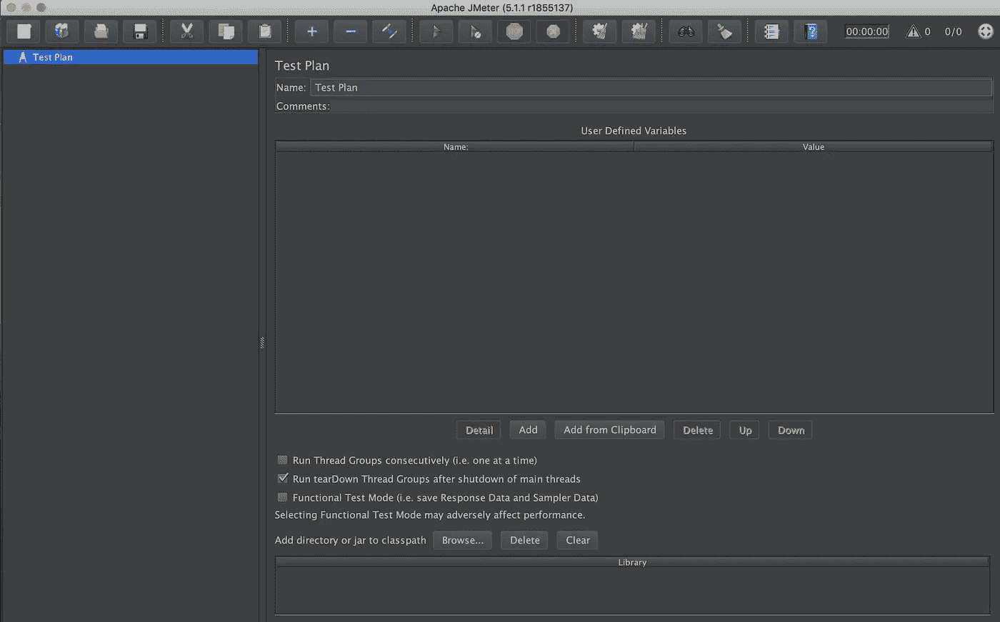

# 如何用 JMeter 对 NodeJS API 进行性能测试

> 原文：<https://medium.com/bb-tutorials-and-thoughts/how-to-do-performance-testing-for-the-nodejs-api-with-jmeter-33f64c573b21?source=collection_archive---------0----------------------->

## 包含示例项目的逐步指南

**JMeter GUI**

Apache JMeter 是一个软件工具，用于在各种协议和技术上对应用程序进行负载测试。它是用 Java 编写的，可以在任何支持 Java 的平台上运行，如 macOS、Windows 等。它甚至为负载测试开发提供了 IDE。您可以在…中运行负载测试