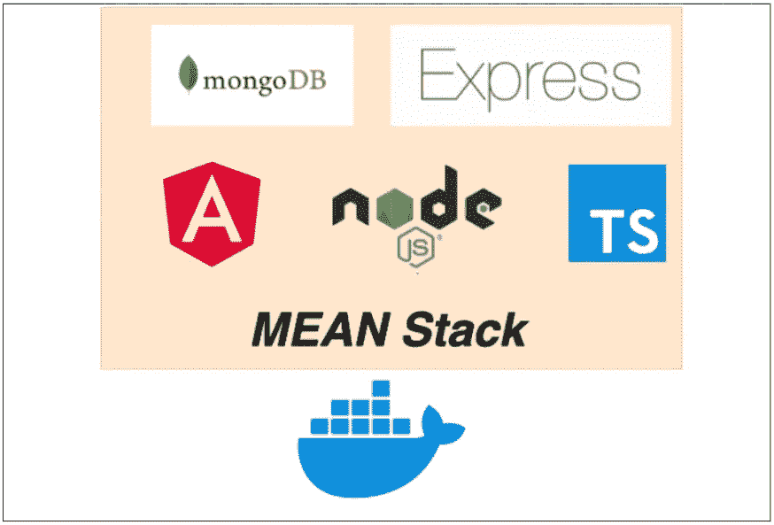

# 如何对平均栈进行排序—打字稿版本

> 原文：<https://medium.com/bb-tutorials-and-thoughts/how-to-dockerize-mean-stack-typescript-version-4c4c532c41d3?source=collection_archive---------0----------------------->

## 包含示例项目的逐步指南

Docker 是一个企业就绪的容器平台，使组织能够在任何地方无缝地构建、共享和运行任何应用程序。几乎每个公司都在将其应用程序容器化，以实现更快的生产工作负载，这样它们就可以随时部署，有时一天部署几次。有这么…