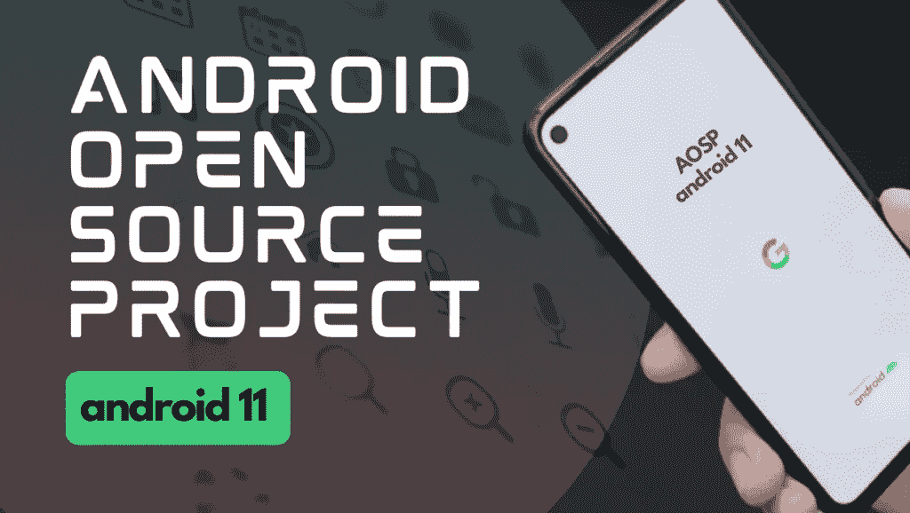
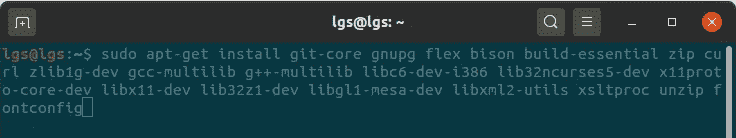
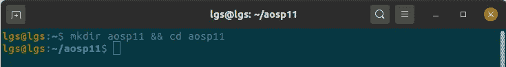
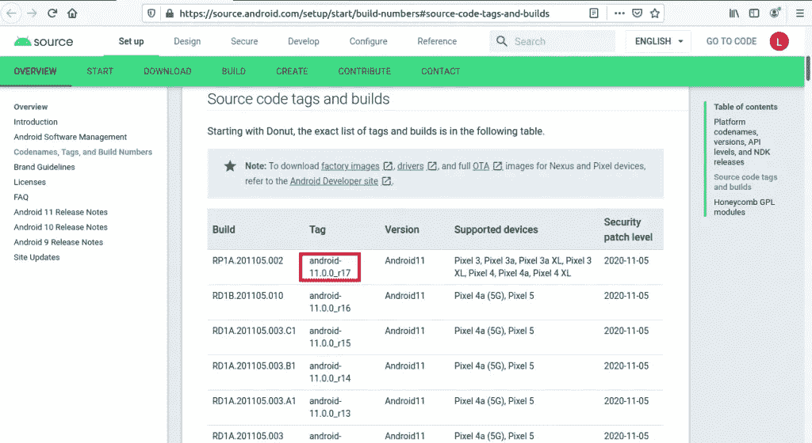
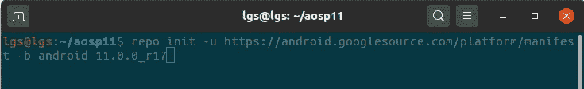
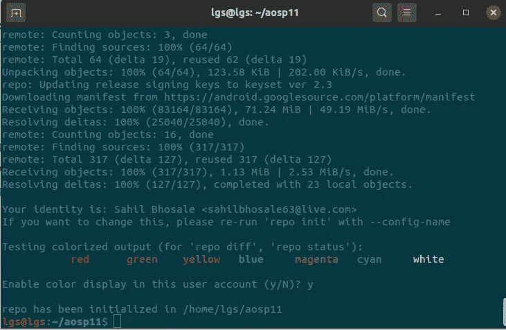

# 如何从零开始下载构建 AOSP Android 11 定制 ROM

> 原文：<https://medium.com/quick-code/how-to-download-and-build-aosp-android-11-custom-rom-from-scratch-74bb5dfe60a2?source=collection_archive---------1----------------------->

## 在 android 设备上成功移植 AOSP 的步骤



[安卓开源项目(AOSP)](https://source.android.com/setup/develop) 是由**谷歌**维护的项目，从这里我们可以获得安卓操作系统的源代码。由于这是一个开源项目，任何人都可以下载 android 源代码，编译到他们的机器上，并可以轻松地对源代码进行一些修改。目前，最新版本的 Android 是 Android R(也称为 Android 11 或红丝绒蛋糕)。你可以从 AOSP 获得任何版本 android 的源代码，比如 Android R、Q、P 等。

> **注:**这不是整篇文章。整篇文章可以在我的网站上找到[LionGuestStudios.com](https://liongueststudios.com/download-and-build-aosp-android11-custom-rom/)

**视频 1:** 从 AOSP 下载并在 Linux 上从头开始构建 AOSP Android 11 定制 ROM

Download and Build AOSP Android 11 custom ROM from AOSP on Linux from scratch

在这篇博客文章中，我们将看到如何下载 Android 11 的源代码，如何使用 Android 开源项目构建或编译它，并在仿真器或物理设备上运行它。

你需要下载 android 11 的原因可能不多:

1.  **将定制 ROM 闪存到您的手机:**如果您的手机制造商没有为您的手机提供最新的 android 版本，而您渴望使用和测试 android 平台提供的最新功能，那么在这种情况下，您可能需要下载 android 源代码。
2.  **为 android 开源项目做贡献(AOSP):** 如果你是一名开发人员，并希望为 AOSP 贡献代码，那么在这种情况下，你可以获得 Android 源代码。
3.  **创建自己的 android 版本:**如果你想制作自己的 Android 版本，比如 Cyanogenmod 或类似的东西，你也可以获得源代码。

# 系统要求:

要下载并构建 AOSP 项目，你应该安装一个 64 位版本的**Linux**(18.04 或更高版本)或 **Mac** 操作系统。在这里，RAM 在构建/编译 android 源代码时起着非常关键的作用。

根据官方文件，建议你至少要有 **16GB** 的 RAM。如果你想构建一个旧版本的 android，那么 8GB 可能适合你。我尝试了 8GB 内存的 Android 10**(Android-10 . 0 . 0 _ r20)**，但我遇到了**“java 堆内存不足错误”**，但当我增加 Java 堆大小时，它得到了修复。

但是当我用 T4 8GB 的内存为安卓 11 T2(安卓 11 . 0 . 0 _ r17)T3 构建的时候，我也遇到了同样的内存错误。因此，我尝试了许多不同的东西，但问题仍然存在。然后我将内存增加到 16GB，构建成功了。

1.  **操作系统:**不支持 64 位 Linux 或 Mac、Windows。
2.  **内存:**首选 16 GB
3.  **可用磁盘空间:**250–300 GB 可用空间

开放式 JDK 预装了 AOSP，因此无需单独安装。

# 安装所需的软件包:

只需复制下面的命令并粘贴到您的终端。这将安装所有这些软件包，这些都是使用 android 源代码所必需的。



```
sudo apt-get install git-core gnupg flex bison build-essential zip curl zlib1g-dev gcc-multilib g++-multilib libc6-dev-i386 lib32ncurses5-dev x11proto-core-dev libx11-dev lib32z1-dev libgl1-mesa-dev libxml2-utils xsltproc unzip fontconfigsudo apt update 
sudo apt upgrade
```

# 下载 Android 11 源代码

[下载 Android 开源项目(AOSP)](https://source.android.com/setup/build/downloading) 源代码的过程需要相当长的时间才能完成，所以请确保您有良好的互联网连接，以便您可以在更短的时间内完成。平均来说，下载 android 源代码大约需要**7-10 个小时**。

我们先创建一个名为 **aosp11** 的目录，你可以在里面下载 android 11 的源代码。

```
//Created a new directory and cd into it 
mkdir aosp11 && cd aosp11
```



你现在在 **aosp11** 目录中。现在，您必须通过运行以下命令来配置与您的帐户相关联的**名称**和**电子邮件地址**。在这里，用您真实的 git 帐户详细信息替换报价中的单词。

```
git config --global user.name "Your Name" 
git config --global user.email "you@example.com"
```

现在让我们下载回购工具。从您的**主目录**中，逐一运行以下命令。

```
cd .. //Currently, you are in aosp11 dir, this will take you back to home dir 
mkdir ~/bin 
PATH=~/bin:$PATH 
curl https://storage.googleapis.com/git-repo-downloads/repo > ~/bin/repo 
chmod a+x ~/bin/repo
```

为了获得 Android 11 源代码，我们首先必须在当前工作目录中初始化[回购工具](https://stackoverflow.com/questions/25046570/what-does-repo-init-and-repo-sync-actually-do)。这将创建一个**。我们当前工作目录下的 repo** 子目录。

在这里，您甚至可以使用 **-b** 标签指定您想要下载的分支(这是可选的)。如果你不指定分支，那么它将默认采用**主**分支。

但在这种情况下，我们希望获得 Android 11 源代码，因此我们将使用 **-b** 标签指定 **android 11** 分支，并初始化 repo。

现在要获得 android 11 的标签，我们必须访问 android 官方文档上的[源代码标签和构建](https://source.android.com/setup/start/build-numbers#source-code-tags-and-builds)页面。这是你选择下载哪个 android 版本的地方。在这种情况下，我们将下载 android 11，您可以通过从上面的页面中选择适当的标签来选择您想要的 android 版本。



```
repo init -u https://android.googlesource.com/platform/manifest -b android-11.0.0_r17
```

**android-11.0.0_r17** 是最新版本的 Android 11 可供下载。将来，如果发布了其他版本的 Android(Android S 或 android 12 等),那么您必须通过选择适当的标签来更改这个命令，然后用上面的命令初始化 repo。



在 repo init 期间，如果您遇到任何与 python 相关的问题，如 **/usr/bin/env: 'python ':没有这样的文件或目录**，那么运行下面的命令来修复它。

```
sudo ln -s /usr/bin/python3 /usr/bin/python
```

一段时间后，您应该会看到一条消息**“在这个用户帐户中启用彩色显示？”**选择 **y** 并按回车键。



Flashing AOSP android 11 custom rom on emulator

> 注意:这不是整篇文章。整篇文章可以在我的网站上找到[LionGuestStudios.com](https://liongueststudios.com/download-and-build-aosp-android11-custom-rom/)

谢谢你的阅读。如果您喜欢这些内容，请在[版块](https://www.patreon.com/liongueststudios)上支持我们。你的支持一定会帮助我们写出更多这样的内容。这篇文章最初发表在我的网站[LionGuestStudios.com](https://liongueststudios.com/download-and-build-aosp-android11-custom-rom/)

*原载于 2021 年 2 月 27 日*[*https://liongueststudios.com*](https://liongueststudios.com/download-and-build-aosp-android11-custom-rom/)T22。