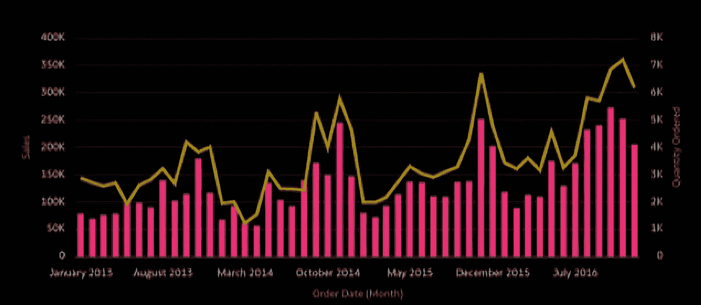

# 如何在任何地方嵌入 Oracle Analytics！

> 原文：<https://medium.com/oracledevs/how-to-embed-oracle-analytics-anywhere-43233e9f7830?source=collection_archive---------2----------------------->



# **简介**

将分析嵌入到门户、网站和应用程序中可以大大提高工作效率，提供更快的洞察时间，因为决策所需的信息可以放在需要的地方。有了如此多的用例，iFrames 可以成为一个强大的工具，从可能使用不同技术或相同技术的不兼容版本的嵌入主机“沙箱”嵌入分析。

我之前[写过](/oracledevs/embedding-oracle-analytics-what-are-the-options-47f4a6c86851)关于使用 [iFrame](https://developer.mozilla.org/en-US/docs/Web/HTML/Element/iframe) 嵌入 Oracle Analytics，此外[还描述了](https://insight2action.medium.com/embedding-quick-tip-using-an-iframe-to-embed-oracle-analytics-in-oracle-visual-builder-cloud-79d9c1ee5d29)一种在 Oracle Visual Builder 中使用 iFrame 的方法。这是 Oracle Analytics 产品文档的[链接](https://docs.oracle.com/en/cloud/paas/analytics-cloud/acubi/embed-iframes.html#GUID-D00F05D0-3E73-4DEA-B2D3-C569FFB45FF6)，其中描述了 iFrames 的使用。也有可能[使用分析工作簿 URL 引用特定画布。](https://docs.oracle.com/en/cloud/paas/analytics-cloud/acubi/share-workbook-url-specific-canvas-selected.html)

在这篇博客中，我将描述如何使用 iframe 将 Oracle Analytics 嵌入到任何支持 iframe 的网站、应用程序或门户中。

# **何时使用 iFrame**

“内嵌框架”或“iFrame”支持将一个文档嵌入到另一个 HTML 文档中，并由标签 [< iFrame >](https://www.w3schools.com/tags/tag_iframe.asp) 定义。嵌入 Oracle Analytics 时使用 iFrames 在您需要从要嵌入的主页或应用程序中“沙箱化”嵌入的分析内容时最有用。如果您正在使用一个以不同方式工作的框架来淘汰(例如 React)，或者如果您处于一个使用不同技术版本的场景中(例如 Oracle JET)，这将特别有用。

# **如何使用 iFrame**

在本节中，我将描述使用 iFrame 嵌入分析的几个用例，从基本的工作簿 URL 引用开始，直到使用窗口消息和事件将值传递到 iFrame 中，然后 iFrame 可以用作嵌入分析内容的过滤器源。

# **使用 iFrame‘src’参数**

这是一种将分析内容嵌入网页的简单方法。iFrame 'src '参数适用于您已经将希望嵌入的内容托管在其他地方或者能够上传合适的 HTML 文件的情况(例如，我在示例中[描述了](https://insight2action.medium.com/embedding-quick-tip-using-an-iframe-to-embed-oracle-analytics-in-oracle-visual-builder-cloud-79d9c1ee5d29)将分析嵌入 Visual Builder)。这个例子为 iFrame 定义了一个特定的高度/宽度，但是也可以创建[响应的](https://www.w3schools.com/howto/howto_css_responsive_iframes.asp)iFrame。

```
<!DOCTYPE HTML>
<html>
<head>
  <meta charset="utf-8"/>
  <title>iFrame Embed </title>
</head>
<body>

<iframe src="<link to OAC Workbook URL" height="1000px" width="1000px"></iframe></body></html>
```

# **使用 iFrame 的‘srcdoc’参数**

如果您有一个用例，其中可能无法通过 URL 引用已经在某处托管的内容，或者您无法将 HTML 上传到与您嵌入的位置相同的主机，那么这就是可以使用 iFrame ['srcdoc](https://www.w3schools.com/tags/att_iframe_srcdoc.asp) 参数的地方。

我发现这是创建自包含分析嵌入引用的最有用的方法之一，因为您使用带有 iFrame 标签的 iFrame *inline* 来定义要嵌入的 HTML。这里有一个例子:

```
<!DOCTYPE HTML PUBLIC "-//IETF//DTD HTML//EN">
<html><head>
  <meta charset="utf-8"/>
  <title> iFrame Embed </title>
</head><body>
  <div><iframe style='width:1000px; height:800px' srcdoc="<!DOCTYPE HTML>
  <html dir='ltr'>
      <head>
          <meta http-equiv='Content-Type' content='text/html; charset=utf-8'>
          <title>Oracle Analytics Embed Example</title>
          <script src='https://<oac-instance>.analytics.ocp.oraclecloud.com/public/dv/v1/embedding/standalone/embedding.js' type='application/javascript'>
          </script>
      </head>
      <body>
          <h1>Embedded Analytics</h1>
          <div style='border:1px solid black;position: absolute; width: calc(100% - 40px); height: calc(100% - 120px)''><oracle-dv project-path='/@Catalog/shared/Embed/Public Live/Dark_Theme_Embed'
           active-page='canvas' 
           active-tab-id='1'>
       </oracle-dv>
          </div><script>
          requirejs(['jquery','knockout','ojs/ojcore', 'ojs/ojknockout', 'ojs/ojcomposite', 'obitech-application/application', 'jet-composites/oracle-dv/loader'], function($, ko, application) {
          ko.applyBindings();
          });
          </script></body>
  </html>" >
  </iframe></div></body>
</html>
```

有一些要点需要注意:

*   即使嵌入到 JET 应用程序中，也必须使用/standalone/路径来嵌入. js。此选项提供 Oracle Analytics 所用版本的 JET 库，因此在使用不同版本的 JET 时非常有用。
*   iFrame“srcdoc”参数在双引号" "中包含内联 HTML。这意味着如果内联 HTML 需要双引号，那么需要使用**&quot；**(这在使用‘srcdoc’和传递过滤器嵌入分析内容时尤其相关。例如，“你好”会变成&quot；你好&quot；
*   有一个 iFrame 属性[‘沙箱’](https://www.w3schools.com/tags/att_iframe_sandbox.asp)可以限制 iFrame 中可能对您的用例有用的内容。

# **将值传递到 iFrame 中**

嵌入式分析的一个常见要求是能够将值传递给嵌入式画布，以充当过滤器。当使用 iFrames 时，我们需要使用窗口。PostMessage() [方法](https://developer.mozilla.org/en-US/docs/Web/API/Window/postMessage)并在 iFrame 中定义一个事件监听器。

下面是一些将过滤器应用于列“区域”的示例代码，我将在下面进一步解释..

```
<!DOCTYPE HTML>
<html>
<head>
  <meta charset='utf-8'/>
  <title> iFrame Embed </title>
</head><body>
    <h1>Embed Analytics into iFrame and pass filter value</h1>
    <button onclick='PassFilterValue()'> Pass a filter value </button>
    <hr><iframe id='OACiFrameEmbed' style='width:1200px; height:1000px' srcdoc="<!DOCTYPE HTML>
      <html dir='ltr'>
          <head>
              <meta http-equiv='Content-Type' content='text/html; charset=utf-8'>
              <title>Oracle Analytics Embed Example</title>
              <script src='https://<oac-instance>.analytics.ocp.oraclecloud.com/public/dv/v1/embedding/standalone/embedding.js' type='application/javascript'>
              </script></head>
          <body>
                <h1>Sales Analytics</h1>
                <div style='width:1200px; height:1000px'><oracle-dv id='Filter'
                       project-path='<path to DV workbook>'
                       active-page='canvas'
                       active-tab-id='1'
                       project-options='{&quot;bDisableMobileLayout&quot;:false, &quot;bShowFilterBar&quot;:true}'
                       filters='{{filters}}'>
                    </oracle-dv></div><script>requirejs(['jquery','knockout','ojs/ojcore', 'ojs/ojknockout', 'ojs/ojcomposite', 'obitech-application/application', 'jet-composites/oracle-dv/loader'],
            function($, ko, application) {function model() {
                            var self = this;
                            self.filters = ko.observableArray([{
                              'sColFormula': 'XSA(\'<user>\'.\'Order Activity\').&quot;Columns&quot;.&quot;Region&quot;',
                              'sColName': 'Region',
                              'sOperator': 'in',
                              'isNumericCol': false,
                              'isDateCol': false,
                              'bIsDoubleColumn': false,
                              'aCodeValues': [],
                              'aDisplayValues': ['Central','West']
                            }]);window.addEventListener('message', (event) => {
                             if ((typeof event.data === 'string' || event.data instanceof String) && event.origin == '[http://localhost:8080'](http://localhost:8080')) {
                               let self = this;
                               self.filters([{
                                 'sColFormula': 'XSA(\'<user>\'.\'Order Activity\').&quot;Columns&quot;.&quot;Region&quot;',
                                 'sColName': 'Region',
                                 'sOperator': 'in',
                                 'isNumericCol': false,
                                 'isDateCol': false,
                                 'bIsDoubleColumn': false,
                                 'aCodeValues': [],
                                 'aDisplayValues': [event.data]}
                               ]);
                               }
                           }, false);}ko.applyBindings(new model);});</script></body>
      </html>">
     </iframe><script>
       function PassFilterValue () {
         document.getElementById("OACiFrameEmbed").contentWindow.postMessage('South', '[http://localhost:8080'](http://localhost:8080'));
       }
  </script></body>
</html>
```

此示例的起点是一个分析画布，其中过滤器应用于中部和西部地区。


当按下“传递过滤器值”按钮时，包含新过滤器值 South 的事件将作为消息发送到 iFrame。


描述这段代码，有一个 HTML 按钮，当按下它时，将调用一个函数将消息发送到 iFrame。请注意，传递消息的主机包含在消息中，以确保消息是“安全的”。您会注意到 iFrame 的事件侦听器中的 if()语句引用了同一个主机。

```
<button onclick='PassFilterValue()'> Pass a filter value </button>
.
.
.<other code>
.
.
 <script>
   function PassFilterValue () {   document.getElementById("OACiFrameEmbed").contentWindow.postMessage('South', '[http://localhost:8080'](http://localhost:8080'));
       }
 </script>
```

对 Oracle Analytics“embedding . js”的引用是/standalone/选项:

```
<script src='https://<oac-instance>.analytics.ocp.oraclecloud.com/public/dv/v1/embedding/standalone/embedding.js' type='application/javascript'>
</script>
```

这是下面的<oracle-dv>标签和要点说明:</oracle-dv>

```
<oracle-dv id='Filter'
 project-path='<path to DV workbook>'
 active-page='canvas'
 active-tab-id='1'
 project-options='{&quot;bDisableMobileLayout&quot;:false, &quot;bShowFilterBar&quot;:true}'
 filters='{{filters}}'>
 </oracle-dv>
```

注意在项目选项中对" "使用了"转义。使用在下一段代码中定义的可观察对象来设置过滤器，如下所述:

```
<script>requirejs(['jquery','knockout','ojs/ojcore', 'ojs/ojknockout', 'ojs/ojcomposite', 'obitech-application/application', 'jet-composites/oracle-dv/loader'],
function($, ko, application) {function model() {
                var self = this;
                self.filters = ko.observableArray([{
                  'sColFormula': 'XSA(\'<user>\'.\'Order Activity\').&quot;Columns&quot;.&quot;Region&quot;',
                  'sColName': 'Region',
                  'sOperator': 'in',
                  'isNumericCol': false,
                  'isDateCol': false,
                  'bIsDoubleColumn': false,
                  'aCodeValues': [],
                  'aDisplayValues': ['Central','West']
                }]);window.addEventListener('message', (event) => {
                 if ((typeof event.data === 'string' || event.data instanceof String) && event.origin == '[http://localhost:8080'](http://localhost:8080')) {
                   let self = this;
                   self.filters([{
                     'sColFormula': 'XSA(\'<user>\'.\'Order Activity\').&quot;Columns&quot;.&quot;Region&quot;',
                     'sColName': 'Region',
                     'sOperator': 'in',
                     'isNumericCol': false,
                     'isDateCol': false,
                     'bIsDoubleColumn': false,
                     'aCodeValues': [],
                     'aDisplayValues': [event.data]}
                   ]);
                   }
               }, false);}ko.applyBindings(new model);});</script>
```

在这段代码中，请注意过滤器的可观察数组的定义。这篇[博客](/@insight2action/visual-builder-component-for-embedding-analytics-part-3-filters-44a3b4a2af89)描述了如何为 Oracle Analytics 创建一个过滤器 JSON 数组。同样，您将看到我们必须使用&quot；对任何" "字符进行转义。。

在事件侦听器中，有一个 if()检查传递到 iFrame 中的事件内容的类型。在这种情况下，它检查字符串类型的内容，但它也可能是一个数组，在这种情况下，它将类似于:

```
if ((Array.isArray(event.data)) && event.origin == 'http://[localhost:8080'](https://o8z08rvxuv4ut3a-db20220719103336.adb.us-ashburn-1.oraclecloudapps.com'))
```

# **总结**

本博客展示了如何使用 iFrame 在各种用例中嵌入 Oracle Analytics 内容的示例，以及如何将过滤器传递到引用嵌入式分析的 iFrame 中。

想讨论一下吗？进入我们的[公共休闲频道](https://bit.ly/devrel_slack)了解更多信息。