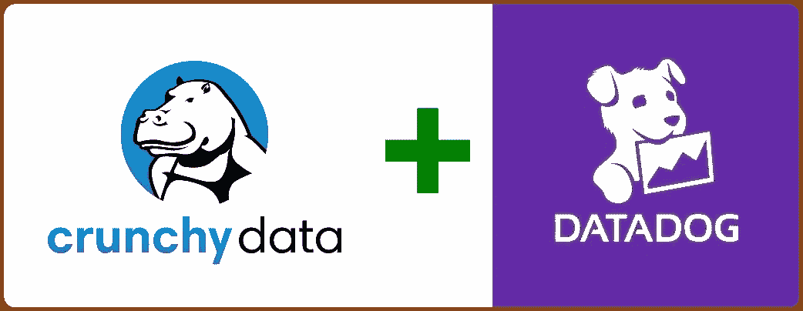
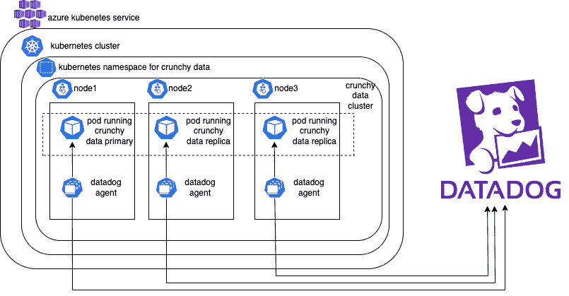
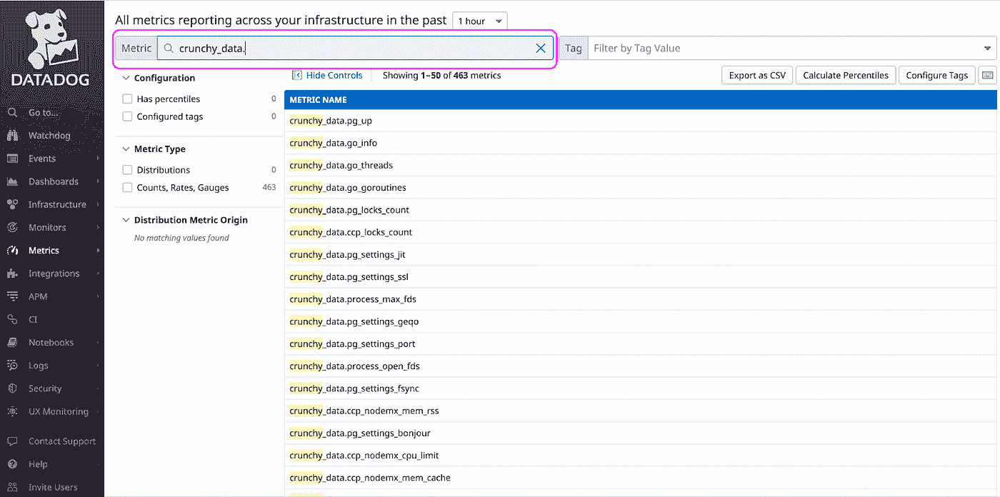

# 如何通过 Datadog 实现对您的海量数据 PostgreSQL 集群的观察

> 原文：<https://medium.com/globant/how-to-enable-observability-into-your-crunchy-data-postgresql-clusters-via-datadog-60e0fa7a23a5?source=collection_archive---------0----------------------->



Crunchy Data integration with Datadog

在本文中，我们将学习如何通过 Datadog 来观察您的数据 Postgres 集群。

那么，我们开始吧。

# **本文涵盖的内容:**

1.  概观
2.  需要能够观察到复杂的数据 Postgres 集群
3.  可用选项
4.  提议的解决方案
5.  先决条件
6.  实施步骤
7.  结论
8.  参考

# **概述:**

**PostgreSQL**

PostgreSQL 是一个强大的开源对象关系数据库系统，它使用并扩展了 SQL 语言，并结合了许多功能，可以安全地存储和扩展最复杂的数据工作负载。

PostgreSQL 附带了许多功能,旨在帮助开发人员构建应用程序，管理人员保护数据完整性和构建容错环境，并帮助您管理数据，无论数据集大小。

除了免费和开源之外，PostgreSQL 还具有高度的可扩展性。你可以定义自己的数据类型，构建自定义函数，甚至用不同的编程语言编写代码，而不需要重新编译你的数据库。

**脆脆的数据**

这些易碎的数据有助于 Kubernetes 支持的商业分布式工具集部署企业级 PostgreSQL 数据库。

Crunchy Data 创建、扩展和管理生产就绪的 Kubernetes Postgres 数据库。您可以使用强大的控件轻松定制 pod 配置以满足您的需求。使用 Postgres 操作符，只需几个命令，就可以在几秒钟内配置一个启动并运行的新数据库，准备接收数据。

它对开发人员友好，高度可用，并提供灾难恢复功能。

它支持零停机软件升级，这意味着可以使用滚动更新无缝部署安全补丁、次要和主要升级，从而最大限度地减少对应用程序和服务的中断。

**数据狗**

Datadog 是一种针对云规模应用的可观测性服务，通过一个位于 SaaS 的数据分析平台提供对服务器、数据库、工具和服务的监控。

Datadog 本质上是一个云应用的监控和安全平台。它汇集了端到端的跟踪、指标和日志，使应用程序、基础设施和第三方服务完全可见。这些功能可以帮助企业保护他们的系统，避免停机，并确保客户获得最佳的用户体验。Datadog 是一个授权工具。

# **用例:**

虽然在 PostgreSQL 集群出现问题时，拥有高度可用且容错的系统有助于解决问题，但监控有助于在问题发生之前就预测到问题。此外，监控可以帮助您诊断和解决可能不会导致停机但会导致性能下降的其他问题。

当 PostgreSQL 存储应用程序的关键任务数据时，人们总是想知道数据库的性能如何。

我们可以参考一些特定于 PostgreSQL 的关键数据指标，这些指标可以帮助我们了解 PostgreSQL 数据库集群的状态和健康状况，如下所述。

*   集群中每个 pod 和节点的 **CPU** 和**内存**使用情况。
*   **备份状态**:上次对集群进行备份的时间。绿色很好。橙色表示备份已超过一天，可能需要调查。
*   **活动连接**:有多少客户端连接到数据库。连接的客户端太多可能会影响性能，当值接近 100%时，可能会导致客户端无法连接。
*   **事务空闲**:有多少客户端的连接状态为“事务空闲”。处于这种状态的客户端太多会导致性能问题，在某些情况下还会导致维护问题。
*   **Idle** :有多少台客户端已连接但处于“空闲”状态。
*   **连接**:事务连接中活动、空闲和空闲的聚合视图。
*   **数据库大小**:PostgreSQL 集群中的数据库有多大。通常与另一个用于分析的指标结合使用，有助于跟踪总体磁盘使用情况，以及是否需要围绕 PVC 大小采取任何分类步骤。
*   **行活动**:选择、插入、更新、删除的行数。这有助于您确定工作负载中读取和写入的百分比，并有助于使用其他指标做出数据库调优决策。
*   **复制状态**:提供关于主 PostgreSQL 实例和副本 PostgreSQL 实例之间复制延迟(以字节和时间为单位)的指导信息。这可以指示在发生故障转移时会丢失多少数据。
*   **冲突/死锁**:当 PostgreSQL 无法完成操作时会出现这些情况，这会导致事务丢失。目标是让这些数字为 0。如果出现这些情况，请检查您的数据访问和写入模式。
*   **缓存命中率**:衡量有多少“工作数据”，例如正在被访问和操作的数据，驻留在内存中。这用于了解 PostgreSQL 需要利用多少磁盘。
*   **提交&回滚**:提交和回滚了多少事务。
*   **锁**:给定系统中存在的锁的数量。

# **解决方案:**

建议的解决方案包括利用 Datadog 的能力来监控我们的复杂数据 PostgreSQL 集群工作负载。



如上图所示，我们将使用部署在 Crunchy Data PostgreSQL cluster pods 旁边的 Datadog 代理，作为边柜容器。这些 Datadog 代理被部署为一个 DaemonSet，因此在 Kubernetes 集群中的每个节点上都可以使用 Datadog 代理来捕获复杂的数据指标。每个节点上运行的 Datadog 代理将从 Crunchy Data pods 中提取所有需要的指标，并将它们推送到 Datadog 服务器。一旦在 Datadog 服务器中可用，我们就可以以可视化的方式在仪表板中查看这些指标，并在其上创建警报。

# **先决条件:**

1.  一个使用 AKS 部署 Crunchy Data PostgreSQL 集群的活动 Azure 订阅。
2.  访问一个活跃的数据狗帐户。
3.  安装了 Kubernetes 命令行工具(kubectl)的工作站，用于与部署在 AKS 中的 Kubernetes 集群进行交互。
4.  在您的工作站上安装工作舵。

# **实施步骤:**

我们可以使用[舵图](https://docs.datadoghq.com/agent/kubernetes/?tab=helm)或直接使用 [DaemonSet](https://docs.datadoghq.com/agent/kubernetes/?tab=daemonset) 对象 YAML 定义来部署 Datadog 代理。

**数据狗配置**

让我们使用舵图法，按照以下步骤操作。

1.  如果这是全新安装，请通过执行以下命令添加 Helm Datadog repo

```
*helm repo add datadog https://helm.datadoghq.com**helm repo update*
```

2.更新 *values.yaml* 文件以启用“普罗米修斯刮擦”配置部分。使用 Datadog[*values . YAML*](https://github.com/DataDog/helm-charts/blob/master/charts/datadog/values.yaml)*配置文件作为参考，创建自己的 *values.yaml* 文件。*

```
**prometheusScrape:* *enabled: true**
```

*3.从 Datadog UI 中的[组织设置](https://app.datadoghq.com/organization-settings/api-keys)页面检索您的 Datadog API 密钥，并运行以下命令*

```
**helm install datadog -f values.yaml  --set datadog.apiKey=<DATADOG_API_KEY> datadog/datadog --set targetSystem=linux**
```

*以上步骤将把 Datadog 代理作为 daemonset 安装到您的 Kubernetes 集群中。*

***易碎数据配置***

*配置易碎数据，以支持将指标摄取到 Datadog。*

*有两个可能的选项来启用 Datadog 中来自 Crunchy Data PostgreSQL 集群的可观察性和指标摄取。让我们详细讨论这两者，并为实现选择最佳方案。*

***选项 1:直接集成易碎数据 PostgreSQL pods***

*在这种方法中，Datadog 代理将直接连接到 Crunchy Data PostgreSQL 集群数据库。它将使用基于用户名和密码的身份验证进行连接，然后从数据库中提取所需的指标。随后，它会将这些指标发送到 Datadog 服务器。*

*出于以下原因，我们不推荐这种方法。*

*   *我们需要在每个我们想要监控的数据数据库中创建一个用户和角色。*
*   *Datadog 代理使用基于用户名和密码的身份验证连接到数据库以收集指标。这有时会变得喋喋不休，并可能导致数据库性能问题。*
*   *该选项仅提供数量非常有限的指标。*

***备选方案 2:基于 PgMonitor 和出口商的 prometheus 废料处理***

*在这种方法中，Datadog 代理不会直接连接到易碎的数据 PostgreSQL 集群数据库。相反，易碎的数据 PostgreSQL pods 将暴露特定端口和端点上基于普罗米修斯的指标(在 pgMonitor 和操作员的帮助下)。我们将配置 Datadog 代理来监听这个端点，以获取公开的指标。随后，数据狗代理会将这些指标发送到数据狗服务器。*

*这种方法解耦了 Datadog 代理和数据库之间的直接交互，从而有助于我们运行两个组件，而不会相互干扰。*

*这是我们推荐的收集由 pgMonitor 堆栈和操作者公开的数据指标的方法。*

*这个选项是合适的，因为 Datadog 代理不直接与数据库对话。相反，Datadog 代理将废弃 pgMonitor 和操作员在端口 9187 上公开的所有指标。这种方法通过将数据压缩到 Datadog 中来获取几乎所有可用的指标。将获取大约 463 个自定义指标。*

***所需配置变更:***

*完整的数据 Postgres 运营商部署代码可以在[这里](https://github.com/CrunchyData/postgres-operator-examples/tree/main/helm)找到。*

*用以下内容更新“postgres-operator”的“Postgres”文件夹下的 *values.yaml* 文件。*

```
**monitoring: true**instances:* *- name: '<name_your_instance>'* *metadata:* *labels:* *tags.datadoghq.com/env: "<add_environment_name_here>"* *tags.datadoghq.com/service: "postgrescluster-<add_cluster_name_here>"* *tags.datadoghq.com/version: "<add_postgres_version_number_here>"**metadata:* *annotations:* *ad.datadoghq.com/database.check_names: '["openmetrics"]'* *ad.datadoghq.com/database.init_configs: '[{}]'* *ad.datadoghq.com/database.instances: '[{"prometheus_url":    "http://%%host%%:9187/metrics","namespace": "crunchy_data","metrics": ["*"]}]’**
```

*上面的代码确实支持对 pod 的监控。此外，它还做了另外两件事。*

*   *第一个是，标记您的松散数据 Postgres pods，以便可以根据集群名称和环境名称过滤掉 Datadog 中的指标。当您跨多个帐户和环境管理多个集群时，拥有这些标记非常有帮助。*
*   *第二个是，它向易碎的数据 Postgres 集群容器添加了注释。这是自动发现 Datadog 代理的 pod 所必需的。通过自动发现，Datadog 代理可以检测本机 Prometheus 注释，并自动安排 OpenMetrics 检查，以收集 Kubernetes 中的 pod 公开的 Prometheus 指标。*

*如果您想了解有关自动发现的更多信息，请点击[此处](https://docs.datadoghq.com/getting_started/containers/autodiscovery/?tabs=adannotationsv2agent736)。*

*元数据部分中添加的注释包括一个检查名称、暴露指标的 prometheus url 以及将捕获所有指标的名称空间名称(在我们的例子中，我们将其称为*‘crunchy _ data’*)。与*“指标”*相对的 *** 表示，我们希望公开所有可用的指标。*

*在 Postgres 部署的 *values.yaml* 文件中添加上述配置后，通过使用修改后的 *values.yaml* 重新部署来更新集群。*

```
**helm upgrade <release_name> <chart_directory> -f values.yaml -n <namespace_name>**
```

*以上命令将升级您的集群。*

# ***数据狗中的验证:***

*等待几分钟，您将在 Datadog 中看到指标。*

*登录 Datadog UI 后，请从左侧菜单导航至指标→摘要。*

*它将打开新的一页。在公制标签对应的文本框中输入*‘crunchy _ data’*,然后按回车键。*

*如果您还记得的话，我们在配置自动发现时已经给了*‘crunchy _ data’*作为名称空间名称。如果您提供了任何不同的名称，请相应地进行搜索。*

*我们得到了近 463 个自定义指标，如下所示。*

**

*如需了解所披露指标的详细信息，请点击[此处](https://access.crunchydata.com/documentation/pgmonitor/4.6/exporter/#metrics-collected)。*

*一旦这些指标在您的 Datadog 帐户中可用，您也可以在这些指标上创建监视器/警报。也许，我会在我的下一篇文章中谈到这一点。*

# ***概要**:*

*在本文中，我们展示了如何通过 Datadog 来观察您的复杂数据 PostgreSQL 集群。*

*这将让您鸟瞰运行在您的基础设施中的数据库 PostgreSQL 集群。出现诸如高利用率、死锁、复制延迟、空闲连接等问题时。等等。，我们就可以根据 Datadog 中的指标做出明智的决策，从而更好地为我们的应用和服务提供服务。*

# ***参考文献:***

*   *[https://www.crunchydata.com/](https://www.crunchydata.com/)*
*   *[https://www.postgresql.org/](https://www.postgresql.org/)*
*   *[https://www.datadoghq.com/](https://www.datadoghq.com/)*
*   *[https://azure.microsoft.com/en-us/services/kubernetes-service/](https://azure.microsoft.com/en-us/services/kubernetes-service/)*
*   *[https://kubernetes.io/docs/reference/kubectl/](https://kubernetes.io/docs/reference/kubectl/)*
*   *[https://kubernetes.io/docs/concepts/overview/working-with-objects/annotations/](https://kubernetes.io/docs/concepts/overview/working-with-objects/annotations/)*
*   *[https://helm.sh/](https://helm.sh/)*
*   *[https://docs.datadoghq.com/containers/kubernetes/prometheus?tabs=helm (T11)](https://docs.datadoghq.com/containers/kubernetes/prometheus/?tabs=helm)*