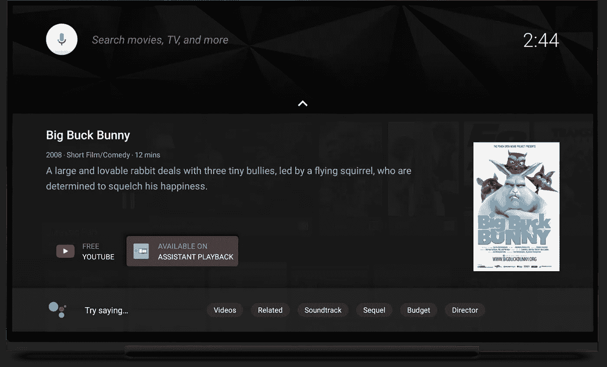

# 如何在 Android TV Oreo+上吸引和取悦用户

> 原文：<https://medium.com/androiddevelopers/how-to-engage-and-delight-users-on-android-tv-oreo-cead289c3f57?source=collection_archive---------3----------------------->

Android TV Oreo home screen

正如你从上图中看到的，Android TV 有一个以内容为中心的主屏幕，为应用程序提供了很多空间来吸引用户。应用程序可以创建多行内容卡，这些内容卡可以针对用户进行个性化设置。结合丰富的元数据和视频预览，内容才是真正的王道。

这还不是全部:凭借谷歌助手、谷歌播放分发、谷歌播放计费、无摩擦登录、用于第二屏幕体验的邻近技术、UHD/HDR、内置演播功能、直播电视框架和其他功能，它是最先进的智能电视平台。

但是，你的应用程序充分利用它了吗？

# 主屏幕上的**频道**

频道是显示在主屏幕上的多行内容卡(节目)。频道是动态的，由应用程序控制。这是一个从应用外部推动用户参与的机会。

默认情况下，每个应用程序在主屏幕上都有一个频道。应用程序可以为用户创建多个频道。其他频道需要用户授权才能添加到主屏幕。

> 默认频道应由应用程序创建时安装。不要等用户打开你的应用。

 [## 主屏幕上的频道| Android 开发者

### 观看下一个频道是出现在主屏幕中的第二行，在应用程序行之后。系统创建并…

developer.android.com](https://developer.android.com/training/tv/discovery/recommendations-channel#creating_a_channel) 

小贴士:

1.  让您的频道和节目保持新鲜
2.  回应用户。例如，建议根据应用内互动添加新频道。
3.  提供丰富的元数据和视频预览
4.  安装应用程序时添加默认频道。
5.  从主屏幕启动时，内容应该立即开始播放

# **玩下一个**

“播放下一个”是系统管理的频道，显示在主屏幕的第二行。应用程序可以添加程序来播放下一行。下面是一些很好的候选人

*   用户正在观看的电视连续剧的新集。
*   用户中途留下的内容，即继续观看。
*   先前标记为收藏或添加到其监视列表的内容用户。

小贴士:

*   不要添加用户没有互动过的新程序。
*   等待明确的信号，然后再添加到下一个播放。如果用户开始看电影，并在几分钟后离开，不要添加它。
*   用户通常不观看电影演职员表，所以当当前回放位置占总节目持续时间的 90%或更多时，不要添加或删除任何先前添加的节目。对于一些特殊的内容，完成回放可能是有意义的。
*   添加接下来要播放的节目时，请选择适当的类型。这使得启动器可以定制用户体验，使其更具吸引力。设置类型为启动器提供了正确的信号来为用户构建上下文线索——WATCH _ NEXT _ TYPE _ CONTINUE、WATCH_NEXT_TYPE_NEXT、WATCH_NEXT_TYPE_NEW、WATCH_NEXT_TYPE_WATCHLIST

# **谷歌助手&通用搜索**

作为 Android TV 上的媒体内容提供商，支持内容发现和播放的语音交互可能是你最重要的 Google Assistant 用例。

这里有一篇很棒的博文解释了这是如何工作的:

 [## 在安卓电视上使用谷歌助手播放视频

### 由开发者项目工程师本杰明·巴克斯特在今年早些时候发布，我们宣布谷歌助手将…

android-developers.googleblog.com](https://android-developers.googleblog.com/2017/10/video-playback-with-google-assistant-on.html) 

小贴士:

*   测试以确保您的内容的“WatchAction”出现在电影和电视实体搜索中。在 UI 中，这是一个标签为“在<app>可用”的按钮</app>
*   使用设备上的 ContentProvider 时，在结果列表中提供[所有必填字段](https://developer.android.com/training/tv/discovery/searchable#columns)。对于电视节目，将[时长](https://developer.android.com/training/tv/discovery/searchable#details)设置为剧集的第一集或最后一集。

> **元数据不匹配**是错过观察动作的首要原因。

*   确保深层链接由您的 Android TV 应用程序处理
*   支持所有传输控制(播放、暂停、停止、前进/后退、下一个/上一个、搜索)
*   支持自动播放—尊重[*EXTRA _ START _ Playback*](https://developer.android.com/reference/android/support/v4/content/IntentCompat.html#EXTRA_START_PLAYBACK)EXTRA。

# **无摩擦登录、第二屏体验等**

**身份:**

基于设备凭据的登录不应成为电视用户的主要身份解决方案。这是一个共享设备，在电视上打字既困难又令人沮丧。

考虑使用[智能锁作为密码](https://developers.google.com/identity/smartlock-passwords/android/)、[邻近技术](https://developers.google.com/nearby/)或像 Adobe Pass 这样的 TVE 解决方案

> [网飞智能锁案例研究](https://developers.google.com/identity/casestudies/netflix-smartlock-casestudy.pdf)

**第二屏**

借助附近的技术，您可以发现跨设备运行的应用程序实例，并构建第二屏幕体验

 [## 附近|谷歌开发者

### 在附近的设备和人之间建立简单的交互。

developers.google.com](https://developers.google.com/nearby/) 

[**Google Play 计费**](https://support.google.com/googleplay/android-developer/answer/140504) **(订阅)**

定期付款，免费试用，宽限期，升级/降级，季节性价格，介绍性价格，实时开发者通知，帐户持有和更多！

 [## 创建订阅-播放控制台帮助

### 使用 Google Play 计费，您可以提供应用内产品，以循环方式向用户收取内容或服务费用…

support.google.com](https://support.google.com/googleplay/android-developer/answer/140504) 

**后倾图书馆**

一个具有易于使用的 UI 组件的库，针对 10 英尺体验进行了优化。

 [## 为电视| Android 开发人员构建布局

### 电视屏幕通常在大约 10 英尺外观看，虽然它比大多数其他 Android 设备都大得多…

developer.android.com](https://developer.android.com/training/tv/start/layouts) 

**输入处理**

响应通常在电视遥控器上找到的所有媒体键。

 [## 管理电视控制器| Android 开发者

### 电视控制器通常是蓝牙设备，它们可能会通过定期进入睡眠来尝试省电…

developer.android.com](https://developer.android.com/training/tv/start/controllers) 

在 Google+上继续对话

 [## 安卓电视

### 按下问号，查看所有可用的快捷键安卓电视- ADT-1，安卓电视游戏，安卓电视…

plus.google.com](https://plus.google.com/communities/109694875004529508368)