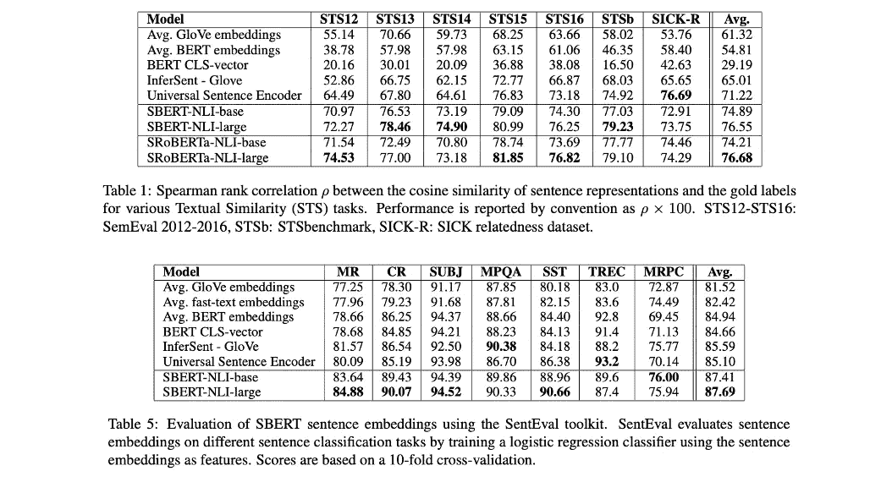
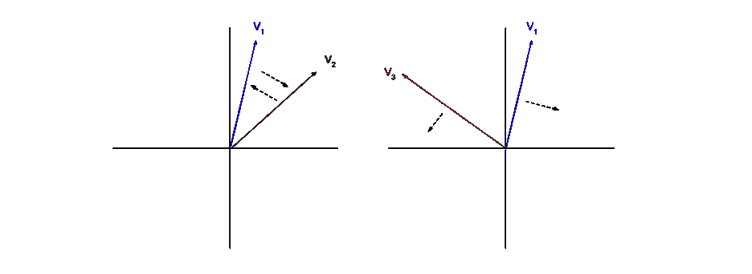

# 如何微调 Slack 机器人问答系统中的句子-BERT

> 原文：<https://medium.com/capital-one-tech/how-to-fine-tune-sentence-bert-for-question-answering-5107fa5224c9?source=collection_archive---------0----------------------->

## 一个关于使用句子变形库微调问题匹配的句子变形库的简单教程


我是 Alison，Capital One 的一名工程师，正在开发一个内部问答聊天机器人。在 Capital One，我们团队沟通的主要方式之一是 Slack，这里有数百个讨论频道，讨论的话题从部署软件到公司旅行。在每个渠道中，员工就指定主题进行问答，但许多相同的问题会被重复询问。为了通过自动回答最常见的问题来简化这一支持过程，我的团队开发了一个 [Slack bot](https://slack.com/help/articles/115005265703-Create-a-bot-for-your-workspace) 。该 bot 目前用于 130 多个不同的内部 Capital One Slack 渠道，其中许多渠道包含超过 1000 名成员。

当一个团队希望将我们的机器人添加到他们的频道时，他们会创建一组问答组，包括(1)某个问题的多种表达方式，以及(2)问题变体的相应答案。在生产中，bot 使用这些问答组来微调问题匹配模型，该模型将传入的 Slack 消息与已知问题进行匹配。当 bot 在 Slack 通道中收到消息时，它可以用问题建议或与传入消息非常匹配的问题进行回复。当一个问题推荐被点击后，机器人会回复与之对应的答案。随着时间的推移，问答组的集合可以被修改，模型可以再次微调。我们用于问题匹配的模型是 [BERT](https://arxiv.org/abs/1810.04805) (来自变形金刚的双向编码器表示)，具体来说就是句子-BERT。

在这篇文章中，我将根据我为 Capital One 构建这个内部机器人的经验，分享一些关于如何微调问题匹配的[句子-BERT](https://arxiv.org/abs/1908.10084) 的技巧。

# 什么是句子-伯特？

句子-BERT 是一个单词嵌入模型。[单词嵌入](https://en.wikipedia.org/wiki/Word_embedding)模型用于通过将短语、单词或单词片段(单词的一部分)转换成矢量来用数字表示语言。这些模型可以在大型背景语料库(数据集)上进行预训练，然后用针对特定领域或任务的较小语料库进行更新。这个过程被称为微调。

最好的单词嵌入模型能够表示文本含义，包括上下文。例如，两个不同单词 sleepy 和疲惫的向量表示将非常相似，因为它们往往出现在相似的上下文中。BERT 就是这些高性能模型中的一个，句子-BERT 就是从这个模型中派生出来的。它是由谷歌研究人员在 2018 年开发的，并在超过 11，000 本书和整个维基百科上进行训练。

我们特别选择了 Sentence-BERT，因为它已经针对单个句子级别的更快相似性计算进行了优化，这使得它非常适合我们的问题匹配任务。正如你在下面的表格中看到的，Sentence-BERT 在各种 NLP 任务中表现非常好，最显著的是我们在[语义文本相似度](https://paperswithcode.com/sota/semantic-textual-similarity-on-sts-benchmark) (STS)上的用例。



*“Sentence-BERT: Sentence Embeddings using Siamese BERT-Networks” (https://arxiv.org/abs/1908.10084) by Nils Reimers and Iryna Gurevych is licensed under CC BY-SA 4.0 (https://creativecommons.org/licenses/by-sa/4.0/).*

尽管仅使用预训练的句子-BERT 模型就可能获得有意义的结果，但我们看到了预训练模型和我们仅使用来自我们自己的 Slack 数据的 7，000 个新话语(问题和答案)进行微调的模型之间在准确性上的巨大差异。当在 200 个新测试问题上评估这两个模型时，预训练模型的问题匹配准确率为 52%，微调模型的问题匹配准确率为 79%。随着我们增加用于微调的数据量，精确度进一步提高。

# 教程:使用句子-BERT 进行问题匹配

假设我们想要使用 Sentence-BERT 来确定哪些问答组与传入的 Slack 消息最匹配。


*User Icon Source (http://freepik.com/), Robot Icon Source (http://flaticon.com/) — (made by user Good Ware)*

我们使用[句子转换库](https://www.sbert.net/)，这是一个用于最先进的句子和文本嵌入的 Python 框架。我们整理数据，微调模型，然后用最终的模型进行问题匹配。让我们来看一下实现它的步骤，从数据集开始，到推理结束。

# 一.数据示例

假设我们希望我们的机器人回答关于烹饪博客的问题。我们的数据集有三个问题组。每组包含一些问题变体和相应的答案。问题变体越多越好，但是为了保持这个句子-BERT 教程的简单，我们将只使用几个。

问题与其对应的答案之间是多对一的关系。我们有三个问答小组，每个小组有两到三个不同的问题。我们希望模型能够学习每组问题之间的语义关系。例如，如果我们从组 1 中选取两个示例问题，并使用模型将每个问题转换为单词嵌入向量:

*有哪些我会做的一锅饭？→ v1*

*有哪些简单易做的食谱？→ v2*

我们希望 v1 和 v2 根据一个[距离度量](https://en.wikipedia.org/wiki/Metric_(mathematics))像[余弦距离](https://en.wikipedia.org/wiki/Cosine_similarity)彼此接近。另一方面，如果我们从组 3 获取一条消息，我在您的一个配方中发现了一个错别字，并将其转换为 v3，我们希望 v3 根据相同的度量远离 v1 和 v2。

# 二。三重损失

在微调过程的每次迭代期间，我们选择锚向量 v1 来关注。然后，我们选择一个正数据点和一个负数据点进行比较:v2 来自与 v1 相同的组，v3 来自不同的组。然后，我们最小化 v1 和 v2 之间的距离(锚和正)，同时最大化 v1 和 v3 之间的距离(锚和负)。这种优化的损失函数被称为[三重损失](https://en.wikipedia.org/wiki/Triplet_loss)。



*“Given a triplet of (anchor, positive, negative), the loss minimizes the distance between anchor and positive while it maximizes the distance between anchor and negative.” (Nils Reimers:* [*https://www.sbert.net/docs/package_reference/losses.html#tripletloss).*](https://www.sbert.net/docs/package_reference/losses.html#tripletloss).) *loss = max(distance(anchor, positive) — distance(anchor, negative) + margin, 0).*

# 三。向模型输入数据

让我们看看输入到模型中进行微调的最终数据。我们将这些数据放入一个 [TSV 文件](https://en.wikipedia.org/wiki/Tab-separated_values)中，其中每一行包含一个组号，后跟问题或答案文本。

请注意，我们在每个编号组的末尾都包含了答案。虽然答案的结构通常与其相关问题不同，但它们通常包括对部分问题或其他相关信息的重新表述。我们发现模型可以从这种语义关系中学习。将答案包含在数据中进行微调，即使在推理过程中仅使用问题进行比较，也会在问题匹配准确性方面产生显著差异。

# 四。微调模型

现在我们的数据已经准备好了，我们可以继续微调模型。**下面的代码是一个玩具示例**-我已经成功地使用了 7000 多个数据点，但没有尝试使用更少的数据点，您需要调整**批量大小**和**周期数**，这取决于您拥有的数据量和您发现的最佳表现。在微调过程中，您可能还想对测试数据使用 [TripletEvaluator](https://www.sbert.net/docs/package_reference/evaluation.html#sentence_transformers.evaluation.TripletEvaluator) ，但是为了保持本教程的简单，我没有在这里包括它。

```
# sentence-transformers==1.0.4, torch==1.7.0.
import random
from collections import defaultdict
from sentence_transformers import SentenceTransformer,SentencesDataset
from sentence_transformers.losses import TripletLoss
from sentence_transformers.readers import LabelSentenceReader, InputExample
from torch.utils.data import DataLoader # Load pre-trained model - we are using the original Sentence-BERT for this example.
sbert_model = SentenceTransformer('bert-base-nli-stsb-mean-tokens') # Set up data for fine-tuning
sentence_reader = LabelSentenceReader(folder='~/tsv_files')
data_list = sentence_reader.get_examples(filename='recipe_bot_data.tsv')
triplets = triplets_from_labeled_dataset(input_examples=data_list)
finetune_data = SentencesDataset(examples=triplets, model=sbert_model)
finetune_dataloader = DataLoader(finetune_data, shuffle=True, batch_size=16)# Initialize triplet loss
loss = TripletLoss(model=sbert_model)# Fine-tune the model
sbert_model.fit(train_objectives=[(finetune_dataloader, loss)], epochs=4,output_path='bert-base-nli-stsb-mean-tokens-recipes')
```

# 动词 （verb 的缩写）推理

现在我们有了新的微调模型，我们可以用它来转换任何文本。对于我们推荐点击问题以接收其相关答案的任务，我们使用余弦距离来确定松弛消息和已知问题之间的语义相似性。

为简单起见，我们将新问题与已知问题进行比较，而不是与答案进行比较。然而，我们也可以直接将新问题与答案选项进行比较，特别是因为我们已经在微调过程中包含了答案。

在生产中，预计算**问题向量**并将其与相应的**答案**一起存储是很有用的。这使我们能够快速计算传入消息和现有问题之间的距离，按距离排序，然后提供与传入消息最接近的问题对应的答案。然而，为了简单起见，从数据库或文件中读取预存数据不包括在下面的示例代码中。

假设我们刚刚收到 Slack 消息*厨师好，我想从一些简单的食谱开始。有什么建议吗？*以下是我们制作相关问答的步骤。

1.使用我们的微调模型将传入的 Slack 消息转换为向量。

样本输入:

```
new_question = """Hello chefs, I would like to get started with some easy recipes. Any suggestions?"""
recipe_model = SentenceTransformer('bert-base-nli-stsb-mean-tokens-recipes')
encoded_question = recipe_model.encode([new_question])
```

2.将结果向量与 ***q_a_mappings*** 中所有预先计算的问题向量进行比较，排序，并显示前 *n* 个匹配。在本例中，我们显示两个匹配项。我们将问题向量(嵌入)、问题文本和答案存储在三个相同长度的平行列表中。这样，相关的嵌入、问题和答案都可以方便地位于每个列表的相同索引处。相似度计算代码是受[这个例子](https://github.com/UKPLab/sentence-transformers/blob/master/examples/applications/semantic-search/semantic_search.py)的启发。

```
# scipy==1.5.4, numpy==1.19.5
from scipy import spatial
import numpy as npq_a_mappings = {'Question Embedding': [[ ], [ ], [ ], ...], 'Question Text': ['What should I cook after work?', 'What are some one-pot meals I can cook?', ...], 'Corresponding Answer': ['For easy one-pot or weeknight recipes, please access this [link].', 'For easy one-pot or weeknight recipes, please access this [link].', ...]}question_embeddings = q_a_mappings['Question Embedding'] question_texts = q_a_mappings['Question Text']
answer_mappings = q_a_mappings['Corresponding Answer']distances = spatial.distance.cdist(np.array(encoded_question), question_embeddings, 'cosine')[0]
results = zip(range(len(distances)), distances)
results = sorted(results, key=lambda x: x[1])for idx, distance in results[0:2]: # just getting top
    print(f"\nMatch {idx+1}:")
    print(question_texts[idx])
    print(answer_mappings[idx])
```

样本输出:

```
Match 1:
What are some easy recipes to make?
For easy one-pot or weeknight recipes, please access this [link].Match 2:
Do you have advice on how to get started with cooking?
Beginner cooking tutorials can be accessed [here].
```

# 不及物动词结论

这就对了。这是一个简单的介绍，关于如何使用句子变形库来微调问题回答的句子-BERT。请查看[库文档](https://www.sbert.net/)，了解更多使用方法。

[*背景矢量*](https://www.freepik.com/vectors/background) *由 starline 创建—【www.freepik.com】[](http://www.freepik.com)*

**披露声明:2021 资本一。观点是作者个人的观点。除非本帖中另有说明，否则 Capital One 不隶属于所提及的任何公司，也不被这些公司认可。使用或展示的所有商标和其他知识产权是其各自所有者的财产。**

**最初发表于*[*【https://www.capitalone.com】*](https://www.capitalone.com/tech/machine-learning/how-to-finetune-sbert-for-question-matching/)*。**