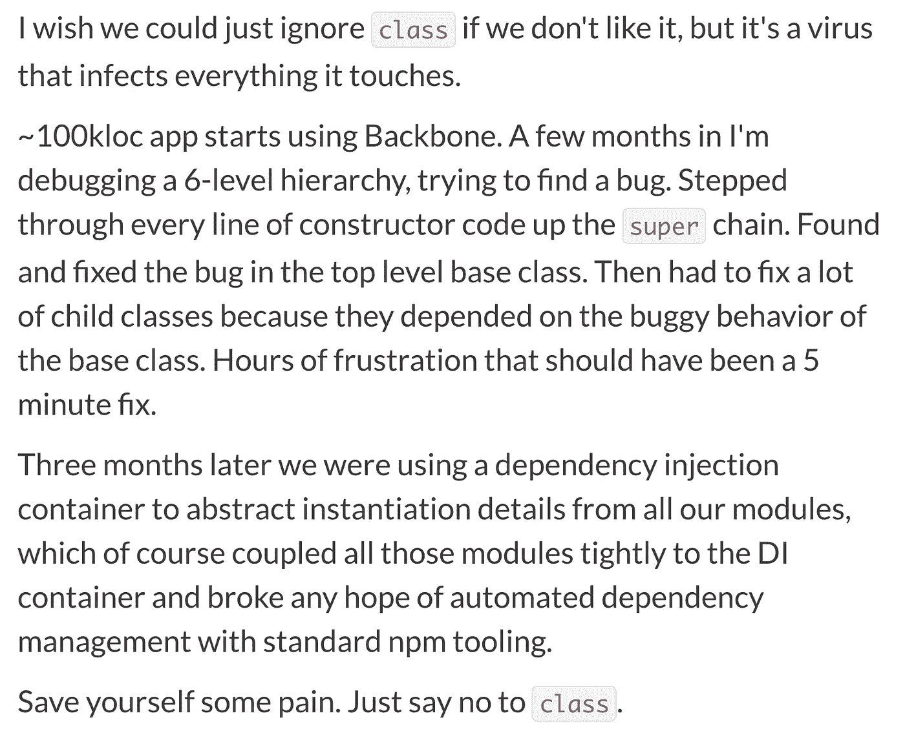

# 如何修复 ES6“class”关键字

> 原文：<https://medium.com/javascript-scene/how-to-fix-the-es6-class-keyword-2d42bb3f4caf?source=collection_archive---------0----------------------->

## 第一个版本中没有什么是完美的，但这并不意味着没有希望。也许我们可以修复 ES7 中的“类”

> **TL；博士**因为与它们相关的危险*(已经对很多实际项目造成了很多实际的损害)*我们需要在 lint 规则中不允许 *`new`* ， *`extends`* ， *`super，* & *`instanceof`* 。ES6 类不会让我们不允许 *`new`* 不抛出错误。

JavaScript 中的` *class* `关键字似乎不可避免地会流行起来，但这是一个问题，因为**它在很多方面都是不完整的**。

既然它已经出来了，人们正在使用它，似乎唯一合理的前进方式就是**努力让它对每个人都更好**。

在 JavaScript 中，**任何函数都可以实例化并返回对象。**当你在没有构造函数的情况下这样做时，它被称为**工厂函数**。类`无法与工厂的能力和灵活性竞争—特别是印记，对象池不是唯一的工厂用例。

GoF 的《设计模式》一书中有整整一节是关于对象构造的，它的存在只是为了避开构造函数和类的限制。

参见:[三种不同的 OO 原型。](http://ericleads.com/2013/02/fluent-javascript-three-different-kinds-of-prototypal-oo/)

底线:**类不会给你任何功能**，这些功能不是由**工厂函数**和内置于语言中的**原型 OO** 提供的。当你创建一个类时，你所做的就是选择一个*不太强大、不太灵活的机制*和 [**一大堆陷阱和痛苦。**](/javascript-scene/the-two-pillars-of-javascript-ee6f3281e7f3)

## 阶级是一种病毒

` *class* `关键字有希望有用吗？也许吧。

# 我们为什么要烦恼呢？

为什么我们不创建一个 lint 规则，然后继续呢？

**`*class*`关键字正在 JavaScript 社区中制造裂痕**。

**类可能有用**。如果我们想在它的基础上构建抽象呢？如果我们想在语言本身中做更多受益于“T2”类集成的事情(比如内置的*特征*)，该怎么办？

难道整个 JavaScript 社区不应该从`*类*中受益吗？

# **如何修复“类”**

## **使类继承复合**

类似于[邮票的排版方式。](http://chimera.labs.oreilly.com/books/1234000000262/ch03.html#prototypal_inheritance_with_stamps)换句话说，改变`*扩展*'的行为，或者**反对`*扩展【T20`***,用类似于【T22`*组合*`关键字的东西替换它，这样**可以组合任意数量的类。**

已经有人讨论过在 ES7 中这样做了，(可能是通过*特征*)，我们做得正确真的很重要，而且我们提出的任何解决方案都是与工厂函数的调用点兼容的，这样你就可以很容易地切换实现。

据我所知，即使[对工厂函数的重构在应用程序开发项目中相当常见](http://refactoring.com/catalog/replaceConstructorWithFactoryMethod.html)，但是*工厂替换透明性在 TC-39 上并不是一个高优先级。* **说错了请指正**，附参考链接。

## 弃用`新的'

` *new* 关键字违反了**替换原则**和**打开/关闭原则**。它也是破坏性的，因为**给语言**增加了零值，并且**将所有调用者耦合到对象实例化的细节**。

如果你从一个需要`*new*`( ES6 中的所有类)的类开始，然后你决定你需要使用一个工厂而不是一个类，**你不能在不重构所有调用者的情况下做出改变。** [看看这个例题要领](https://gist.github.com/ericelliott/e994ee541d0ed365f5fd)。

这对于共享库和公共接口来说尤其成问题，因为**你可能无法使用类访问所有的代码。**你可能认为用` *new* 关键字调用一个工厂函数没有任何害处，但是` *new* 关键字触发了一些行为，这些行为改变了函数被调用时的情况。某些种类的工厂很难用“新的”来实现。[更深入的解释参见要点](https://gist.github.com/ericelliott/e994ee541d0ed365f5fd)。

**更新:**根据 **Brendan Eich** 的消息，针对“*新*”问题的修复程序正在 ES7 中讨论:

> 一个被抛出捕获的错误比一个在运行时语义中作为一个无声但致命的(不考虑分配权重)差异而逃脱的错误要好。
> 
> 如果有帮助的话，为 ES7 提出的想法是，你可以在类中添加一个“调用处理程序”,在没有“new”的情况下调用它:

> 我使用了“this.constructor ”,但是当然也可以直接使用“Point2D”。在这种情况下，子类将不得不覆盖`[Symbol.call]'方法，这似乎是不可取的，并很容易避免，如上所示。
> 
> 底线是，我们不希望 ES6 中有隐式的调用处理程序。我们需要在 ES7 中做到这一点，目前努力失败是未来的唯一方法。
> 
> /是

## 确保 **` *类*`遵守替换原则**

当你从一个职业转换到一个工厂时， **` *职业*遵守替代原则**是至关重要的。这是很重要的一点。如果调用者依赖于某个类的任何行为或属性，而您决定将实现更改为工厂，那么您就破坏了调用代码。我不知道有什么好的理由从工厂转到一个班。

在构建大型应用程序(100kloc+代码库)的团队中，将大型类层次结构分解成更小、更具可组合性的工厂是一项常见的维护活动。事实上，你不能简单地用一个工厂来代替一个类，这浪费了大量的时间和精力，也是很多创业公司的主要资源消耗。我哪里知道？我为许多这样的项目、小型创业公司和企业组织提供过咨询。

相信我的话:这相当普遍，而且非常昂贵。如今，公司被迫不仅重构类的实现，而且重构所有的调用点——有时类在图书馆和公共 SDK 中，需要大量的协调、宣传和教育。我见过这个具体问题**扼杀项目**和**让创业公司屈服**。

## 弃用**超级**

根据定义，Super 将子类与父类紧密耦合，这意味着父类中的任何变化都可能导致**不可知的连锁变化**，这些连锁变化**会破坏从父类**继承的任何东西。

我曾经不得不调试一个子类的问题，这个子类在类层次结构中有 6 层。我的同事们毫无保留地对主干扩展进行子类化。我不得不一行一行地遍历每个子视图，沿着`*超级*'链的控制流程向上。最后在顶级基类中发现问题并修复。然后我花了接下来的几个小时修复所有在我修复基类的行为时被破坏的子类。

如果你正在导出一个人们可以继承的库类，并且你对父类的行为做了**任何改变**，**你可能已经破坏了一个你甚至不知道存在的子类**。

这尤其麻烦，因为**子类不遵守封装规则**。他们经常调用` *super* `,使用和覆盖私有属性和方法等等……基本上， [**super 是一个代码气味**](http://martinfowler.com/bliki/CallSuper.html) ，并且是一个灾难的配方。

它也**不与工厂**合作，这意味着**它违反了替代原则。**

如果我们不能用`*类*解决这些问题，我们应该推动**完全废弃这个关键字，**因为就目前而言， [**` *类*`已经坏了，绝对不应该使用**](/javascript-scene/the-two-pillars-of-javascript-ee6f3281e7f3) **。**

# 替代中断目录

替换的问题很严重，需要解决。

如果我们能够*在这里列出每一个可能的突破性变化*，假设我们能够将一致性融入到语言规范中，那么在未来“*类*”可能会有一些希望。

*   **`*新的*要求。坦率地说，在 JavaScript 中,“new”没有理由像这样改变行为。它没有增加任何价值，并且由于破坏了构造函数/工厂替换，它确实增加了显著的痛苦和复杂性。**
*   **的行为`*这个* `** 。它总是引用类构造函数中的新实例。在工厂函数中，`*这个*`是动态的，遵循一套完全不同的规则。可能的解决方案:**弃用` *this* `** 而代之以按名称引用类或函数。这种解决方案的一个主要缺点是它会破坏`*。call()* `，`*`。apply()* `和`*。bind()* `，除非我们**也改变它们的行为**来覆盖函数名引用。我不喜欢这些解决方案。请随意提出更好的选择。
*   **`*instance of*`—**IMO， **` *instanceof* 无论如何都是坏的**，因为它不做名字所描述的事情，而且从用户的角度来看，**当你试图跨执行上下文使用它时，或者当构造器原型属性改变时，它完全就是**。可能的解决方案:**弃用 `** 的`*实例。*
*   **`*super*`—**`*super*`显然不能用于工厂函数，因为继承与工厂的工作方式完全不同(返回的实例可以是任何东西)，所有用户都应该遵守公共 API。可能的解决方案:**弃`*超* `** ，以及 [**好的除掉**](http://martinfowler.com/bliki/CallSuper.html) **。**