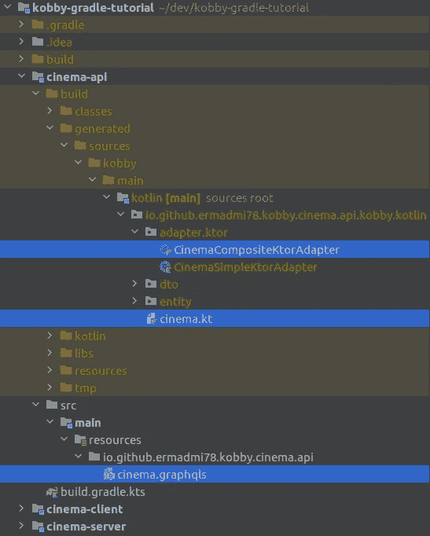

# 如何用 GraphQL 模式生成 Kotlin DSL 客户端

> 原文：<https://blog.kotlin-academy.com/how-to-generate-kotlin-dsl-client-by-graphql-schema-707fd0c55284?source=collection_archive---------2----------------------->

## 介绍 Kobby 插件——kot Lin graph QL 客户端的代码生成器

«Kotlin» and «GraphQL» mean the same thing to you!

一方面，GraphQL 模式惟一地定义了数据模型和实现它的服务的可用操作。另一方面，Kotlin 为创建您自己的特定领域语言(DSL)提供了惊人的机会。这样，您就可以根据发布的 GraphQL 模式编写一种特定于领域的语言来与您的 GraphQL 服务进行交互。但是手工编写这样的代码是徒劳的。这就是 [**Kobby 插件**](https://github.com/ermadmi78/kobby) 的用武之地，它可以解析您的服务的 GraphQL 模式并生成用于交互的客户端 DSL。我们来试试吧！

本文中示例的源代码可以在 [**Kobby Gradle 教程**](https://github.com/ermadmi78/kobby-gradle-tutorial) 和 [**Kobby Maven 教程**](https://github.com/ermadmi78/kobby-maven-tutorial) 中找到。

# 最后我们会得到什么？

*如果你懒得看整篇文章……*

## 询问

## 变化

## 签署

# Kobby 插件设置

> 起初是这个词…

但是我们将从我们服务的模式开始。默认情况下， [Kobby 插件在项目资源中扩展名为`graphqls`的文件中寻找 GraphQL 模式](https://github.com/ermadmi78/kobby/wiki/Gradle-GraphQL-Schema-Location)。为了简单起见，我们将模式放在一个名为`cinema.graphqls`的文件中:

这个简单的模式将允许我们尝试所有种类的 GraphQL 操作——查询、变异和订阅。

接下来，我们必须配置插件。对于 Gradle 项目，它看起来像这样:

对于 Maven 项目，这看起来并不那么优雅:

有[显式](https://github.com/ermadmi78/kobby/wiki/Available-Gradle-Plugin-Settings)和隐式方式来配置插件。我们通过向 [Jackson](https://github.com/FasterXML/jackson) 和[kt](https://ktor.io/)库添加依赖项来使用隐式方式。Kobby Plugin 不仅会扫描资源中的模式文件，还会分析项目依赖关系。如果依赖项中存在 Jackson，则该插件会将 Jackson 注释添加到生成的 [DTO](https://en.wikipedia.org/wiki/Data_transfer_object) 类中，以确保 JSON 序列化。如果项目依赖项中存在 Ktor，则该插件将生成默认 DSL 适配器。我们将在下一节讨论适配器。

# 实例化 DSL 上下文

我们已经配置了我们的插件。现在，我们必须根据我们的模式生成一个 DSL。为 Gradle 运行`gradle build`，为 Maven 运行`mvn compile`，插件将找到`cinema.graphqls`文件，并基于该文件生成 DSL:

该插件将使用`cinemaContextOf` builder 函数创建`cinema.kt`文件，该函数实例化`CinemaContext`接口，即所生成 DSL 的入口点:

我们必须将`CinemaAdapter`接口的实例传递给 builder 函数来创建上下文。什么是适配器？由 Kobby Plugin 生成的 DSL 上下文对传输层和 GraphQL 通信协议一无所知。上下文实现只是构建查询并将其传递给适配器。而适配器必须完成所有的脏工作—将查询发送到服务器，并接收和反序列化响应。您可以编写自己的适配器实现，或者使用插件生成的默认适配器。

我们将使用默认的适配器。它使用[kt 或](https://ktor.io/)在 HTTP 上执行 GraphQL 查询和变异，并在 WebSocket 上建立订阅会话:

# 执行查询

我们准备执行第一个查询。让我们试着找一部有 ID 的演员的电影。在 GraphQL 中，这个查询如下所示:

在科特林，它看起来是这样的:

`context.query`为[挂起功能](https://kotlinlang.org/docs/coroutines-basics.html)，不阻塞当前线程。执行查询的结果是什么？在 GraphQL 中，结果是 JSON，如下所示:

为了浏览结果，插件生成如下所示的“实体”界面:

`context.query`函数返回`Query`实体的一个实例，因此结果的导航如下所示:

# 执行突变

让我们创作一部新电影。在 GraphQL 中，变异看起来像这样:

我们将得到如下所示的 JSON 结果:

在科特林，这种变异看起来像这样:

`context.mutation`函数返回`Mutation`实体接口的一个实例，也是[暂停函数](https://kotlinlang.org/docs/coroutines-basics.html)。所以，我们的突变不会阻塞当前线程。

# 建立订阅

让我们订阅新电影通知。在 GraphQL 中，订阅如下所示:

有了这个订阅，我们将收到如下所示的 JSON 消息:

Kotlin 中订阅操作的语义不同于查询和变异操作的语义。虽然查询和变异只是发送一个请求和接收一个响应，但是订阅创建了一个长期会话来侦听传入的消息。因此，我们必须创建一个异步侦听器来接收传入的消息:

别担心，我们没有在无限循环中阻塞线程，因为`subscribe`函数和`receive`函数是[暂停函数](https://kotlinlang.org/docs/coroutines-basics.html)。

订阅会话的生命周期与`subscribe`函数的执行时间相同。当我们进入`subscribe`函数时，一个会话被创建，当我们退出时，该会话被销毁。

`receive`函数为每个传入的消息返回一个`Subscription`实体接口的实例。

# 我在这篇文章中没有提到什么？

*   我还没有介绍如何将模式中定义的标量映射到 Kotlin 数据类型。
*   我还没有谈到插件如何处理抽象数据类型。
*   我还没有介绍如何使用 GraphQL 指令定制生成的 DSL。
*   我还没有谈到插件[如何支持服务器端开发](https://github.com/ermadmi78/kobby/wiki/GraphQL-Java-Kickstart-support)。

而且最重要的是，我没有谈到如何使用 [Kotlin 扩展函数](https://kotlinlang.org/docs/extensions.html)将生成的 DSL 变成类固醇上的丰富域模型。也许我会在以后的文章中讨论这个问题。

