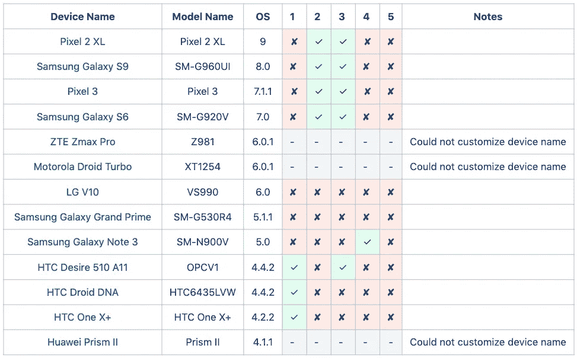

# 如何获得 Android 设备昵称

> 原文：<https://medium.com/capital-one-tech/how-to-get-an-android-device-nickname-d5eab12f4ced?source=collection_archive---------0----------------------->

## 流行 Android 设备上五大方法的比较

# 背景

在大多数 Android 设备上，用户可以选择设置一个自定义的设备昵称，以便更容易识别他们的设备。当向用户显示他们的设备列表时，我们希望显示他们的自定义设备名称，而不是出厂默认值(如果有)。

# 研究

我在网上搜索，发现了几种不同的方法来读取 Android 上用户指定的设备昵称:

1.  [设置。system . getstring(getContentResolver()，“蓝牙 _ 名称”)；](https://developer.android.com/reference/android/provider/Settings.System.html#getString(android.content.ContentResolver,%20java.lang.String))
2.  [设置。secure . getstring(getContentResolver()，“蓝牙 _ 名称”)；](https://developer.android.com/reference/android/provider/Settings.Secure.html#getString(android.content.ContentResolver,%20java.lang.String))
3.  [bluetooth adapter . getdefaultadapter()。getName()；](https://developer.android.com/reference/android/bluetooth/BluetoothAdapter.html#getName())
4.  [设置。system . getstring(getContentResolver()，“设备名称”)；](https://developer.android.com/reference/android/provider/Settings.System.html#getString(android.content.ContentResolver,%20java.lang.String))
5.  [设置。secure . getstring(getContentResolver()，“lock _ screen _ owner _ info”)；](https://developer.android.com/reference/android/provider/Settings.Secure.html#getString(android.content.ContentResolver,%20java.lang.String))

*注意:#3 需要蓝牙权限。*

来源:

*   [堆栈溢出——如何在 android 中获取用户自定义的“设备名”？](https://stackoverflow.com/questions/16704597/how-do-you-get-the-user-defined-device-name-in-android)
*   [堆栈溢出——如何获取设备名称(而不是构建。MODEL)从 Android 编程？](https://stackoverflow.com/questions/38393849/how-to-fetch-device-name-not-build-model-from-android-programatically)
*   [Xamarin 论坛—设备名称—非品牌、型号或制造商。而是用户分配的设备名称。](https://forums.xamarin.com/discussion/91705/device-name-not-make-model-or-manufacturer-but-the-user-assigned-name-of-the-device)

# 结果

但是它们在各种流行的 Android 设备上表现如何呢？下表中的#列指的是用于访问上述“研究”部分中提及的设备昵称的方法。绿色勾号表示我们能够成功读取用户的自定义设备昵称。

# 结论

没有标准化的 Android API 来读取用户指定的设备昵称，并且不是所有的 Android 设备都支持自定义昵称。有很多方法可以读取这些数据，但是没有一种方法可以在所有的 Android 设备上运行。

虽然我们没有找到一致的方法来访问用户指定的设备昵称，但有一些可用的库，如 [AndroidDeviceNames](https://github.com/jaredrummler/AndroidDeviceNames) ，它们可以提供一个比工厂设置值更*可读的设备名称(例如“sailfish”)。例如，它可以提供比代号“dream2qltecan”或型号“SM-G955W”更容易被用户识别的“Samsung S8+”。*

*声明:这些观点仅代表作者个人观点。除非本帖中另有说明，否则 Capital One 不属于所提及的任何公司，也不被其认可。使用或展示的所有商标和其他知识产权都是其各自所有者的所有权。本文为 2019 首都一。*