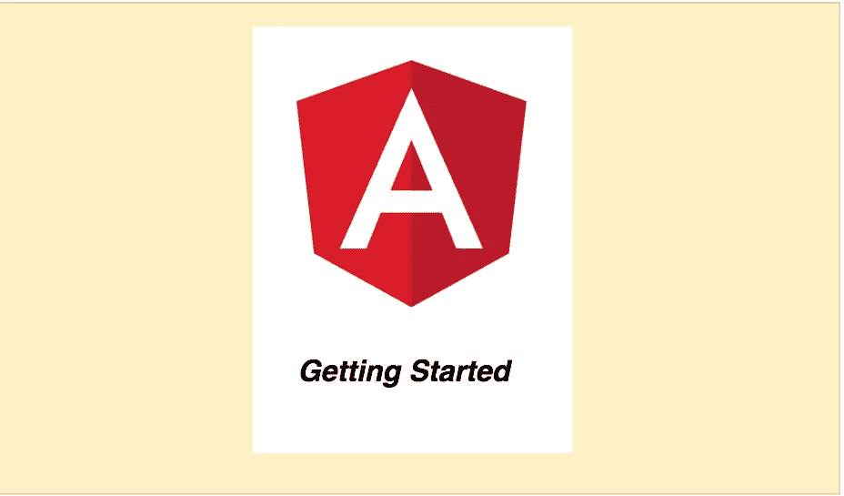

# 如何开始使用 Angular

> 原文：<https://medium.com/bb-tutorials-and-thoughts/how-to-get-started-with-angular-c3c209d6fe90?source=collection_archive---------0----------------------->

## 带有示例项目的初学者指南

Angular 是一个固执己见的 web 应用 javascript 框架。您可以使用简单的声明性模板快速构建功能。您可以使用 Angular 构建一个应用程序，并重用您的代码和能力来为任何开发目标构建应用程序。在您开始之前，有太多的事情需要了解…