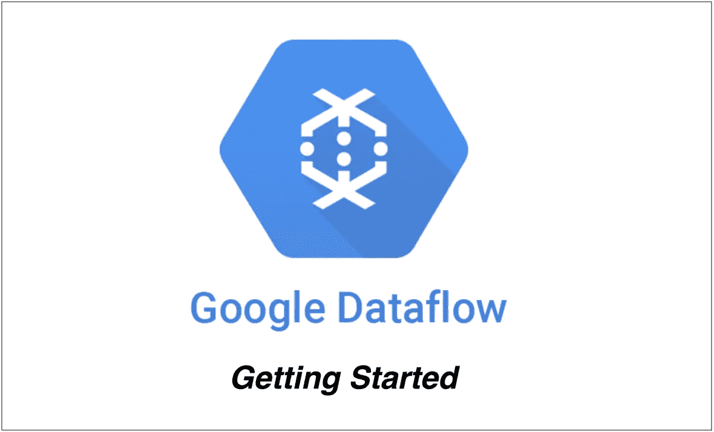

# 如何开始使用 GCP 数据流

> 原文：<https://medium.com/bb-tutorials-and-thoughts/how-to-get-started-with-gcp-dataflow-822295dce7b4?source=collection_archive---------0----------------------->

## 带示例项目的初学者指南

GCP 数据流是一个统一的流和批量数据处理，无服务器，快速，经济高效。这是一个完全托管的数据处理服务，还有许多其他功能，你可以在它的网站上找到。 Apache Beam 是一种高级的统一编程模型，可实现批处理和流数据处理作业…