# 如何开始移动应用测试

> 原文：<https://medium.com/globant/how-to-get-started-with-mobile-app-testing-4e1ccccc756a?source=collection_archive---------0----------------------->

# 介绍

随着全球 36 亿部智能手机和数以千计的移动应用程序被推送到应用程序商店，工程师们正在移动应用程序开发和测试领域寻找新的职业机会。移动行业正被数以百万计的应用程序淹没。因此，移动应用测试变得至关重要。

# 什么是移动应用测试

移动应用程序测试是测试移动应用程序所需的质量、功能、可用性、兼容性、性能和其他特征的过程。

在将软件提供给客户之前，测试是每一个软件开发的重要组成部分，随着移动应用的出现，测试变得更加重要。越来越多的移动设备导致了大量的操作系统碎片、各种屏幕尺寸和分辨率。

Android 和 iOS 是最受欢迎的智能手机操作系统。有数以百万计的应用程序是为这些平台设计的，可以在 Google Play 和苹果应用商店下载。移动应用程序的成功可以通过下载量、正面评论、频繁更新和修复漏洞的新功能来衡量。

# 移动应用的类型

根据功能和编程技术，移动应用主要分为三种类型:

**原生应用**是为智能手机操作系统(OS)明确编码的。这包括大多数 Android 和 iOS 设备。由于是为一个特定的平台编程的，本地应用程序不能混合使用。

**网络应用**的操作与本地应用类似，但通过网络浏览器和有限的特性功能来访问。它们不是需要下载并安装到智能手机上的独立应用程序。

最后，还有**混合应用**。它们使用多平台 web 技术(例如 HTML5、CSS 和 Javascript)构建，然后使用 PhoneGap、Xamarin、Mobile Angular UI、Ionic 等框架将这些代码嵌入到原生包装器中。这些大多是网络应用，操作和感觉都像本地应用。

# 移动、网络和桌面应用之间的区别

根据定义，移动应用程序是在特定操作系统上运行的便携式设备上运行的软件应用程序。这些类型的应用程序可以通过谷歌 Play 商店和苹果应用商店等特定于操作系统的门户网站下载，并安装在用户设备上，具有更高级别的硬件访问权限。

网络应用程序每次运行时都会从互联网下载程序的特定部分到设备上。Google Play 即时应用是不需要完全安装、手动更新和设备硬件能力的 web 应用的最好例子。它们大多运行在服务器上。

桌面应用程序是安装在台式机和笔记本电脑设备上的独立应用程序。这些软件可以像微软 Office 套件、谷歌 Chrome 一样功能齐全，也可以执行一些功能，比如计算器和日历应用。通常，桌面应用程序完全依赖于设备硬件。

# 最常用的移动平台(OS)

就像 Windows 和 macOS 控制你的台式机或笔记本电脑一样，移动 OS 控制你的智能手机和平板电脑。当你购买任何一款移动设备时，它都会附带一个针对该设备的操作系统。这种智能手机操作系统管理移动设备的软件和硬件资源，类似于计算机操作系统。

移动电话有以下不同操作系统:

*   安卓(谷歌)
*   iOS(苹果)
*   八达(三星)
*   黑莓操作系统(动态研究)
*   视窗操作系统(微软)
*   塞班操作系统(诺基亚)
*   Tizen(三星)

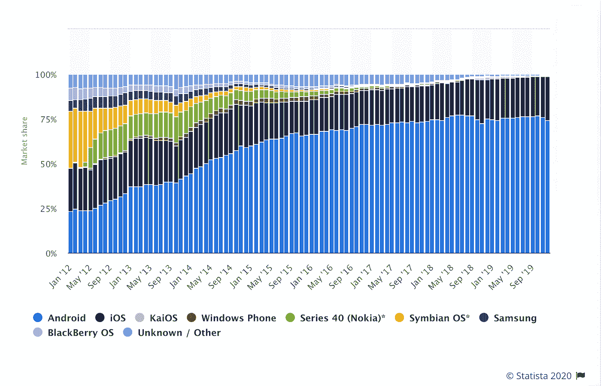

Market share of mobile operating systems worldwide 2012–2020

根据 statista.com2020 年 1 月发布的调查，Android 和 iOS 是最受欢迎的移动操作系统，共同占据了全球 99%的市场份额。截至 2019 年 12 月，Android 以 74.13%的份额主导智能手机行业，iOS 以 24.79%的份额紧随其后。

# 移动应用测试的主要挑战

移动应用在投放市场之前应该是坚如磐石的。但是 QA 工程师在测试他们的应用程序时可能会面临一些关键的挑战。

**显示器分辨率&宽高比**:显示器分辨率的多样性——从 480p 到 1600 p——令人应接不暇，因为现在有可变的刷新率。对于测试来说，这意味着在几十种设备上运行该应用程序，从廉价设备到尖端旗舰产品。

**移动网络**:移动连接有几个本地标准，包括蜂窝和 WiFi。对于国际应用程序，开发者必须确保他们的应用程序兼容所有标准。数据消费是另一个方面，每个地区可能都没有无限制使用的特权。

硬件接入:iPhones 以稳定的硬件和最新的操作系统更新而闻名。这并不适用于 Android，在 Android 上你会发现六家 SoC 供应商和制造商。因此，移动应用程序不能广泛利用 Android 硬件，因为它们必须支持无限的制造商。

**操作系统版本**:五年来，iOS 设备以获得快速一致的操作系统更新而闻名。谁会相信 2016 年的 iPhone 7 运行在最新的 iOS14 上？对于开发者来说，他们必须在 Android 开发的五年中支持旧的 Android 版本和 API。

国际化:大多数移动应用程序都是为国际市场设计的。测试应用程序的翻译和地区语言支持只是故事的一半。开发人员和测试人员还应该考虑地区时间设置和受众。这些特点一直让开发者困惑。

# 从移动应用测试策略和计划开始

为了赢得构建一个全面胜任的应用程序的战斗，你必须意识到挑战并开发健壮的移动应用程序测试策略。如果你记住这些基本因素，你会受益匪浅:

*   选择合适的移动设备进行测试对于确保应用在所有设备上的性能和稳定性至关重要。
*   在模拟器上测试你的应用程序可能会节省你购买硬件的费用，但是你会失去对硬件统计数据的监控。
*   云测试和内部测试的决定取决于您的需求和您对试验的期望。
*   手动和自动测试是两种互补的方法，可以节省您的时间，同时使输出更具统计性。
*   设备上和内部测试可让您监控系统资源使用情况，如 CPU 温度、内存使用情况和电池消耗情况。
*   对于安全测试，传入和传出的凭据必须进行端到端加密，无论应用程序使用什么网络。
*   工具和方法的选择会从根本上影响移动 app 部署和更新的质量和条款。您需要确保及时和成本有效的测试，同时考虑到不断发展的用户需求。

# 手机词汇的有效使用

为了使用智能手机和平板电脑，用户需要通过手势与应用程序进行交互。有几种不同的手势(见下图 1)。

*   **轻拍**:用指尖短暂触碰表面。
*   **双击**:用指尖快速触摸表面两次
*   **拖动**:在表面上移动指尖而不失去接触
*   **轻弹**:用指尖快速刷表面
*   **捏**:用两个手指触摸表面，并使它们靠得更近
*   **展开**:用两个手指触摸表面并分开
*   **按下**:长时间触摸表面
*   **按压并轻敲**:用一个手指按压表面，并用第二个手指短暂触摸表面。
*   **按住并拖动**:用一个手指按住表面，并在表面上移动第二个手指，不要失去接触
*   **旋转**:用两个手指触摸表面，顺时针或逆时针方向移动
*   **打开**:用指尖快速触摸表面两次。
*   **选择**:用指尖短暂触摸表面。

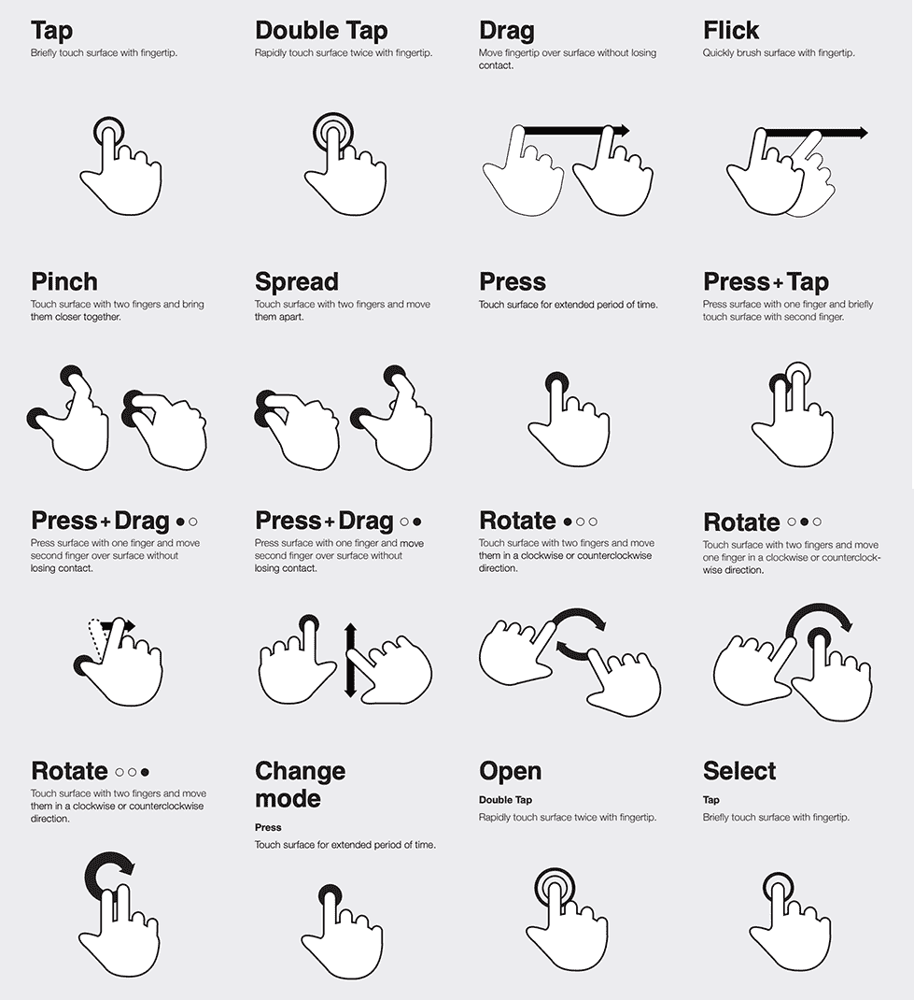

*Image 1 — Gestures on Mobile*

所以，在 bug 管理工具上发布 bug 的时候，使用上面的移动词汇表总是一个有效的想法。

# 了解方向—横向和纵向

智能手机设备使用两种方向-横向和纵向。智能手机中的加速度计用于根据设备的方向对齐屏幕。

移动应用程序使用这一功能，通过简单地转动设备而无需按下任何按钮来支持附加布局，从而创建更好的用户体验。因此，在测试移动应用程序时，应该检查应用程序是支持两种方向还是只支持一种方向，根据这一点，可以增加测试用例的数量来测试方向。

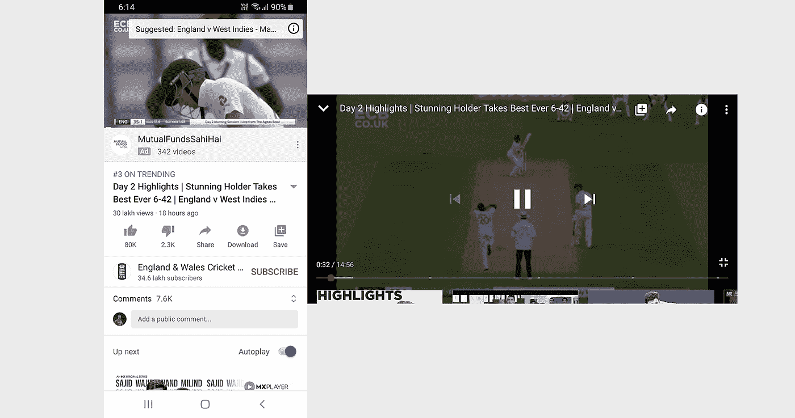

*Image 2 — Portrait vs. Landscape modes*

例如，YouTube 应用程序通过在横向模式下添加附加功能来利用可用空间(见图 2)。

# 设备碎片

设备碎片指的是在任何给定时间都处于活动状态的不可计数的移动设备数量。这对于应用程序开发人员来说非常重要，测试人员必须确保所有此类设备的良好用户体验。根据 Statista 的数据，智能手机用户的数量已经超过了 35 亿大关。

移动设备和操作系统有太多的组合被称为碎片化。移动设备碎片化大多与 Android 操作系统有关，因为有大量制造商提供他们自己的分叉版本的操作系统，如三星的 One UI(用于 Galaxy 系列)，一加的 OxygenOS，小米的 MIUI，华为的 EMUI。

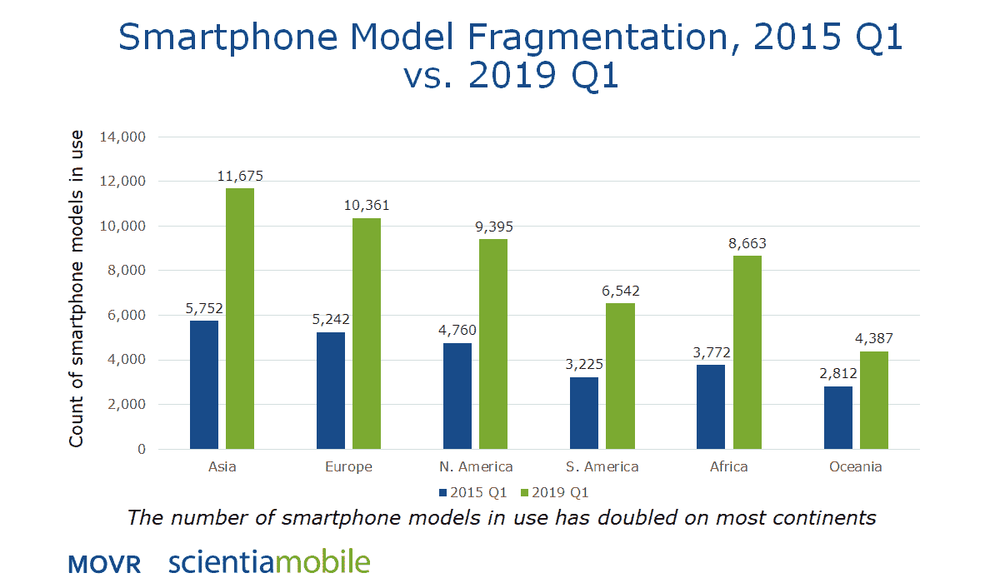

*Image 3 —* [*Smartphone Model Fragmentation*](https://www.scientiamobile.com/device-fragmentation-growing-20-per-year/)

为了使移动测试易于管理，我们需要在创建测试计划时考虑这一点。由于这种多样性，测试人员需要确保一个被测试的应用程序是否能够完美地与客户终端用户的设备一起工作。测试可以通过关注以下几点来实现这一点:

*   确定目标受众和目标用户中最受欢迎的设备
*   确定应用程序必须支持的最小设备集
*   利用设备云服务，最大限度地减少内部测试所需的物理设备数量。

# 移动应用的测试类型

有各种不同的有效移动测试类型，包括功能测试、安全测试、性能测试、可用性测试、本地化测试、安装测试、兼容性测试和中断测试。它们中的大多数是我们在 web 测试中也遵循的常见类型，但是以下两种类型(包括兼容性测试和中断测试)是不同的。

## 兼容性测试

兼容性测试是指检查和验证您的应用程序，以确保不同设备组合的行为保持一致。开发人员花费越来越多的时间来规划和开发应用程序，因为他们希望在所有设备上获得最佳的用户体验。

## 中断测试

这是一种移动应用程序测试，处理应用程序如何对中断做出反应并恢复到中断前的状态。在测试不同类型的中断时，我们需要确保如果应用程序被中断，它应该进入暂停状态，并在中断结束后立即重启。

我们的日常生活都会被打断。考虑一个现实生活中的例子，当你在 YouTube 上观看视频时，被一个电话打断。我们中的一些人可能会注意到电话，忽略它并继续观看视频，少数人可能会参加电话会议，然后继续观看视频。

然而，人们在观看视频时的思维被中断或丢失，因此中断测试有助于找出应用程序表现出的行为。上述示例的预期行为是，当用户接听电话时视频暂停，当电话结束时视频继续播放。

下面是移动应用程序中断的例子

*   来电和去电
*   获取短信或 WhatsApp 信息
*   推送通知
*   电池拆除
*   电池电量低/满
*   设备关闭
*   将应用程序置于后台
*   手机屏幕会自动锁定
*   闹钟，日历事件
*   低存储，低内存
*   网络连接丢失和恢复
*   将应用程序发送到后台/恢复它

上面列出的中断场景并不详尽，但包括了最常见的场景。

# 在不同的操作系统上测试

现在，我们将了解如何在 Android 和 iOS 设备上测试应用，以及在执行这些测试时需要记住哪些要点。

# 安卓操作系统

# Android 操作系统简介

由谷歌和开放手机联盟(Open Handset Alliance)联合开发，基于 Linux 内核的 Android 是主导智能手机行业近四分之三的移动操作系统。Android 支持智能手机、平板电脑甚至笔记本电脑，主要是为触摸屏移动设备设计的。

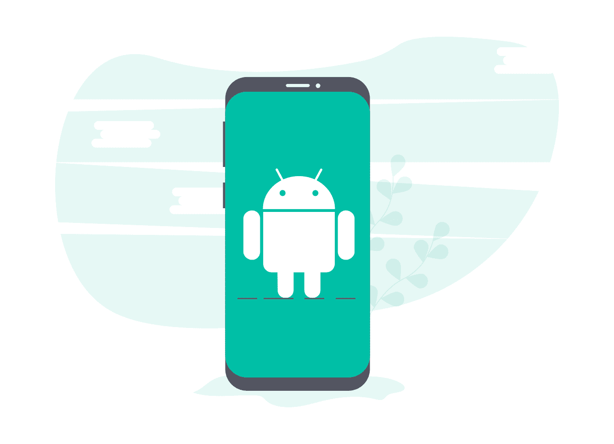

# 装置

为了在您的设备上安装 Android 应用程序进行测试，您需要从 Google Play 外部下载应用程序。出于安全原因，默认情况下禁用此选项。

按照以下步骤启用侧装并安装 APK 文件，

*   允许第三方应用。进入菜单>设置>安全>并检查“*未知来源*”。
*   在计算机上下载应用程序。
*   连接设备并将应用程序复制到设备存储器。
*   使用文件管理器安装应用程序。
*   Android 将要求您授予安装该应用程序的权限。
*   授予许可，它应该会把你弹回安装屏幕。
*   该应用程序将安装在您的智能手机上。

# 模拟器

Android 模拟器模拟一个设备，并将其显示在您的开发计算机上。在 Android Studio 中开发应用程序后，创建一个 Android 虚拟设备(AVD)来安装和运行应用程序。

**如何创建新的 AVD:**

1.  在 AVD 管理器的“**您的虚拟设备**屏幕中，点击**创建虚拟设备**。
2.  从“**选择硬件**屏幕，选择类别和设备配置文件，然后单击下一步。您也可以创建新的或导入硬件配置文件。
3.  从“**选择系统映像**屏幕，选择特定的 API 级别，然后单击下一步。“推荐”选项卡列出了推荐的系统映像。
4.  如果您看到系统映像旁边的下载选项，请单击它下载系统映像。
5.  在验证**配置**页面上，检查所有信息，选择方向，并点击完成。

现在，从工具栏中，从调试配置中选择您的应用程序。从目标设备的下拉菜单中，选择您创建的 AVD。最后，单击运行(见图 4)。

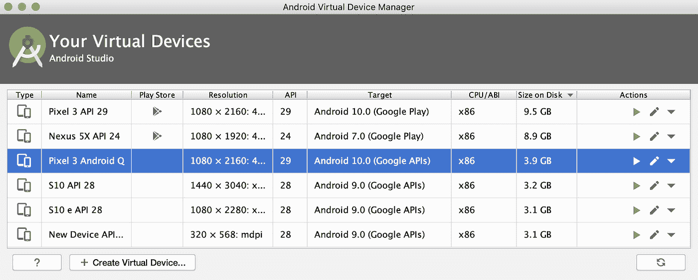

*Image 4 — Virtual devices on Android Studio*

当您从 Android studio 运行项目时，您可以在模拟器上启动应用程序，或者您可以将 APK 文件拖放到模拟器上进行安装。一旦应用程序安装在模拟器上，您就可以开始测试它了。

# Android 上的开发人员选项

Android 有惊人的隐藏设置，可以通过在设备设置中启用“开发者选项”来访问(见图 5)。这个功能有很多高级和独特的功能，包括 USB 调试，调整动画设置，显示 CPU 使用率，后台进程限制，强制 GPU 渲染，等等。

## 如何启用开发人员选项:

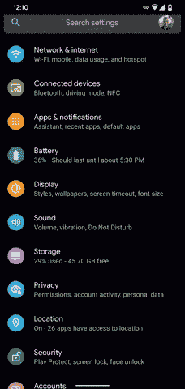

*Image 5 — Enabling Developer Options in Android*

*   转到设备的“设置”
*   点击“关于”或“关于设备”或“关于手机”选项
*   向下滚动，然后轻按“内部版本号”7 次。
*   输入您的 PIN、模式或密码以启用开发者选项菜单。

就是这样。“开发者选项”菜单将出现在你的设置菜单中。

# 从您的 Android 设备捕获日志

在测试移动应用时，有大量的理由向开发者提供**日志**来强调任何发现。

*   从开发人员选项中启用设备上的 USB 调试
*   将您的设备连接到计算机
*   启动 Android Studio。
*   单击视图>工具窗口> Logcat(或单击工具窗口栏中的 Logcat)。
*   Logcat 窗口将开始显示日志消息

从右上角，选择“无过滤器”，你会看到你的 Android 设备的日志正在收集。突出显示所需的日志并另存为。日志(见图 6)。

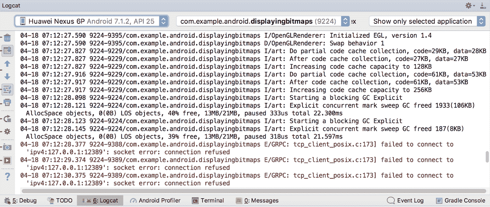

*Image 6 — Logs in Android*

# 从 Android 设备捕获屏幕截图

要从您的 Android 设备上捕捉屏幕截图，首先，在 Android 设备或模拟器上运行您的应用程序。在 Android Studio 中，选择视图>工具窗口> Logcat。现在，从顶部窗口的下拉列表中选择 Android 设备。单击窗口左侧的屏幕截图。

按照以下步骤在没有 Android studio 的情况下捕捉截图，

*   打开您想要捕捉的屏幕。
*   根据您的手机型号:同时按住电源+音量键几秒钟。
*   如果不起作用，请按住电源按钮几秒钟。然后点击截图。

就是这样。在屏幕顶部，您会看到一个截图。

# 在 Android 上录制您的屏幕视频

您记录应用程序屏幕的主要原因是，您可以使用视频片段将其附加到缺陷上。在 Android 10 中，现在有一个内置的屏幕记录器。您可以使用通知栏快速设置来访问它。

此外，play store 上有许多 Android 屏幕录制应用程序。最好的应用之一是——AZ 屏保。这是一个稳定的，高品质的 Android 屏幕录像机，帮助您录制流畅清晰的屏幕视频。

您还可以使用 Android studio 录制视频。要捕捉你屏幕上的视频，首先，在 Android 设备上运行你的应用。转到 Android studio，选择视图>工具窗口> Logcat。现在，从屏幕录制设置中，选择比特率和分辨率。单击 Logcat 窗口左侧的 Record。完成后，将最终输出保存为 MP4 文件。

# 监控 CPU 和 RAM 的使用情况

Android Profiler 让您了解您的应用程序如何利用设备的 CPU、内存、网络和电池资源。要打开 Android Profiler，请选择视图>工具窗口> Profiler。当您启动可调试的应用程序时，Android Profiler 开始收集分析数据和资源使用情况。

# 启用触摸

在 Android 中启用触摸是一个很好的做法，因此在为 bug 录制视频时，一个圆圈会出现在你的手指下，并随着你在屏幕上移动而移动。这将有助于开发人员在重现 bug 时看到屏幕上点击了多少次。您可以使用下面的步骤来启用它；

打开设置>开发者选项>向下滚动以启用显示拍子。

# ios

# iOS 设备

iOS 是仅次于 Android 的第二大流行移动操作系统。由苹果公司开发的 iOS 仅限于苹果移动设备(见图 7)。多年来，Android 和 iOS 设备一直在争夺更高的市场份额。但 iOS 部分专注于高端市场，份额为 25%。

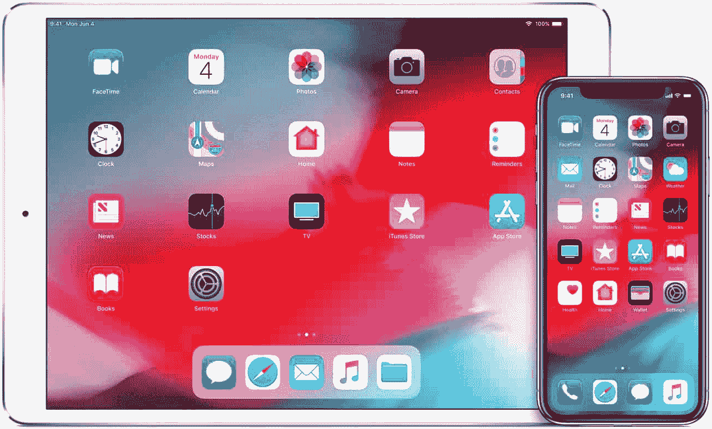

*Image 7 — iOS Operating System*

# iOS 应用程序安装(iTunes 和 xCode)

## 对于使用 iTunes 安装 iOS 应用程序，请执行以下操作:

*   iOS 应用构建完成后，下载。ipa 文件。
*   打开 iTunes 并拖放。ipa 文件到应用程序库中。
*   现在，将您的设备连接到 iTunes 并打开您的设备应用程序。
*   最后，单击安装按钮，然后单击同步按钮。

## 对于使用 Xcode 安装 iOS 应用程序，请执行以下操作:

*   下载。ipa 文件。
*   打开 Xcode 并选择“窗口”>“设备”。
*   出现设备屏幕时，选择要安装的设备。
*   拖放您的。ipa 文件到已安装的应用程序部分。

# iOS 应用程序安装(OTA)

OTA(空中下载)部署允许您通过 HTTPS 安装应用程序。通过 OTA 安装应用程序时，请执行以下操作。

*   下载。ipa 文件。
*   上传。你喜欢的网站上的 ipa 文件。
*   上传。plist 文件，并确保可以通过 HTTPS 访问该文件。
*   为创建网页。使用*<itms-services://>*协议的 plist 文件
*   收到链接后，系统会提示您安装该应用程序。

你也可以使用 TestFlight 或 Diawi 等其他工具安装 iOS 应用。找到下面的详细步骤。

## 使用 TestFlight 安装应用

要使用 TestFlight 测试测试版应用，你需要接受开发者的电子邮件或公共链接邀请，并拥有一台可以用来测试的设备。

1.  [在你的苹果 iPhone 上安装 TestFlight](https://itunes.apple.com/us/app/testflight/id899247664?mt=8) 。
2.  现在，在邀请邮件中，点击 iOS 设备上的公共链接。
3.  点击开始测试，或者点击要测试的应用程序的安装或更新。

## 使用 Diawi 安装应用程序

你必须上传一个 IPA 文件到 [diawi](https://www.diawi.com/) ，然后你会得到一个链接，在 safari 中打开这个链接，你会被要求安装这个应用。点击安装。

# 获取 iOS 日志

如前所述，如果我们发现应用程序崩溃或任何其他关键问题，提供日志总是一个好主意。这将帮助开发人员找到缺陷的根本原因。

## 如何使用您的 iOS 设备记录日志并分享

*   打开设置
*   点击隐私
*   Tap 分析和改进
*   点击分析数据
*   向下滚动并选择日期正确的应用程序日志
*   点击共享图标，与开发者共享日志

## 如何使用 MAC 和 Windows 记录 iOS 日志

*   连接您的 iOS 设备并将您的设备与 iTunes 同步
*   **在 Mac 上**，进入 Finder，然后从菜单中选择“Go”>“Go to Folder”选项。(键盘快捷键是 Command-Shift-G。)
*   复制并粘贴这个位置:*~/Library/Logs/crash reporter/mobiled device*
*   打开与您的设备对应的文件夹。
*   **在 Windows 8 上**:进入*C:\ Documents and Settings \ \ Application Data \ Apple computer \ Logs \ crash reporter \<你的 iPhone 的名字> \*
*   **在 Windows Vista 或 7 上**:转到 *C:\Users\ <用户名>\ AppData \ Roaming \ Apple computer \ Logs \ crash reporter/mobiled DEVICE/<DEVICE _ NAME>*

## iOS 模拟器(如何访问和运行 iOS 模拟器？)

通常，您可能更喜欢在不启动应用程序的情况下启动模拟器。这有助于监控您的应用程序如何从设备的主屏幕启动，或者如果您想要在 Safari 浏览器中测试 iOS web 应用程序。要在 xCode 上启动 iOS 模拟器，请遵循以下步骤(参见图 8)。

*   按住 Control 键点按 Xcode 图标，并从下面的快捷菜单中选择“打开开发者工具”>“模拟器”。
*   现在，选择您的首选 iOS 设备并运行模拟器。这将启用一个 iOS 主屏幕，您可以在其中模拟您的应用程序。

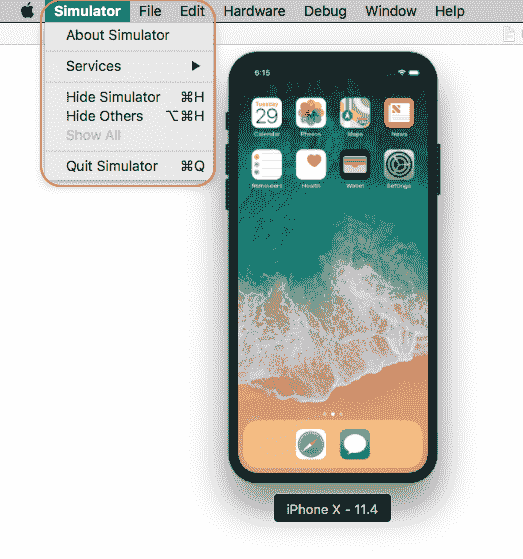

*Image 8 — iOS Simulator*

# 怎么去 UDID

UDID 代表唯一的设备 ID。对于苹果 iOS 设备，UDID 是由 40 个字母和数字组成的独特序列。苹果开发者要注册 iOS 设备进行测试，首先需要唯一的 UDID。以下是如何获得苹果 iOS 设备的 UDID(见图 9)。

*   启动 iTunes 并连接您的 iOS 设备。
*   在 iTunes 的“设备”部分，单击您的设备。
*   现在，点击“序列号”，这应该会变成 UDID。
*   最后，从 iTunes 菜单中选择“编辑”，然后选择“复制”。

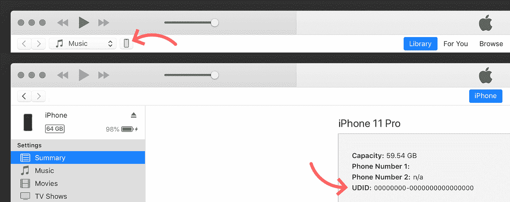

*Image 9 — UDID in iOS*

# 其他需要考虑的要点

# 燃烧基分解剂

Firebase Crashlytics 是谷歌的实时崩溃报告程序，可以帮助您跟踪和修复 Android 应用程序的稳定性问题。Firebase Crashlytics 通过智能地对应用程序崩溃进行分组并突出显示可能导致崩溃的原因，将您从繁琐的故障排除中解救出来。

# 选择合适的移动设备进行测试

选择用于测试的移动设备是战略测试计划的重要组成部分，该计划跟踪成功并确保最终用户的高采用率。如今的智能手机和平板电脑领域高度分散，涵盖了不同制造商和型号的许多设备。

在选择测试设备时，我们需要确保它应该支持最大数量的设备。因此，选择理想的设备列表来测试您的移动应用程序非常重要。

以下是选择移动应用测试设备的参数:

*   了解你的移动应用用户目标
*   市场份额和知名度
*   操作系统和操作系统版本采用
*   制造商
*   屏幕尺寸和分辨率
*   五金器具

# 模拟器

在真实设备上测试您的移动应用程序总是一个有效的想法，但这可能是相当大的资金投入。所以为了节省成本，我们也可以在模拟器上测试我们的应用程序。它们很容易设置，也很容易获得。您可以利用模拟器来探索移动应用程序的行为。

*   Android Studio AVD
*   基因运动
*   面向开发人员的三星仿真器

*模拟器与真实设备*的决策也取决于您在开发生命周期中的位置。以下是使用模拟器的一些优点和缺点；

*   仿真器/模拟器在大多数情况下都是开放和免费的软件，可以很容易地从互联网上下载并随时进行测试。
*   它们具有成本效益，因为这是一种相当便宜的解决方案。
*   模拟器不能模拟电池问题、网络连接和其他实时数据:GPS、传感器、手势、触摸力等。
*   它无法在来电、短信等方面模拟应用程序的性能。
*   触摸屏问题也无法模拟
*   最后，并不是所有的移动应用都可以在模拟器上测试。生物统计学等功能依赖于设备硬件的应用程序需要在真实设备上进行测试。

# 设备云

设备云是移动测试环境，允许应用程序开发人员远程评估其应用程序的性能。这为应用程序开发人员提供了访问现代虚拟设备的机会，而无需购买硬件。

具有物理硬件的设备云还可以提供对实时 CPU 温度、内存使用和电池消耗等因素的更多见解。在下面找到最好的 5 个设备群，

*   [完美无缺](https://www.perfecto.io/)
*   [酱油实验室](https://saucelabs.com/)
*   [AWS 设备农场](https://aws.amazon.com/device-farm/)
*   [科比顿](https://kobiton.com/)
*   [微软应用中心](https://appcenter.ms/)

如今，由于设备碎片化的原因，大多数公司都使用基于云的测试平台进行测试。有了设备云，人们可以从不同的制造商那里获得许多具有不同操作系统版本的设备来测试他们的应用程序。

在使用设备云时，您可能会面临一些挑战，包括测试应用程序的电池使用、存储使用等性能。此外，网络覆盖测试不能在云上轻松完成，为此，我们需要一个真实的设备进行测试。

对于真实的设备，您可以使用设备硬件来执行许多测试。例如，如果测试中的应用程序需要使用手机的摄像头(例如扫描条形码或点击图片)，这在大多数设备群中都无法实现。

# 结论

在当今的移动应用世界中，移动应用测试被强烈推荐，并且对于更好的用户体验非常重要。一个漏洞百出的移动应用程序肯定会影响你的应用程序的成功率，因为用户可能会开始在应用程序商店发布负面评论，这也可能会给你的应用程序留下不好的印象。

为了提升应用程序内的体验，我们应该建立一个可靠的测试策略，牢记上面文章中提到的要点，包括不同操作系统的市场份额、制造商拥有的操作系统风格、可能的测试范围(性能、安全性、稳定性等)。)，并选择合适的设备进行测试。这将有助于实现最大的测试覆盖面，从而提高下载量、客户覆盖面和商店的正面评价。

移动应用测试对于企业来说至关重要，它通过为每位客户提供最佳体验来吸引和留住用户，并让他们重新使用应用。